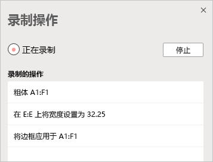
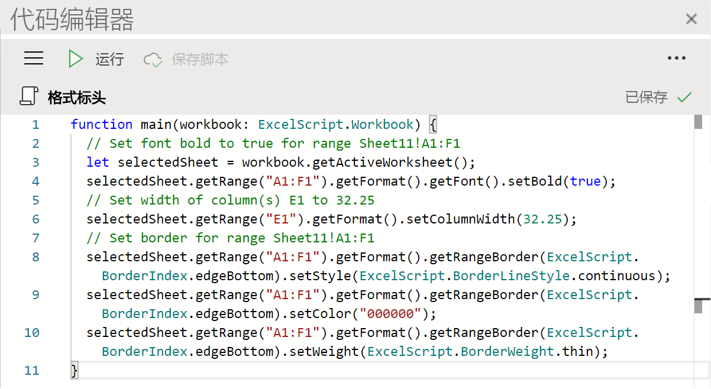

# Excel 网页版中的 Office 脚本（预览版）Office Scripts in Excel on the web (preview)

Excel 网页版中的 Office 脚本可以让您可以自动化日常任务。Office Scripts in Excel on the web let you automate your day-to-day tasks. 你可以使用操作录制器录制 Excel 操作，这会创建一个脚本。You can record your Excel actions with the Action Recorder, which creates a script. 此外，你还可以使用代码编辑器创建和编辑脚本。You can also create and edit scripts with the Code Editor. 本文档系列将指导你如何使用这些工具。This series of documents teaches you how to use these tools. 我们将向你介绍操作录制器，让你了解如何录制频繁的 Excel 操作。You'll be introduced to the Action Recorder and see how to record your frequent Excel actions. 你还将学习如何使用代码编辑器创建或更新自己的脚本。You'll also learn how to make or update your own scripts with the Code Editor.

 

> [!VIDEO https://www.microsoft.com/videoplayer/embed/RE4qdFF]

[!INCLUDE [Preview note](../includes/preview-note.md)]

## 何时使用 Office 脚本When to use Office Scripts

你可以使用脚本录制和重播不同工作簿和工作表上的 Excel 操作。Scripts allow you to record and replay your Excel actions on different workbooks and worksheets. 如果你发现自己正在执行重复操作，则 Office 脚本可以将整个工作流程缩减为按一下按钮，从而为你提供帮助。If you find yourself doing the same things over and over again, an Office Script can help you by reducing your whole workflow to a single button press.

例如，假如你在 Excel 中打开一个会计网站的 .csv 文件，以此开始一天的工作。As an example, say you start your work day by opening a .csv file from an accounting site in Excel. 你需要花几分钟删除不必要的列，设置表格格式，添加公式和在新工作表中创建一个数据透视表。You then spend several minutes deleting unnecessary columns, formatting a table, adding formulas, and creating a PivotTable in a new worksheet. 你可以使用操作录制器录制这些每天重复的操作。Those actions you repeat daily can be recorded once with the Action Recorder. 录制之后，运行脚本即可处理整个 .csv 转换。From then on, running the script will take care of your entire .csv conversion. 这样不仅可以消除忘记步骤的风险，而且还能够与他们共享流程，无需为他们提供任何指导。You'll not only remove the risk of forgetting steps, but be able to share your process with others without having to teach them anything. Office 脚本可以自动化常见任务，使你和你的工作空间可以更有效率、更加高效。Office Scripts automate your common tasks so you and your workplace can be more efficient and productive.

## 操作录制器Action Recorder

操作录制器可以录制你在 Excel 中进行的操作，并将它们转换为脚本。The Action Recorder records actions you take in Excel and translates them into a script. 运行操作录制器之后，你可以在编辑单元格、更改格式和创建表格时捕获 Excel 操作。With the Action recorder running, you can capture the Excel actions as you edit cells, change formatting, and create tables. 可以在其他工作表和工作簿上运行生成的脚本，以重复创建原始操作。The resulting script can be run on other worksheets and workbooks to recreate your original actions.

## 代码编辑器Code Editor

使用操作录制器录制的所有脚本均可通过代码编辑器编辑。All scripts recorded with the Action Recorder can be edited through the Code Editor. 这使你能够调整和自定义脚本，以更好地满足你的准确需求。This lets you tweak and customize the script to better suit your exact needs. 此外，你还可以添加不能直接通过 Excel UI 访问的逻辑和功能，例如条件语句 (if/else) 和循环。You can also add logic and functionality that is not directly accessible through the Excel UI, such as conditional statements (if/else) and loops.

一种简单的开始学习 Office 脚本方式就是在 Excel 网页版上录制脚本，然后查看生成的代码。One easy way to start learning the capabilities of Office Scripts is to record scripts in Excel on the web and view the resulting code. 另一种选择是按照我们的[教程](../tutorials/excel-tutorial.md)进行，以更具指导性的结构化方式进行学习。Another option is to follow our [tutorials](../tutorials/excel-tutorial.md) to learn in a more guided and structured way.

## 后续步骤Next steps

完成 [Excel 网页版上的 Office 脚本教程](../tutorials/excel-tutorial.md)，以了解如何创建你的第一个 Office 脚本。Complete the [Office Scripts in Excel on the web tutorial](../tutorials/excel-tutorial.md) to learn how to create your first Office Scripts.

## 另请参阅See also

- [Excel 网页版上的 Office 脚本的脚本基础知识Scripting fundamentals for Office Script in Excel on the web](../develop/scripting-fundamentals.md)
- [Office 脚本 API 参考Office Scripts API reference](/javascript/api/office-scripts/overview)
- [Office 脚本疑难解答Troubleshooting Office Scripts](../testing/troubleshooting.md)
- [M365 中的 Office 脚本设置Office Scripts settings in M365](https://support.office.com/article/office-scripts-settings-in-m365-19d3c51a-6ca2-40ab-978d-60fa49554dcf)
- [Excel 中的 Office 脚本简介 (support.office.com)Introduction to Office Scripts in Excel (on support.office.com)](https://support.office.com/article/introduction-to-office-scripts-in-excel-9fbe283d-adb8-4f13-a75b-a81c6baf163a)
