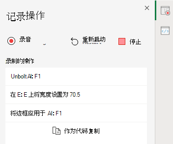

# Excel 网页版中的 Office 脚本（预览版）Office Scripts in Excel on the web (preview)

Excel 网页版中的 Office 脚本可以让您可以自动化日常任务。Office Scripts in Excel on the web let you automate your day-to-day tasks. 你可以使用操作录制器录制 Excel 操作，这会创建一个脚本。You can record your Excel actions with the Action Recorder, which creates a script. 此外，你还可以使用代码编辑器创建和编辑脚本。You can also create and edit scripts with the Code Editor. 然后，可在组织中共享你的脚本，以便同事也可实现其工作流的自动化。Your scripts can then be shared across your organization so your coworkers can also automate their workflows.

本文档系列将指导你如何使用这些工具。This series of documents teaches you how to use these tools. 我们将向你介绍操作录制器，让你了解如何录制频繁的 Excel 操作。You'll be introduced to the Action Recorder and see how to record your frequent Excel actions. 你还将学习如何使用代码编辑器创建或更新自己的脚本。You'll also learn how to make or update your own scripts with the Code Editor.

 

> [!VIDEO https://www.microsoft.com/videoplayer/embed/RE4qdFF]

## RequirementsRequirements

[!INCLUDE [Preview note](../includes/preview-note.md)]

若要使用 Office 脚本，需要以下内容。To use Office Scripts, you'll need the following.

1. [Excel 网页版](https://www.office.com/launch/excel)（不支持桌面等其他平台）。[Excel on the web](https://www.office.com/launch/excel) (other platforms, such as desktop, are not supported).
1. OneDrive for Business。OneDrive for Business.
1. 可访问 Microsoft 365 Office 桌面应用的任何商业版或教育版 Microsoft 365 许可证，例如：Any commercial or educational Microsoft 365 license with access to the Microsoft 365 Office desktop apps, such as:

    - Office 365 商业版Office 365 Business
    - Office 365 商业高级版Office 365 Business Premium
    - Office 365 专业增强版Office 365 ProPlus
    - Office 365 专业增强版（设备）Office 365 ProPlus for Devices
    - Office 365 企业版 E3Office 365 Enterprise E3
    - Office 365 企业版 E5Office 365 Enterprise E5
    - Office 365 A3Office 365 A3
    - Office 365 A5Office 365 A5

> [!NOTE]
> 如果符合这些要求，但仍不能看到 **Automate** 选项卡，你的管理员可能已禁用此功能，或者环境存在其他问题。If you meet these requirements and are still not seeing the **Automate** tab, it's possible that your admin has disabled the feature or there's some other problem with your environment. 请按照 [Automate 选项卡未出现或 Office 脚本不可用 ](../testing/troubleshooting.md#automate-tab-not-appearing-or-office-scripts-unavailable) 下的步骤开始使用 Office 脚本。Please follow the steps under [Automate tab not appearing or Office Scripts unavailable](../testing/troubleshooting.md#automate-tab-not-appearing-or-office-scripts-unavailable) to start using Office Scripts.

## 何时使用 Office 脚本When to use Office Scripts

你可以使用脚本录制和重播不同工作簿和工作表上的 Excel 操作。Scripts allow you to record and replay your Excel actions on different workbooks and worksheets. 如果你发现自己正在重复执行相同的操作，则可以将所有工作转变为易于运行的 Office 脚本。If you find yourself doing the same things over and over again, you can turn all that work into an easy-to-run Office Script. 通过 Excel 中的一个按钮运行脚本，或将其与 Power Automate 结合使用，简化整个工作流程。Run your script with a button-press in Excel or combine it with Power Automate to streamline your entire workflow.

例如，假如你在 Excel 中打开一个会计网站的 .csv 文件，以此开始一天的工作。As an example, say you start your work day by opening a .csv file from an accounting site in Excel. 你需要花几分钟删除不必要的列，设置表格格式，添加公式和在新工作表中创建一个数据透视表。You then spend several minutes deleting unnecessary columns, formatting a table, adding formulas, and creating a PivotTable in a new worksheet. 你可以使用操作录制器录制这些每天重复的操作。Those actions you repeat daily can be recorded once with the Action Recorder. 录制之后，运行脚本即可处理整个 .csv 转换。From then on, running the script will take care of your entire .csv conversion. 这样不仅可以消除忘记步骤的风险，而且还能够与他们共享流程，无需为他们提供任何指导。You'll not only remove the risk of forgetting steps, but be able to share your process with others without having to teach them anything. Office 脚本可以自动化常见任务，使你和你的工作空间可以更有效率、更加高效。Office Scripts automate your common tasks so you and your workplace can be more efficient and productive.

## 操作录制器Action Recorder

操作录制器可以录制你在 Excel 中进行的操作，并将它们转换为脚本。The Action Recorder records actions you take in Excel and saves them as a script. 运行操作录制器之后，你可以在编辑单元格、更改格式和创建表格时捕获 Excel 操作。With the Action recorder running, you can capture the Excel actions as you edit cells, change formatting, and create tables. 可以在其他工作表和工作簿上运行生成的脚本，以重复创建原始操作。The resulting script can be run on other worksheets and workbooks to recreate your original actions.

## 代码编辑器Code Editor

使用操作录制器录制的所有脚本均可通过代码编辑器编辑。All scripts recorded with the Action Recorder can be edited through the Code Editor. 这使你能够调整和自定义脚本，以更好地满足你的准确需求。This lets you tweak and customize the script to better suit your exact needs. 此外，你还可以添加不能直接通过 Excel UI 访问的逻辑和功能，例如条件语句 (if/else) 和循环。You can also add logic and functionality that is not directly accessible through the Excel UI, such as conditional statements (if/else) and loops.

一种简单的开始学习 Office 脚本方式就是在 Excel 网页版上录制脚本，然后查看生成的代码。One easy way to start learning the capabilities of Office Scripts is to record scripts in Excel on the web and view the resulting code. 另一种选择是按照我们的[教程](../tutorials/excel-tutorial.md)进行，以更具指导性的结构化方式进行学习。Another option is to follow our [tutorials](../tutorials/excel-tutorial.md) to learn in a more guided and structured way.

## 共享脚本Sharing scripts

Office 脚本可与 Excel 工作簿的其他用户共享。Office Scripts can be shared with other users of an Excel workbook. 在工作簿中与其他人共享脚本时，该脚本将附加到工作簿中。When you share a script with others in a workbook, the script is attached to the workbook. 你的脚本存储在你的 OneDrive 中，当你共享一个脚本时，你将在打开的工作簿中创建指向该脚本的链接。Your scripts are stored in your OneDrive, and when you share one, you create a link to it in the workbook you have open.

有关共享和取消共享脚本的详细信息，请参阅 [ 在 Excel 网页版中共享 Office 脚本 ](https://support.microsoft.com/office/sharing-office-scripts-in-excel-for-the-web-226eddbc-3a44-4540-acfe-fccda3d1122b) 一文。More details about sharing and unsharing scripts can be in the article [Sharing Office Scripts in Excel for the Web](https://support.microsoft.com/office/sharing-office-scripts-in-excel-for-the-web-226eddbc-3a44-4540-acfe-fccda3d1122b).

> [!NOTE]
> 请参阅 [ Office 脚本存储和所有权 ](script-storage.md) 了解关于如何在 OneDrive 中存储脚本的详细信息。Learn more about how scripts are stored in your OneDrive in [Office Scripts file storage and ownership](script-storage.md).

## 将 Office 脚本连接到 Power AutomateConnecting Office Scripts to Power Automate

[Power Automate](https://flow.microsoft.com/) 是一种可帮助你在多个应用和服务之间创建自动化工作流的服务。[Power Automate](https://flow.microsoft.com/) is a service that helps you create automated workflows between multiple apps and services. Office 脚本可以在这些工作流中使用，以便你在工作簿之外控制脚本。Office Scripts can be used in these workflows, giving you control of your scripts outside of the workbook. 你可以按计划运行脚本，在回复电子邮件时触发它们，等等。You can run your scripts on a schedule, trigger them in response to emails, and much more. 若要了解有关连接这些自动化服务的基础知识，请访问[使用 Power Automate 在 Excel 网页版中运行 Office 脚本](../tutorials/excel-power-automate-manual.md)教程。Visit the [Run Office Scripts in Excel on the web with Power Automate](../tutorials/excel-power-automate-manual.md) tutorial to learn the basics of connecting these automation services.

## 后续步骤Next steps

完成 [Excel 网页版上的 Office 脚本教程](../tutorials/excel-tutorial.md)，以了解如何创建你的第一个 Office 脚本。Complete the [Office Scripts in Excel on the web tutorial](../tutorials/excel-tutorial.md) to learn how to create your first Office Scripts.

## 另请参阅See also

- [Excel 网页版中 Office 脚本的脚本基础知识Scripting fundamentals for Office Scripts in Excel on the web](../develop/scripting-fundamentals.md)
- [Office 脚本 API 参考Office Scripts API reference](/javascript/api/office-scripts/overview)
- [Office 脚本疑难解答Troubleshooting Office Scripts](../testing/troubleshooting.md)
- [M365 中的 Office 脚本设置Office Scripts settings in M365](https://support.office.com/article/office-scripts-settings-in-m365-19d3c51a-6ca2-40ab-978d-60fa49554dcf)
- [Excel 中的 Office 脚本简介 (support.office.com)Introduction to Office Scripts in Excel (on support.office.com)](https://support.office.com/article/introduction-to-office-scripts-in-excel-9fbe283d-adb8-4f13-a75b-a81c6baf163a)
- [在 Excel 网页版中共享 Office 脚本Sharing Office Scripts in Excel for the Web](https://support.microsoft.com/office/sharing-office-scripts-in-excel-for-the-web-226eddbc-3a44-4540-acfe-fccda3d1122b)
