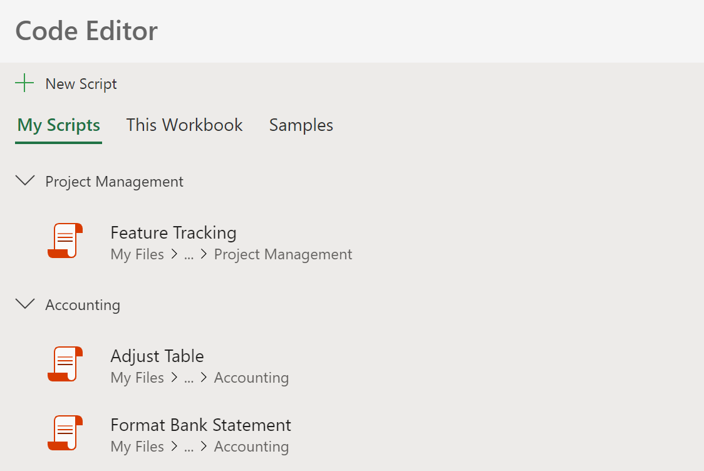

# Office 脚本文件存储和所有权

Office 脚本以 **. osts** 文件的形式存储在 Microsoft OneDrive 中。 这将允许您的脚本位于任何特定工作簿的外部。 您的 OneDrive 设置控制所有 **osts** 文件的共享访问权限和权限。独立于任何 Excel 设置。

## 文件存储

你的 Office 脚本存储在你的 OneDrive 中。 在 **/Documents/Office 脚本/** 文件夹中找到 **osts** 文件。 对这些 **osts** 文件所做的任何编辑（如重命名或删除文件）都将反映在代码编辑器和脚本库中。

与其中一个工作簿共享的脚本将保留在脚本创建者的 OneDrive 中。 当您在 Excel 中运行共享脚本时，不会将它们复制到您的任何本地或 OneDrive 文件夹中。 " **创建** 代码编辑器的副本" 按钮在 OneDrive 中保存脚本的单独副本。 对副本所做的更改不会影响原始脚本。

### 脚本文件夹

将文件夹添加到你的 OneDrive 有助于组织组织的脚本。 " **/Documents/Office scripts/** " 下的任何文件夹都显示在代码编辑器的 " **我的脚本** " 部分下。 请注意，无法使用代码编辑器创建或删除这些文件夹。 同样，脚本也不能放在文件夹中，也不能通过使用代码编辑器在文件夹中移动。

## 文件所有权和保留

Office 脚本存储在用户的 OneDrive 中。 它们遵循 Microsoft OneDrive 指定的保留和删除策略。 若要了解如何处理从组织中删除了用户所创建和共享的脚本，请参阅 [OneDrive 保留和删除](/onedrive/retention-and-deletion)。

## 另请参阅

- [在 Excel 网页版中共享 Office 脚本](https://support.microsoft.com/office/sharing-office-scripts-in-excel-for-the-web-226eddbc-3a44-4540-acfe-fccda3d1122b)
- [Office 脚本疑难解答](../testing/troubleshooting.md)
- [M365 中的 Office 脚本设置](https://support.office.com/article/office-scripts-settings-in-m365-19d3c51a-6ca2-40ab-978d-60fa49554dcf)
- [消除 Office 脚本的影响](../testing/undo.md)
