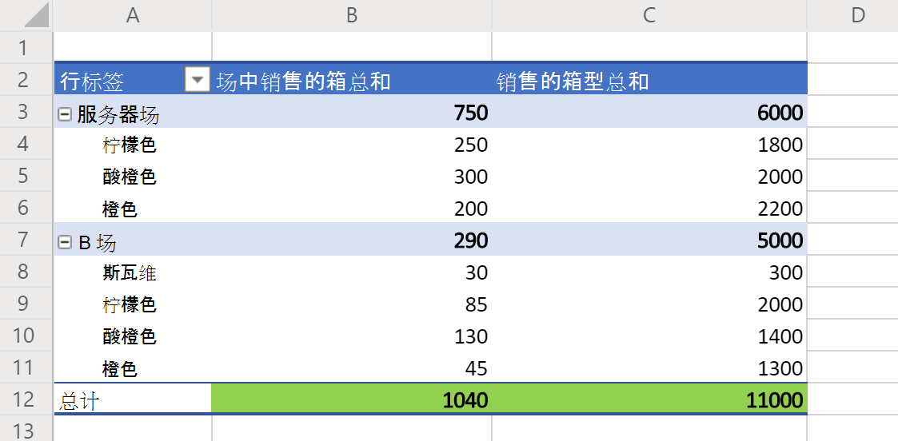

# <a name="basic-scripts-for-office-scripts-in-excel-on-the-web"></a>Excel 网页中的 Office 脚本的基本脚本

以下示例是简单脚本，您可以尝试自己的工作簿。 若要在 Excel 网页中使用它们：：

1. 打开“**自动**”选项卡。
2. 按 **代码编辑器**。
3. 在 **代码编辑器** 的任务窗格中按"新建脚本"。
4. 将整个脚本替换为你选择的示例。
5. 在 **代码** 编辑器的任务窗格中按"运行"。

## <a name="scripting-basics"></a>脚本基础知识

这些示例演示 Office 脚本的基本构建基块。 将其添加到脚本以扩展解决方案并解决常见问题。

### <a name="read-and-log-one-cell"></a>读取和记录一个单元格

此示例读取 **A1 的值，** 并打印到控制台。

```TypeScript
function main(workbook: ExcelScript.Workbook) {
  // Get the current worksheet.
  let selectedSheet = workbook.getActiveWorksheet();

  // Get the value of cell A1.
  let range = selectedSheet.getRange("A1");
  
  // Print the value of A1.
  console.log(range.getValue());
}
```

### <a name="read-the-active-cell"></a>读取活动单元格

此脚本记录当前活动单元格的值。 如果选择了多个单元格，将记录最左上方的单元格。

```TypeScript
function main(workbook: ExcelScript.Workbook) {
  // Get the current active cell in the workbook.
  let cell = workbook.getActiveCell();

  // Log that cell's value.
  console.log(`The current cell's value is ${cell.getValue()}`);
}
```

### <a name="change-an-adjacent-cell"></a>更改相邻单元格

此脚本使用相对引用获取相邻单元格。 请注意，如果活动单元格位于最上面一行，脚本的一部分将失败，因为它引用当前选定单元格上方的单元格。

```TypeScript
function main(workbook: ExcelScript.Workbook) {
  // Get the currently active cell in the workbook.
  let activeCell = workbook.getActiveCell();
  console.log(`The active cell's address is: ${activeCell.getAddress()}`);

  // Get the cell to the right of the active cell and set its value and color.
  let rightCell = activeCell.getOffsetRange(0,1);
  rightCell.setValue("Right cell");
  console.log(`The right cell's address is: ${rightCell.getAddress()}`);
  rightCell.getFormat().getFont().setColor("Magenta");
  rightCell.getFormat().getFill().setColor("Cyan");

  // Get the cell to the above of the active cell and set its value and color.
  // Note that this operation will fail if the active cell is in the top row.
  let aboveCell = activeCell.getOffsetRange(-1, 0);
  aboveCell.setValue("Above cell");
  console.log(`The above cell's address is: ${aboveCell.getAddress()}`);
  aboveCell.getFormat().getFont().setColor("White");
  aboveCell.getFormat().getFill().setColor("Black");
}
```

### <a name="change-all-adjacent-cells"></a>更改所有相邻单元格

此脚本将活动单元格中的格式复制到相邻单元格。 请注意，此脚本仅在活动单元格不在工作表边缘时有效。

```TypeScript
function main(workbook: ExcelScript.Workbook) {
  // Get the active cell.
  let activeCell = workbook.getActiveCell();

  // Get the cell that's one row above and one column to the left of the active cell.
  let cornerCell = activeCell.getOffsetRange(-1,-1);

  // Get a range that includes all the cells surrounding the active cell.
  let surroundingRange = cornerCell.getResizedRange(2, 2)

  // Copy the formatting from the active cell to the new range.
  surroundingRange.copyFrom(
    activeCell, /* The source range. */
    ExcelScript.RangeCopyType.formats /* What to copy. */
    );
}
```

### <a name="change-each-individual-cell-in-a-range"></a>更改区域的每个单元格

此脚本将循环遍历当前选择的范围。 它清除当前格式，将每个单元格中的填充颜色设置为随机颜色。

```TypeScript
function main(workbook: ExcelScript.Workbook) {
  // Get the currently selected range.
  let range = workbook.getSelectedRange();

  // Get the size boundaries of the range.
  let rows = range.getRowCount();
  let cols = range.getColumnCount();

  // Clear any existing formatting
  range.clear(ExcelScript.ClearApplyTo.formats);

  // Iterate over the range.
  for (let row = 0; row < rows; row++) {
    for (let col = 0; col < cols; col++) {
      // Generate a random color hex-code.
      let colorString = `#${Math.random().toString(16).substr(-6)}`;

      // Set the color of the current cell to that random hex-code.
      range.getCell(row, col).getFormat().getFill().setColor(colorString);
    }
  }
}
```

### <a name="get-groups-of-cells-based-on-special-criteria"></a>根据特殊条件获取单元格组

此脚本获取当前工作表的已用区域的所有空白单元格。 然后，它用黄色背景突出显示所有这些单元格。

```TypeScript
function main(workbook: ExcelScript.Workbook) {
    // Get the current used range.
    let range = workbook.getActiveWorksheet().getUsedRange();
    
    // Get all the blank cells.
    let blankCells = range.getSpecialCells(ExcelScript.SpecialCellType.blanks);

    // Highlight the blank cells with a yellow background.
    blankCells.getFormat().getFill().setColor("yellow");
}
```

## <a name="collections"></a>收藏

这些示例处理工作簿中的对象集合。

### <a name="iterating-over-collections"></a>对集合进行 Iterating

此脚本获取并记录工作簿中所有工作表的名称。 它还将选项卡颜色设置为随机颜色。

```TypeScript
function main(workbook: ExcelScript.Workbook) {
  // Get all the worksheets in the workbook.
  let sheets = workbook.getWorksheets();

  // Get a list of all the worksheet names.
  let names = sheets.map ((sheet) => sheet.getName());

  // Write in the console all the worksheet names and the total count.
  console.log(names);
  console.log(`Total worksheets inside of this workbook: ${sheets.length}`);
  
  // Set the tab color each worksheet to a random color
  for (let sheet of sheets) {
    // Generate a random color hex-code.
    let colorString = `#${Math.random().toString(16).substr(-6)}`;

    // Set the color of the current worksheet's tab to that random hex-code.
    sheet.setTabColor(colorString);
  }
}
```

### <a name="querying-and-deleting-from-a-collection"></a>查询和删除集合

此脚本创建新的工作表。 它在新建工作表之前检查工作表的现有副本并将其删除。

```TypeScript
function main(workbook: ExcelScript.Workbook) {
  // Name of the worksheet to be added.
  let name = "Index";

  // Get any worksheet with that name.
  let sheet = workbook.getWorksheet("Index");
  
  // If `null` wasn't returned, then there's already a worksheet with that name.
  if (sheet) {
    console.log(`Worksheet by the name ${name} already exists. Deleting it.`);
    // Delete the sheet.
    sheet.delete();
  }
  
  // Add a blank worksheet with the name "Index".
  // Note that this code runs regardless of whether an existing sheet was deleted.
  console.log(`Adding the worksheet named ${name}.`);
  let newSheet = workbook.addWorksheet("Index");

  // Switch to the new worksheet.
  newSheet.activate();
}
```

## <a name="dates"></a>日期

本节中的示例显示如何使用 JavaScript [Date](https://developer.mozilla.org/docs/web/javascript/reference/global_objects/date) 对象。

以下示例获取当前日期和时间，然后将这些值写入活动工作表中的两个单元格。

```TypeScript
function main(workbook: ExcelScript.Workbook) {
  // Get the cells at A1 and B1.
  let dateRange = workbook.getActiveWorksheet().getRange("A1");
  let timeRange = workbook.getActiveWorksheet().getRange("B1");

  // Get the current date and time with the JavaScript Date object.
  let date = new Date(Date.now());

  // Add the date string to A1.
  dateRange.setValue(date.toLocaleDateString());

  // Add the time string to B1.
  timeRange.setValue(date.toLocaleTimeString());
}
```

下一个示例将读取 Excel 中存储的日期，并将其转换为 JavaScript Date 对象。 它将日期 [的数字序列号用作](https://support.office.com/article/now-function-3337fd29-145a-4347-b2e6-20c904739c46) JavaScript Date 的输入。

```TypeScript
function main(workbook: ExcelScript.Workbook) {
  // Read a date at cell A1 from Excel.
  let dateRange = workbook.getActiveWorksheet().getRange("A1");

  // Convert the Excel date to a JavaScript Date object.
  let excelDateValue = dateRange.getValue() as number;
  let javaScriptDate = new Date(Math.round((excelDateValue - 25569) * 86400 * 1000));
  console.log(javaScriptDate);
}
```

## <a name="display-data"></a>显示数据

这些示例演示如何使用工作表数据，并为用户提供更好的视图或组织。

### <a name="apply-conditional-formatting"></a>应用条件格式

本示例将条件格式应用于工作表中当前使用的范围。 条件格式是前 10% 的值的绿色填充。

```TypeScript
function main(workbook: ExcelScript.Workbook) {
  // Get the current worksheet.
  let selectedSheet = workbook.getActiveWorksheet();

  // Get the used range in the worksheet.
  let range = selectedSheet.getUsedRange();

  // Set the fill color to green for the top 10% of values in the range.
  let conditionalFormat = range.addConditionalFormat(ExcelScript.ConditionalFormatType.topBottom)
  conditionalFormat.getTopBottom().getFormat().getFill().setColor("green");
  conditionalFormat.getTopBottom().setRule({
    rank: 10, // The percentage threshold.
    type: ExcelScript.ConditionalTopBottomCriterionType.topPercent // The type of the top/bottom condition.
  });
}
```

### <a name="create-a-sorted-table"></a>创建排序表

本示例从当前工作表的已用区域创建一个表格，然后根据第一列对表格进行排序。

```TypeScript
function main(workbook: ExcelScript.Workbook) {
  // Get the current worksheet.
  let selectedSheet = workbook.getActiveWorksheet();

  // Create a table with the used cells.
  let usedRange = selectedSheet.getUsedRange();
  let newTable = selectedSheet.addTable(usedRange, true);

  // Sort the table using the first column.
  newTable.getSort().apply([{ key: 0, ascending: true }]);
}
```

### <a name="log-the-grand-total-values-from-a-pivottable"></a>记录数据透视表中的"总计"值

本示例查找工作簿中的第一个数据透视表，并记录"总计"单元格 (在下面的图像中以绿色突出显示) 。



```TypeScript
function main(workbook: ExcelScript.Workbook) {
  // Get the first PivotTable in the workbook.
  let pivotTable = workbook.getPivotTables()[0];

  // Get the names of each data column in the PivotTable.
  let pivotColumnLabelRange = pivotTable.getLayout().getColumnLabelRange();

  // Get the range displaying the pivoted data.
  let pivotDataRange = pivotTable.getLayout().getBodyAndTotalRange();

  // Get the range with the "grand totals" for the PivotTable columns.
  let grandTotalRange = pivotDataRange.getLastRow();

  // Print each of the "Grand Totals" to the console.
  grandTotalRange.getValues()[0].forEach((column, columnIndex) => {
    console.log(`Grand total of ${pivotColumnLabelRange.getValues()[0][columnIndex]}: ${grandTotalRange.getValues()[0][columnIndex]}`);
    // Example log: "Grand total of Sum of Crates Sold Wholesale: 11000"
  });
}
```

### <a name="use-data-validation-to-create-a-drop-down-list"></a>使用数据验证创建下拉列表

此脚本为单元格创建下拉选择列表。 它将所选区域的现有值用作列表的选项。


```TypeScript
function main(workbook: ExcelScript.Workbook) {
  // Get the values for data validation.
  let selectedRange = workbook.getSelectedRange();
  let rangeValues = selectedRange.getValues();

  // Convert the values into a comma-delimited string.
  let dataValidationListString = "";
  rangeValues.forEach((rangeValueRow) => {
    rangeValueRow.forEach((value) => {
      dataValidationListString += value + ",";
    });
  });

  // Clear the old range.
  selectedRange.clear(ExcelScript.ClearApplyTo.contents);

  // Apply the data validation to the first cell in the selected range.
  let targetCell = selectedRange.getCell(0,0);
  let dataValidation = targetCell.getDataValidation();

  // Set the content of the drop-down list.
  dataValidation.setRule({
      list: {
        inCellDropDown: true,
        source: dataValidationListString
      }
    });
}
```

## <a name="formulas"></a>公式

这些示例使用 Excel 公式并展示如何在脚本中使用它们。

### <a name="single-formula"></a>单个公式

此脚本设置单元格的公式，然后显示 Excel 如何单独存储单元格的公式和值。

```TypeScript
function main(workbook: ExcelScript.Workbook) {
  let selectedSheet = workbook.getActiveWorksheet();

  // Set A1 to 2.
  let a1 = selectedSheet.getRange("A1");
  a1.setValue(2);

  // Set B1 to the formula =(2*A1), which should equal 4.
  let b1 = selectedSheet.getRange("B1")
  b1.setFormula("=(2*A1)");

  // Log the current results for `getFormula` and `getValue` at B1.
  console.log(`B1 - Formula: ${b1.getFormula()} | Value: ${b1.getValue()}`);
}
```

### <a name="spilling-results-from-a-formula"></a>从公式中溢出结果

此脚本使用 TRANSPOSE 函数将区域"A1：D2"转置为"A4：B7"。 如果转置导致错误#SPILL，它将清除目标区域并再次应用公式。

```TypeScript
function main(workbook: ExcelScript.Workbook) {
  let sheet = workbook.getActiveWorksheet();
  // Use the data in A1:D2 for the sample.
  let dataAddress = "A1:D2"
  let inputRange = sheet.getRange(dataAddress);

  // Place the transposed data starting at A4.
  let targetStartCell = sheet.getRange("A4");

  // Compute the target range.
  let targetRange = targetStartCell.getResizedRange(inputRange.getColumnCount() - 1, inputRange.getRowCount() - 1);

  // Call the transpose helper function.
  targetStartCell.setFormula(`=TRANSPOSE(${dataAddress})`);

  // Check if the range update resulted in a spill error.
  let checkValue = targetStartCell.getValue() as string;
  if (checkValue === '#SPILL!') {
    // Clear the target range and call the transpose function again.
    console.log("Target range has data that is preventing update. Clearing target range.");
    targetRange.clear();
    targetStartCell.setFormula(`=TRANSPOSE(${dataAddress})`);
  }

  // Select the transposed range to highlight it.
  targetRange.select();
}
```

## <a name="suggest-new-samples"></a>建议新示例

我们欢迎您提出有关新示例的建议。 如果存在有助于其他脚本开发人员的常见方案，请在下面的反馈部分中告诉我们。
