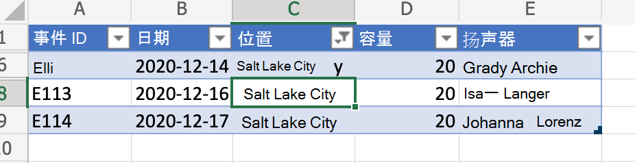
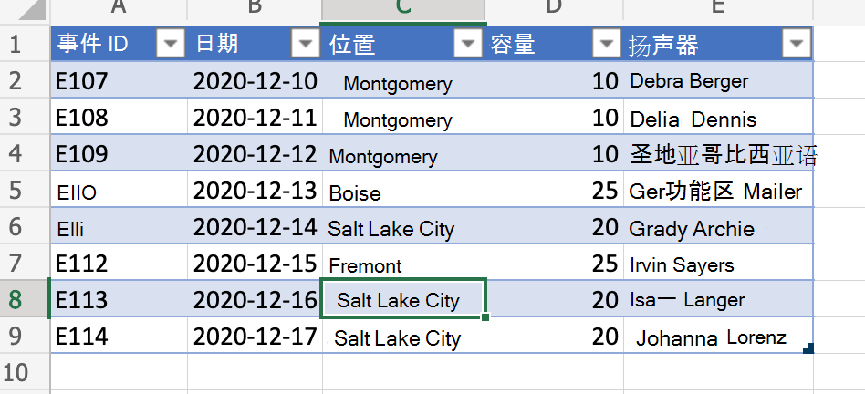

# <a name="clear-table-column-filter-based-on-active-cell-location"></a>基于活动单元格位置清除表格列筛选器

本示例根据活动单元格位置清除表格列筛选器。 该脚本检测单元格是否属于表格，确定表格列，并清除应用了表格的任何筛选器。

如果希望了解有关在清除筛选器之前如何保存筛选器 (并稍后重新应用) ，请参阅通过保存筛选器跨表移动行，这是一个更[](move-rows-across-tables.md)高级的示例。

_在清除列筛选器 (，请注意活动单元格)_



_清除列筛选器后_



## <a name="sample-code-clear-table-column-filter-based-on-active-cell"></a>示例代码：基于活动单元格清除表列筛选器

以下脚本基于活动单元格位置清除表格列筛选器，并可以应用于任何包含表格的 Excel 文件。 为方便起见，你可以 <a href="table-with-filter.xlsx"> 下载并使用 </a>table-with-filter.xlsx。

```TypeScript
function main(workbook: ExcelScript.Workbook) {
    // Get active cell.
    const cell = workbook.getActiveCell();

    // Get all tables associated with that cell.
    const tables = cell.getTables();
    
    // If there is no table on the selection, return/exit.
    if (tables.length !== 1) {
      console.log("The selection is not in a table.");
      return;
    }

    // Get table (since it is already determined that there is only
    // a single table part of the selection).
    const currentTable = tables[0];

    console.log(currentTable.getName());
    console.log(currentTable.getRange().getAddress());

    const entireCol = cell.getEntireColumn();
    const intersect = entireCol.getIntersection(currentTable.getRange());
    console.log(intersect.getAddress());

    const headerCellValue = intersect.getCell(0,0).getValue() as string;
    console.log(headerCellValue);

    // Get column.
    const col = currentTable.getColumnByName(headerCellValue);

    // Clear filter.
    col.getFilter().clear();
}
```

## <a name="training-video-clear-table-column-filter-based-on-active-cell-location"></a>培训视频：基于活动单元格位置清除表格列筛选器

有关如何使用区域的示例，请参阅 [Range 基础知识培训视频](range-basics.md#training-videos-range-basics)。
