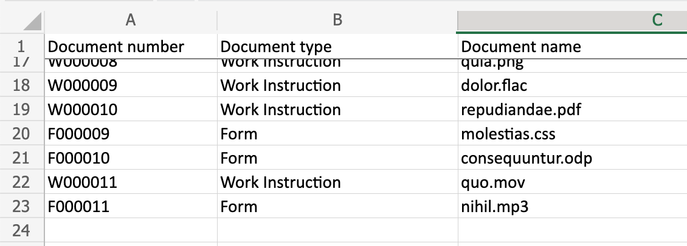
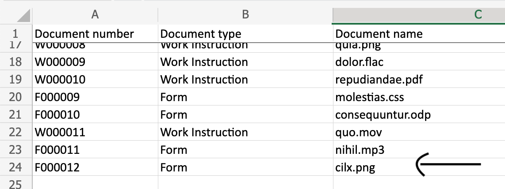
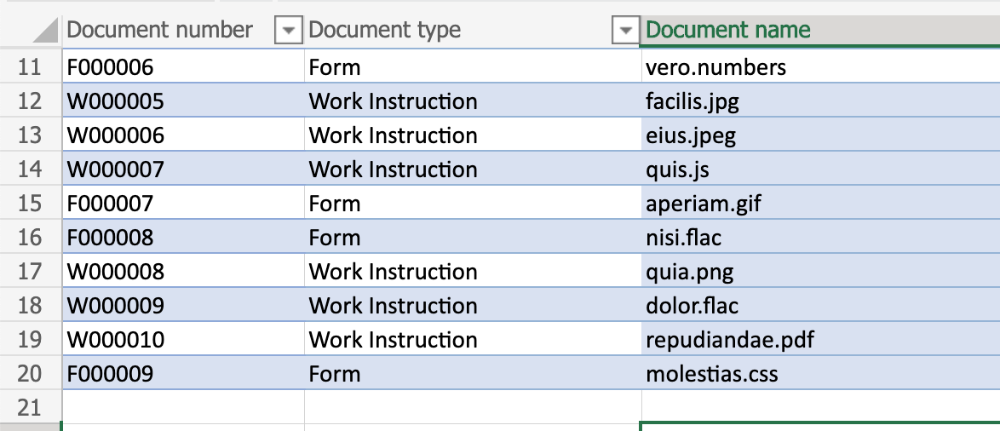
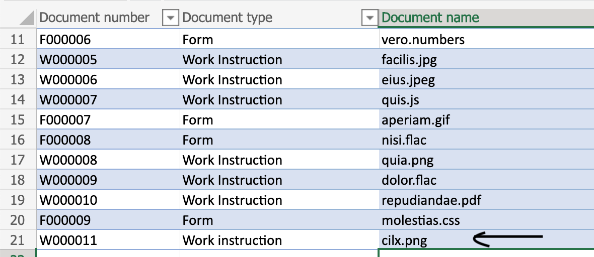

# <a name="generate-a-unique-identifier-in-a-workbook"></a><span data-ttu-id="51a24-103">在工作簿中生成唯一标识符</span><span class="sxs-lookup"><span data-stu-id="51a24-103">Generate a unique identifier in a workbook</span></span>

<span data-ttu-id="51a24-104">此方案可帮助用户生成具有特定格式的唯一文档编号，并将其添加到区域或表格中作为条目。</span><span class="sxs-lookup"><span data-stu-id="51a24-104">This scenario helps a user generate a unique document number with a specific format and add it as an entry to a range or table.</span></span> <span data-ttu-id="51a24-105">添加的新条目或行将包含新生成的唯一文档编号和传递给脚本的一些其他属性。</span><span class="sxs-lookup"><span data-stu-id="51a24-105">The new entry or row added will contain the newly generated unique document number and a few other attributes passed to the script.</span></span>

<span data-ttu-id="51a24-106">此方案的示例有两个版本。</span><span class="sxs-lookup"><span data-stu-id="51a24-106">There are two versions of the sample for this scenario.</span></span>

* [<span data-ttu-id="51a24-107">版本 1：读取行并将其添加到包含普通范围的工作表</span><span class="sxs-lookup"><span data-stu-id="51a24-107">Version 1: Read and add a row to a worksheet containing plain range</span></span>](#sample-code-generate-key-and-add-row-to-range)

    <span data-ttu-id="51a24-108">_在添加新行之前_</span><span class="sxs-lookup"><span data-stu-id="51a24-108">_Before the new row is added_</span></span>

    

    <span data-ttu-id="51a24-110">_添加新行后_</span><span class="sxs-lookup"><span data-stu-id="51a24-110">_After the new row is added_</span></span>

    

* [<span data-ttu-id="51a24-112">版本 2：读取行并将其添加到表中</span><span class="sxs-lookup"><span data-stu-id="51a24-112">Version 2: Read and add a row to a table</span></span>](#sample-code-generate-key-and-add-row-to-table)

    <span data-ttu-id="51a24-113">_在添加新行之前_</span><span class="sxs-lookup"><span data-stu-id="51a24-113">_Before the new row is added_</span></span>

    

    <span data-ttu-id="51a24-115">_添加新行后_</span><span class="sxs-lookup"><span data-stu-id="51a24-115">_After the new row is added_</span></span>

    

## <a name="sample-excel-file"></a><span data-ttu-id="51a24-117">示例 Excel 文件</span><span class="sxs-lookup"><span data-stu-id="51a24-117">Sample Excel file</span></span>

<span data-ttu-id="51a24-118">下载此 <a href="document-number-generator.xlsx">document-number-generator.xlsx</a> 中使用的文件，以尝试一下！</span><span class="sxs-lookup"><span data-stu-id="51a24-118">Download the file <a href="document-number-generator.xlsx">document-number-generator.xlsx</a> used in this solution to try it out yourself!</span></span>

## <a name="sample-code-generate-key-and-add-row-to-range"></a><span data-ttu-id="51a24-119">示例代码：生成键，然后向区域添加行</span><span class="sxs-lookup"><span data-stu-id="51a24-119">Sample code: Generate key and add row to range</span></span>

```TypeScript
function main(workbook: ExcelScript.Workbook, inputString: string): string {
    // Object to hold key prefixes for each document type.
    const PREFIX  = {
        form: 'F',
        'work instruction': 'W'
    }

    // Length of the numeric part of the key.
    const KEYLENGTH = 6;

    // Parse the incoming string as object.
    const input:RequestData = JSON.parse(inputString);

    // Reject invalid request.
    if (input.docType.toLowerCase() !== 'form' && 
        input.docType.toLowerCase() !== 'work instruction') {
        throw `Invalid type sent to the script:  ${input.docType}. Should be one of the following: ${Object.keys(PREFIX)}`
    }

    // Get existing data in the sheet.
    const sheet = workbook.getWorksheet('PlainSheet'); /* plain range sheet */
    const range = sheet.getUsedRange();

    const data = range.getValues() as string[][];

    // Filter rows to match the incoming type and then extract the document number column (index 0) and then sort it. 
    const selectIds = data.filter((value) => {
        return value[1].toLowerCase() === input.docType.toLowerCase();
    }).map((row) => row[0]).sort();

    // Get the max document ID for the type.
    const maxId = selectIds[selectIds.length-1];

    // Extract numeric part.
    const numPart = maxId.substring(1);
    const nextNum = Number(numPart) + 1;

    // If we ever reach the max key value, throw an error.
    if (nextNum >= (10 ** KEYLENGTH)) {
        throw `Key sequence of ${nextNum} out of range for type: ${input.docType}.`
    }
    // Get the correct prefix value.
    const prefixVal: string = PREFIX[input.docType.toLowerCase()] as string;
    
    // Compute next key value.
    const nextKey = prefixVal + '0'.repeat(KEYLENGTH).substring(0, KEYLENGTH - String(nextNum).length) + String(nextNum);
    
    // Get last row and compute next row address.
    const last = range.getLastRow();
    const target = last.getOffsetRange(1, 0);

    // Add a row with incoming data plus the computed key value.
    target.setValues([
      [
        nextKey, 
        /* Capitalize the document type. */
        input.docType[0].toUpperCase() + input.docType.toLowerCase().slice(1),
        input.documentName
      ]
    ])
    console.log(`Added row: ${[nextKey, input.docType, input.documentName]}`)
    // Return the key value recorded in Excel.
    return nextKey;
}

// Incoming data structure.
interface RequestData {
    docType: string
    documentName: string
}
```

## <a name="sample-code-generate-key-and-add-row-to-table"></a><span data-ttu-id="51a24-120">示例代码：生成键，然后向表中添加行</span><span class="sxs-lookup"><span data-stu-id="51a24-120">Sample code: Generate key and add row to table</span></span>

```TypeScript
function main(workbook: ExcelScript.Workbook, inputString: string): string {
    // Object to hold key prefixes for each document type.
    const PREFIX = {
        form: 'F',
        'work instruction': 'W'
    }

    // Length of the numeric part of the key.
    const KEYLENGTH = 6;

    // Parse the incoming string as object.
    const input: RequestData = JSON.parse(inputString);

    // Reject invalid request.
    if (input.docType.toLowerCase() !== 'form' &&
        input.docType.toLowerCase() !== 'work instruction') {
        throw `Invalid type sent to the script:  ${input.docType}. Should be one of the following: ${Object.keys(PREFIX)}`
    }

    // Get existing data in the sheet.
    const sheet = workbook.getWorksheet('TableSheet'); /* table sheet */
    const table = sheet.getTables()[0];
    const range = table.getRangeBetweenHeaderAndTotal();
    const data = range.getValues() as string[][];

    // Filter rows to match the incoming type and then extract the document number column (index 0) and then sort it.
    const selectIds = data.filter((value) => {
        return value[1].toLowerCase() === input.docType.toLowerCase();
    }).map((row) => row[0]).sort();

    // Get the max document ID for the type.
    const maxId = selectIds[selectIds.length - 1];


    // Extract numeric part.
    const numPart = maxId.substring(1);
    const nextNum = Number(numPart) + 1;

    // If we ever reach the max key value, throw an error.
    if (nextNum >= (10 ** KEYLENGTH)) {
        throw `Key sequence of ${nextNum} out of range for type: ${input.docType}.`
    }
    // Get the correct prefix value.
    const prefixVal: string = PREFIX[input.docType.toLowerCase()] as string;

    // Compute next key value.
    const nextKey = prefixVal + '0'.repeat(KEYLENGTH).substring(0, KEYLENGTH - String(nextNum).length) + String(nextNum);

    // Add a row with incoming data plus the computed key value.
    table.addRow(-1, [
            nextKey,
            /* Capitalize the document type. */
            input.docType[0].toUpperCase() + input.docType.toLowerCase().slice(1),
            input.documentName
        ]);
    console.log(`Added row: ${[nextKey, input.docType, input.documentName]}`)
    // Return the key value recorded in Excel.
    return nextKey;
}

// Incoming data structure.
interface RequestData {
    docType: string
    documentName: string
}
```
