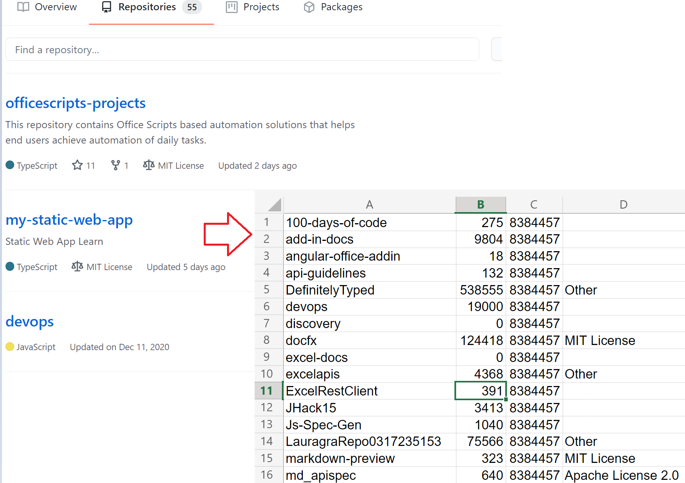

# <a name="use-external-fetch-calls-in-office-scripts"></a>在 Office 脚本中使用外部提取呼叫

此脚本获取有关用户存储库GitHub信息。 它显示了如何在 `fetch` 简单方案中使用。

你可以了解有关正在应用 API 参考中使用的 GItHub GITHUB [API。](https://docs.github.com/rest/reference/repos#list-repositories-for-a-user) 您还可以通过访问 Web 浏览器中的内容来查看原始 API 调用输出 (请务必将 {USERNAME} 占位符替换为 `https://api.github.com/users/{USERNAME}/repos` Github ID) 。



## <a name="sample-code-get-basic-information-about-users-github-repositories"></a>示例代码：获取有关用户数据库GitHub信息

```TypeScript
async function main(workbook: ExcelScript.Workbook) {

  // Replace the {USERNAME} placeholder with your GitHub username.
  const response = await fetch('https://api.github.com/users/{USERNAME}/repos');
  const repos: Repository[] = await response.json();
  
  const rows: (string | boolean | number)[][] = [];
  for (let repo of repos){ 
    rows.push([repo.id, repo.name, repo.license?.name, repo.license?.url])
  }
  const sheet = workbook.getActiveWorksheet();
  const range = sheet.getRange('A2').getResizedRange(rows.length - 1, rows[0].length - 1);
  range.setValues(rows);
  return;
}

interface Repository {
  name: string,
  id: string,
  license?: License 
}

interface License {
  name: string,
  url: string
}
```

## <a name="training-video-how-to-make-external-api-calls"></a>培训视频：如何进行外部 API 调用

[观看 Sudhi Ramamurthy 在 YouTube 上演练此示例](https://youtu.be/fulP29J418E)。
