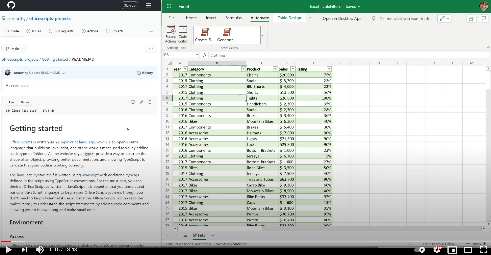
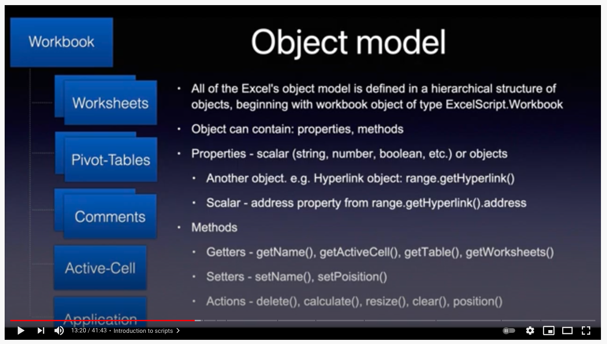
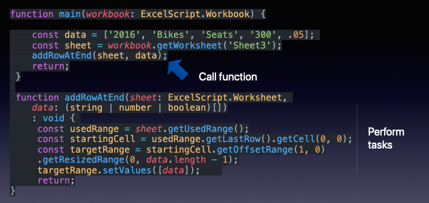
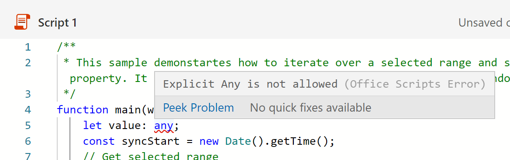
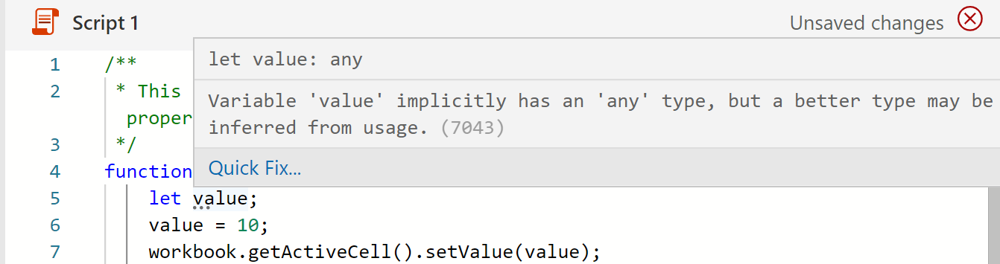

# <a name="getting-started"></a>入门

本节提供有关 Office 脚本的基础知识的详细信息，包括访问、环境、脚本基础知识和几个基本脚本模式。

## <a name="environment-setup"></a>环境设置

了解访问、环境和脚本编辑器的基础知识。

[](https://youtu.be/vvCtxsjPxo8 "Office 脚本应用程序的基础知识")

### <a name="access"></a>Access

Office Scripts requires admin settings available for Microsoft 365 administrator under **Settings**  >  **Org settings** Office  >  **Scripts**. 默认情况下，会为所有用户打开它。 有两个子设置，管理员可以打开和关闭它们。

* 在组织内部共享脚本的能力
* 在 Power Automate 中使用脚本的能力

您可以通过在 Excel 网页浏览器 (浏览器) 中打开文件并查看 Excel 功能区中是否显示"自动"选项卡，来判断您是否可以访问 Office 脚本。
如果仍然看不到"自动执行 **"选项卡，** 请查看 [此疑难解答部分](../../testing/troubleshooting.md#automate-tab-not-appearing-or-office-scripts-unavailable)。

### <a name="availability"></a>供应情况

Office 脚本仅适用于 Excel 网页版中的企业版 E3+ 许可证 (用户和 E1 帐户不支持) 。 Windows 和 Mac 上的 Excel 尚不支持 Office 脚本。

### <a name="scripts-and-editor"></a>脚本和编辑程序

代码编辑器内置于 Excel 网页版 (联机) 。 如果你已使用编辑器（如Visual Studio Code 或 Sublime），则此编辑体验将非常相似。
代码编辑器使用Visual Studio大多数快捷键在 Office 脚本编辑体验中也工作。 请查看以下快捷键讲义。

* [macOS](https://code.visualstudio.com/shortcuts/keyboard-shortcuts-macos.pdf)
* [Windows](https://code.visualstudio.com/shortcuts/keyboard-shortcuts-windows.pdf)

#### <a name="key-things-to-note"></a>要注意的关键内容

* Office 脚本仅适用于存储在 OneDrive for Business、SharePoint 网站和团队网站中的文件。
* 编辑器不会显示脚本的扩展名。 实际上，这些是 TypeScript 文件，但它们使用名为 的自定义扩展存储 `.osts` 。
* 脚本存储在你自己的 OneDrive for Business 文件夹中 `My Files/Documents/OfficeScripts` 。 无需管理此文件夹。 对于部件，你可以忽略这一方面，因为编辑器管理查看/编辑体验。
* 脚本不会存储为 Excel 文件的一部分。 它们单独存储。
* 你可以与 Excel 文件共享脚本，这实际上意味着你将脚本与文件链接，而不是附加它。 有权访问 Excel 文件的任何人也能够查看、运行或 **制作脚本** 副本。  与 VBA 宏相比，这是一个关键区别。
* 除非你共享脚本，否则其他人无法访问它，因为它驻留在你自己的库中。
* 无法从本地磁盘或自定义云位置链接脚本。 Office 脚本仅识别并运行上述 OneDrive 文件夹的预定义 (或共享脚本) 脚本。
* 在编辑过程中，文件会临时保存在浏览器中，但在关闭 Excel 窗口将其保存到 OneDrive 位置之前，必须保存脚本。 请不要忘记在编辑后保存文件。

## <a name="gentle-introduction-to-scripting"></a>脚本简介简介

Office 脚本是使用 TypeScript 语言编写的独立脚本，其中包含对选定的 Excel 工作簿执行一些自动化操作的说明。 所有自动化指令都自包含在脚本中，脚本无法调用或调用其他脚本。 所有脚本都存储在独立文件中，并存储在用户的 OneDrive 文件夹中。 可以录制新脚本、编辑录制的脚本或从头开始编写全新的脚本，所有这些都在内置编辑器界面中完成。 Office 脚本的最好的一部分是，它们不需要用户进一步设置。 没有外部库、网页或 UI 元素、设置等。所有环境设置都由 Office 脚本处理，它允许通过简单的 API 界面轻松而快速地访问自动化。

一些有助于了解如何编辑和浏览脚本的基本概念包括：

* 基本 TypeScript 语言语法
* 了解 `main` 函数和参数
* 对象和层次结构、方法、属性
* 数组 (集合) 导航和操作
* 类型定义
* 环境：记录/编辑、运行、检查结果、共享

本视频和部分详细介绍了其中一些概念。

[](https://youtu.be/8Zsrc1uaiiU "脚本的基础知识")

### <a name="language-typescript"></a>语言：TypeScript

[Office 脚本](../../index.md) 是使用 [TypeScript](https://www.typescriptlang.org/)语言编写的，该语言是一种基于 JavaScript (之一的开放源代码语言，它通过添加静态类型定义) 最常用的语言之一。 正如网站所说明的，提供一种方法来描述对象的形状，提供更好的文档，并允许 `Types` TypeScript 验证代码是否正常工作。

语言语法本身使用 [JavaScript](https://developer.mozilla.org/docs/Web/JavaScript) 编写，其他键入使用 TypeScript 约定在脚本中定义。 在大多数情况下，您可以将 Office 脚本视为使用 JavaScript 编写的。 必须了解 JavaScript 语言的基础知识，以开始 Office 脚本之旅;尽管你无需精通它，但可以开始你的自动化之旅。 使用 Office 脚本的操作录制器，您可以了解脚本语句，因为包含代码注释，您可以遵循和进行小型编辑。

允许脚本与 Excel 交互的 Office 脚本 API 是为可能没有太多编码背景的最终用户设计的。 API 可以同步调用，你无需了解高级主题，如承诺或回调。 Office 脚本 API 设计提供：

* 包含方法、getters/setters 的简单对象模型。
* 作为常规数组的易于访问的对象集合。
* 简单的错误处理选项。
* 优化了选定方案的性能，帮助用户专注于当前方案。

### <a name="main-function-the-scripts-starting-point"></a>`main` function：脚本的起始点

Office 脚本的执行从 函数 `main` 开始。 脚本是包含一个或多个函数以及类型、接口、变量等声明的单个文件。若要随脚本一起操作，请从 函数开始，因为 Excel 始终在您执行任何脚本时首先 `main` `main` 调用 函数。 函数将始终具有至少一个名为 (参数或) 参数，该参数只是一个标识脚本所针对的当前工作簿的 `main` `workbook` 变量名称。 你可以定义其他参数，以使用 Power Automate (脱机) 执行。

* `function main(workbook: ExcelScript.Workbook)`

可以将脚本组织为较小的函数，帮助实现代码的可重复性、清晰度等。其他函数可以位于主函数内部或外部，但始终位于同一文件中。 脚本是自包含的，只能使用在同一文件中定义的函数。 脚本无法调用或调用其他 Office 脚本。

因此，总之：

* `main`函数是任何脚本的入口点。 执行函数时，Excel 应用程序通过提供工作簿作为其第一个参数来调用此主函数。
* 在显示时保留第一个参数 `workbook` 及其类型声明很重要。 你可以向函数添加新参数 (请参阅下一节) 但第一个参数保持 `main` 为正常。


#### <a name="send-or-receive-data-from-other-apps"></a>发送或接收来自其他应用的数据

可以通过在 Power Automate 中运行脚本将 Excel 连接到 [组织的其他部分](https://flow.microsoft.com)。 详细了解在 [Power Automate 流中运行 Office 脚本](../../develop/power-automate-integration.md)。

从 Excel 接收数据或将数据发送到 Excel 的方式是通过 `main` 函数。 将它视为信息网关，允许在脚本中描述和使用传入和传出数据。 可以使用 数据类型 从脚本外部接收数据，并返回任何 TypeScript 识别的数据（如 、 、 或 在脚本中定义的接口形式的任何 `string` `string` `number` `boolean` 对象）。


#### <a name="use-functions-to-organize-and-reuse-code"></a>使用函数组织和重复使用代码

可以使用函数在脚本中组织和重复使用代码。



### <a name="objects-hierarchy-methods-properties-collections"></a>对象、层次结构、方法、属性、集合

Excel 的所有对象模型在对象的层次结构中定义，从类型 为 的 workbook 对象开始 `ExcelScript.Workbook` 。 对象可以包含方法、属性和其他对象。 对象使用 方法相互链接。 对象的方法可以返回另一个对象或对象集合。 使用代码编辑器的 IntelliSense (代码) 功能是浏览对象层次结构的一种很好的方法。 您还可以使用官方 [参考文档网站](/javascript/api/office-scripts/overview) 来跟踪对象之间的关系。

对象 [是](https://developer.mozilla.org/docs/Web/JavaScript/Reference/Global_Objects/Object) 一组属性，而属性是名称或键 (值) 之间的关联。 属性的值可以是一个函数，在这种情况下，该属性称为方法。 对于 Office 脚本对象模型，对象表示 Excel 文件中用户与之交互的内容，如图表、超链接、数据透视表等。它还可以表示对象的行为，如工作表的保护属性。

TypeScript 对象和属性与方法的主题相当深入。 为了开始使用脚本并提高工作效率，你可以记住一些基本内容：

* 对象和属性均使用点 (点) 表示法访问，对象位于 的左侧，属性或方法位于 `.` `.` 右侧。 示例 `hyperlink.address` `range.getAddress()` ：、。
* 属性在本质上是标量 (字符串、布尔值、数字) 。 例如，工作簿的名称、工作表的位置、表格是否具有页脚的值。
* 方法使用开放关闭括号"调用"或"执行"。 示例：`table.delete()`。 有时，参数在打开关闭的括号之间包含，以传递给函数 `range.setValue('Hello')` ：。 可以将许多参数传递给函数 (其协定/签名参数定义) 使用 分隔 `,` 。  例如：`worksheet.addTable('A1:D6', true)`。 您可以传递方法所需的任何类型的参数，如字符串、数字、布尔值，甚至是其他对象，例如 ，其中 是脚本中其他位置创建 `worksheet.addTable(targetRange, true)` `targetRange` 的对象。
* 方法可以返回标量属性 (名称、地址等) 或其他对象 (区域、图表) ，或者不返回任何 (例如方法) 的情况。 `delete` 通过声明变量或分配给现有变量，您可以接收该方法返回的值。 您可以在语句的左侧看到 ，例如 `const table = worksheet.addTable('A1:D6', true)` 。
* 大多数情况下，Office 脚本对象模型由包含用于链接 Excel 对象模型的各个部分的方法的对象组成。 很少遇到标量或对象值的属性。
* 在 Office 脚本中，Excel 对象模型方法必须包含开放式关闭括号。 不允许使用不带它们的方法 (例如将方法分配给变量) 。

让我们看一下对象上的一些 `workbook` 方法。

```TypeScript
function main(workbook: ExcelScript.Workbook) {
    // Return a boolean (true or false) setting of whether the workbook is set to auto-save or not. 
    const autoSave = workbook.getAutoSave(); 
    // Get workbook name.
    const name = workbook.getName();
    // Get active cell range object.
    const cell = workbook.getActiveCell();
    // Get table named SALES.
    const cell = workbook.getTable('SALES');
    // Get all slicer objects.
    const slicers = workbook.getSlicers();
}
```

在此示例中：

* 对象的方法 `workbook` （如 和 `getAutoSave()` ）返回 `getName()` 标量属性 (string、number、boolean) 。
* 方法（如 `getActiveCell()` 返回另一个对象）。
* `getTable()`此方法接受一个 (表名称的参数，) 并返回工作簿中的特定表。
* 该方法返回一个 (，该数组集合在很多位置) 工作簿中所有切片器对象 `getSlicers()` 的集合。

你会注意到，所有这些方法都有前缀，这只是 Office 脚本对象模型中使用的约定，用于传达 `get` 该方法将返回某些内容。 它们通常也称为"getters"。

有两种其他类型的方法，我们将在下一个示例中看到：

```TypeScript
function main(workbook: ExcelScript.Workbook) {
    // Get a worksheet named 'Sheet1.
    const sheet = workbook.getWorksheet('Sheet1'); 
    // Set name to SALES.
    sheet.setName('SALES');
    // Position the worksheet at the beginning.
    sheet.setPosition(0);
}
```

在此示例中：

* `setName()`方法为工作表设置一个新名称。 `setPosition()` 将位置设置到第一个单元格。
* 这些方法通过设置工作簿的属性或行为来修改 Excel 文件。 这些方法称为"setters"。
* 通常，"setter"具有配套"getter"，例如 `worksheet.getPosition` `worksheet.setPosition` 和 ，两者都是方法。

#### <a name="undefined-and-null-primitive-types"></a>`undefined` 和 `null` 基元类型

以下是您必须注意的两种基元数据类型：

1. 该值 [`null`](https://developer.mozilla.org/docs/Web/JavaScript/Reference/Global_Objects/null) 表示有意缺少任何对象值。 它是 JavaScript 的基元值之一，用于指示变量没有值。
1. 尚未分配值的变量的类型为 [`undefined`](https://developer.mozilla.org/docs/Web/JavaScript/Reference/Global_Objects/undefined) 。 如果要求值的变量没有分配的值，则方法或语句 `undefined` 也可以返回。

这两种类型会作为错误处理的一部分出现，如果未正确处理，则可能导致非常麻烦。 幸运的是，TypeScript/JavaScript 提供了一种检查变量的类型或 `undefined` 的方法 `null` 。 我们将在稍后部分讨论其中一些检查，包括错误处理。

#### <a name="method-chaining"></a>方法链接

可以使用点表示法连接从方法返回的对象，以缩短代码。 有时，此技术使代码易于阅读和管理。 但是，要注意一些内容。 让我们看一下以下示例。

下面的代码获取活动单元格和下一个单元格，然后设置值。 这是使用链接的良好候选项，因为此代码将一定会成功。

```TypeScript
function main(workbook: ExcelScript.Workbook) {
    workbook.getActiveCell().getOffsetRange(0,1).setValue('Next cell');
}
```

但是，以下代码 (获取名为 **SALES** 的表，并打开其带状列样式) 一个问题。

```TypeScript
function main(workbook: ExcelScript.Workbook) {
  workbook.getTable('SALES').setShowBandedColumns(true);
}
```

如果 **SALES** 表不存在，如何？ 脚本将失败，并返回错误 (如) ，因为返回 (这是一个指示没有表（如 `getTable('SALES')` `undefined` **SALES**) ）的 JavaScript 类型。 调用 `setShowBandedColumns` 上的 `undefined` 方法没有任何意义，即 ，因此脚本 `undefined.setShowBandedColumns(true)` 会出现错误。

```text
Line 2: Cannot read property 'setShowBandedColumns' of undefined
```

当引用或方法[](https://developer.mozilla.org/docs/Web/JavaScript/Reference/Operators/Optional_chaining)可能为 或 (这是 `undefined` JavaScript 用于指示未分配或非不存在的对象或结果) 来处理此情况时，可以使用可选的链接运算符，从而提供一种通过连接对象简化访问值的方法。 `null`

```TypeScript
function main(workbook: ExcelScript.Workbook) {
    // This line will not fail as the setShowBandedColumns method is executed only if the SALES table is present.
    workbook.getTable('SALES')?.setShowBandedColumns(true); 
}
```

如果要处理不存在的对象条件或由方法返回的类型，最好从 方法分配返回值并单独 `undefined` 处理。

```TypeScript
function main(workbook: ExcelScript.Workbook) {
    const salesTable = workbook.getTable('SALES');
    if (salesTable) {
        salesTable.setShowBandedColumns(true);
    } else { 
        // Handle this condition.
    }
}
```

#### <a name="get-object-reference"></a>获取对象引用

`workbook`对象在 函数中给予 `main` 你。 您可以开始使用 对象 `workbook` 并直接访问其方法。

```TypeScript
function main(workbook: ExcelScript.Workbook) {
    // Get workbook name.
    const name = workbook.getName();
    // Display name to console.
    console.log(name);
}
```

若要使用工作簿中的所有其他对象，请从 object 开始，然后向下转到层次结构，直到到达要 `workbook` 查找的对象。 可以通过使用对象的方法获取对象或检索对象集合来获取对象引用， `get` 如下所示：

```TypeScript
function main(workbook: ExcelScript.Workbook) {
    // Get the active worksheet.
    const sheet = workbook.getActiveWorksheet();
    // Fetch using an ID or key.
    const sheet = workbook.getWorksheet('SomeSheetName');
    // Invoke methods on the object.
    sheet.setPosition(0); 
    
    // Get collection of methods.
    const tables = sheet.getTables();
    console.log('Total tables in this sheet: ' + tables.length);
}
```

#### <a name="check-if-an-object-exists-then-delete-and-add"></a>检查对象是否存在，然后删除并添加

对于创建对象（如使用预定义名称）来说，最好始终删除可能存在的类似对象，然后添加它。 可以使用以下模式实现此要求。

```TypeScript
function main(workbook: ExcelScript.Workbook) {
  // Name of the worksheet to be added. 
  let name = "Index";
  // Check if the worksheet already exists. If not, add the worksheet.
  let sheet = workbook.getWorksheet('Index');
  if (sheet) {
    console.log(`Worksheet by the name ${name} already exists. Deleting it.`);
    // Call the delete method on the object to remove it. 
    sheet.delete();
  } 
    // Add a blank worksheet. 
  console.log(`Adding the worksheet named  ${name}.`)
  const indexSheet = workbook.addWorksheet("Index");
}

```

或者，要删除可能存在或不存在的对象，请使用以下模式。

```TypeScript
    // The ? preceding delete() will ensure that the API is only invoked if the object exists. 
    workbook.getWorksheet('Index')?.delete(); 
```

#### <a name="note-about-adding-an-object"></a>有关添加对象的注释

若要创建、插入或添加对象（如切片器、数据透视表、 **工作表等** ），请使用相应的 add_Object_ 方法。 此方法可用于其父对象。 例如， `addChart()` 方法可用于 `worksheet` 对象。 the **add_Object_** method returns the object it creates. 接收返回的值，并稍后在脚本中使用它。

```TypeScript
function main(workbook: ExcelScript.Workbook) {
  // Add object and get a reference to it. 
  const indexSheet = workbook.addWorksheet("Index");
  // Use it elsewhere in the script 
  console.log(indexSheet.getPosition());
}

```

或者，要删除可能存在或不存在的对象，请使用此模式：

```TypeScript
    workbook.getWorksheet('Index')?.delete(); // The ? preceding delete() will ensure that the API is only invoked if the object exists. 
```

#### <a name="collections"></a>收藏

集合是表、图表、列等对象，可以检索为数组并经过访问进行处理。 可以使用相应的方法检索集合，然后使用多种 TypeScript 数组遍历技术之一在循环中处理数据， `get` 例如：

* [`for` 或 `while`](https://developer.mozilla.org/docs/Web/JavaScript/Guide/Loops_and_iteration)
* [`for..of`](https://developer.mozilla.org/docs/Web/JavaScript/Reference/Statements/for...of)
* [`forEach`](https://developer.mozilla.org/docs/Web/JavaScript/Reference/Global_Objects/Array/forEach)

* [数组的语言基础知识](https://developer.mozilla.org//docs/Learn/JavaScript/First_steps/Arrays)

此脚本演示如何使用 Office 脚本 API 中支持的集合。 它使用随机颜色为文件的每个工作表选项卡着色。

```TypeScript
function main(workbook: ExcelScript.Workbook) {

  // Get all sheets as a collection.
  const sheets = workbook.getWorksheets();
  const names = sheets.map ((sheet) => sheet.getName());
  console.log(names);
  console.log(`Total worksheets inside of this workbook: ${sheets.length}`);
  // Get information from specific sheets within the collection.
  console.log(`First sheet name is: ${names[0]}`);
  if (sheets.length > 1) {
    console.log(`Last sheet's Id is: ${sheets[sheets.length -1].getId()}`);
  }
  // Color each worksheet with random color.
  for (const sheet of sheets) {
    sheet.setTabColor(`#${Math.random().toString(16).substr(-6)}`);
  }
}
```

## <a name="type-declarations"></a>类型声明

类型声明可帮助用户了解他们处理的变量的类型。 它有助于自动完成方法，并有助于进行开发时间质量检查。

您可以在脚本中的不同位置找到类型声明，包括函数声明、变量声明、IntelliSense定义等。

示例：

* `function main(workbook: ExcelScript.Workbook)`
* `let myRange: ExcelScript.Range;`
* `function getMaxAmount(range: ExcelScript.Range): number`

您可以在代码编辑器中轻松识别类型，因为它通常以不同的颜色显示。 通常， `:` 类型声明之前有一个冒号。  

在 TypeScript 中，写入类型是可选的，因为类型推断允许你获得大量功能，而无需编写其他代码。 大多数情况下，TypeScript 语言非常适用于推断变量类型。 但是，在某些情况下，如果语言无法清楚地标识类型，则 Office 脚本需要显式定义类型声明。 此外，Office 脚本 `any` 中不允许显式或隐式。 稍后将详细了解这一点。

### <a name="excelscript-types"></a>`ExcelScript` types

在 Office 脚本中，您将使用以下类型。

* 本机语言类型，如 `number` `string` `object` `boolean` 、、、、 `null` 等。
* Excel API 类型。 它们以 `ExcelScript` 开头。 例如， `ExcelScript.Range` `ExcelScript.Table` 、 等。
* 您可能在脚本 using 语句中定义的任何自定义 `interface` 接口。

接下来，请参阅每个组的示例。

**_本机语言类型_**

在下面的示例中，请注意已使用 `string` 、 `number` 和 `boolean` 的位置。 这些是本机 **TypeScript** 语言类型。

```TypeScript
function main(workbook: ExcelScript.Workbook)
{
  const table = workbook.getActiveWorksheet().getTables()[0];
  const sales = table.getColumnByName('Sales').getRange().getValues();
  console.log(sales);
  // Add 100 to each value.
  const revisedSales = salesAs1DArray.map(data => data as number + 100);
  // Add a column.
  table.addColumn(-1, revisedSales);  
}
/**
 * Extract a column from 2D array and return result.
 */
function extractColumn(data: (string | number | boolean)[][], index: number): (string | number | boolean)[] {

  const column = data.map((row) => {
    return row[index];
  })
  return column;
}
/**
 * Convert a flat array into a 2D array that can be used as range column.
 */
function convertColumnTo2D(data: (string | number | boolean)[]): (string | number | boolean)[][] {

  const columnAs2D = data.map((row) => {
    return [row];
  })
  return columnAs2D;
}
```

**_ExcelScript 类型_**

在下面的示例中，帮助程序函数采用两个参数。 第一个 `sheet` 类型为变量 `ExcelScript.Worksheet` 。

```TypeScript
function main(workbook: ExcelScript.Workbook) {
    const sheet = workbook.getWorksheet('Sheet5');
    const data = ['2016', 'Bikes', 'Seats', '1500', .05];
    addRow(sheet, data);
    return;
}

function addRow(sheet: ExcelScript.Worksheet, data: (string | number | boolean)[]): void {

    const usedRange = sheet.getUsedRange();
    let startCell: ExcelScript.Range;
    // If the sheet is empty, then use A1 as starting cell for update.
    if (usedRange) { 
      startCell = usedRange.getLastRow().getCell(0, 0).getOffsetRange(1, 0);
    } else {
      startCell = sheet.getRange('A1');
    }
    console.log(startCell.getAddress());
    const targetRange = startCell.getResizedRange(0, data.length - 1);      
    targetRange.setValues([data]);
    return;
}
```

**_自定义类型_**

自定义接口 `ReportImages` 用于将图像返回到另一个流操作。 该 `main` 函数声明包括指示 TypeScript 正在返回该 `: ReportImages` 类型的对象的指令。

```TypeScript
function main(workbook: ExcelScript.Workbook): ReportImages {
  let chart = workbook.getWorksheet("Sheet1").getCharts()[0];
  const table = workbook.getWorksheet('InvoiceAmounts').getTables()[0];
  
  const chartImage = chart.getImage();
  const tableImage = table.getRange().getImage();
  return {
    chartImage,
    tableImage
  }
}

interface ReportImages {
  chartImage: string
  tableImage: string
}
```

### <a name="type-assertion-overriding-the-type"></a>类型断言 (覆盖类型) 

如 TypeScript [文档](https://www.typescriptlang.org/docs/handbook/basic-types.html#type-assertions) 所规定，"有时你最终会了解比 TypeScript 更多的值。 通常，当您知道某实体的类型可能比其当前类型更具体时，就会发生这种情况。 类型断言是告诉编译器"信任我，我了解我正在做什么"的一种方法。 类型断言与其他语言中的类型转换类似，但它不执行数据的特殊检查或重构。 它不会影响运行时，并且完全由编译器使用。"

您可以使用 关键字或尖括号断言类型， `as` 如下面的代码所示。

```TypeScript
function main(workbook: ExcelScript.Workbook) {
  let data = workbook.getActiveCell().getValue();
  // Since the add10 function only accepts number, assert data's type as number, otherwise the script cannot be run.
  const answer1 = add10(data as number);
  const answer2 = add10(<number> data);
}

function add10(data: number) { 
  return data + 10;
}
```

#### <a name="any-type-in-the-script"></a>脚本中的"any"类型

[TypeScript 网站指出](https://www.typescriptlang.org/docs/handbook/basic-types.html#any)：

  在某些情况下，并非所有类型信息都可用，或者其声明会花一些不恰当的努力。 对于在没有 TypeScript 或第三方库的情况下编写的代码中的值，可能会出现这些错误。 在这些情况下，我们可能需要选择退出类型检查。 为此，我们将这些值标记为 `any` 以下类型：

  ```TypeScript
  declare function getValue(key: string): any;
  // OK, return value of 'getValue' is not checked
  const str: string = getValue("myString");
  ```

**不允许 `any` 显式**

```TypeScript
// This is not allowed
let someVariable: any; 
```

类型为 Office 脚本处理 Excel API 的方式 `any` 带来了挑战。 当将变量发送到 Excel API 进行处理时，会导致问题。 了解脚本中使用的变量类型对于处理脚本至关重要，因此禁止对具有类型的任何变量进行 `any` 显式定义。 如果脚本中声明了类型的任何 (，在运行脚本脚本之前) 出现编译时 `any` 错误。 You will see an error in the editor as well.




在上一图像中显示的代码中，指示第 5 行 `[5, 16] Explicit Any is not allowed` 16 列声明 `any` 类型。 这可以帮助您找到包含错误的代码行。

若要解决此问题，请始终声明变量的类型。

如果你不确定变量的类型，TypeScript 中的一个酷技巧允许你定义 [联合类型](https://www.typescriptlang.org/docs/handbook/unions-and-intersections.html)。 这可用于变量来保存区域值，可以是许多类型。

```TypeScript
// Define value as a union type rather than 'any' type.
let value: (string | number | boolean);
value = someValue_from_another_source;
//...
someRange.setValue(value);
```

### <a name="type-inference"></a>类型推断

在 TypeScript 中，当没有[](https://www.typescriptlang.org/docs/handbook/type-inference.html)显式类型注释时，有几种使用类型推断来提供类型信息的位置。 例如，x 变量的类型被推断为以下代码中的一个数字。

```TypeScript
let x = 3;
//  ^ = let x: number
```

这种推断发生在初始化变量和成员、设置参数默认值以及确定函数返回类型时。

### <a name="no-implicit-any-rule"></a>no-implicit-any 规则

脚本需要用于显式或隐式声明的变量类型。 如果 TypeScript 编译器无法确定变量 (或者因为类型未显式声明或类型推断无法进行) ，则你将在运行脚本) 之前收到编译时间错误 (错误。 You will see an error in the editor as well.



以下脚本有编译时间错误，因为声明变量时没有类型，并且 TypeScript 无法确定声明时的类型。

```TypeScript
function main(workbook: ExcelScript.Workbook) {
    // The variable 'value' gets 'any' type
    // because no type is declared.
    let value; 
    // Even when a number type is assigned,
    // the type of 'value' remains any.
    value = 10; 
    // The following statement fails because
    // Office Scripts can't send an argument
    // of type 'any' to Excel for processing.
    workbook.getActiveCell().setValue(value);
    return;
}
```

```TypeScript
function main(workbook: ExcelScript.Workbook) {
    // The variable 'cell' gets 'any' type
    // because no type is defined.
    let cell; 
    cell = workbook.getActiveCell().getValue();
    // Office Scripts can't assign Range type object
    // to a variable of 'any' type.
    console.log(cell.getValue());
    return;
}
```

若要避免此错误，请改为使用以下模式。 在每种情况下，变量及其类型都同时声明。

```TypeScript
function main(workbook: ExcelScript.Workbook) {
    const value: number = 10; 
    workbook.getActiveCell().setValue(value);
    return;
}
```

```TypeScript
function main(workbook: ExcelScript.Workbook) {
    const cell: ExcelScript.Range = workbook.getActiveCell().getValue();
    console.log(cell.getValue()); 
    return;
}
```

## <a name="error-handling"></a>错误处理

Office 脚本错误可以分为以下类别之一。

1. 编辑器中显示的编译时警告
1. 编译时错误，该错误在您运行时出现，但在执行开始之前出现
1. 运行时错误

可以在编辑器中用红色波浪下划线标识编辑器警告：


有时，还可能会看到橙色警告下划线和灰色信息性消息。 应仔细检查它们，尽管它们不会导致错误。

无法区分编译时错误和运行时错误，因为两条错误消息看起来相同。 当您实际执行脚本时，这两者均会发生。 下图显示了编译时错误和运行时错误的示例。


在这两种情况下，你将看到发生错误的行号。 然后，你可以检查代码、修复问题，然后再次运行。

以下是避免运行时错误的一些最佳实践。

### <a name="check-for-object-existence-before-deletion"></a>在删除之前检查对象是否存在

或者，要删除可能存在或不存在的对象，请使用此模式：

```TypeScript
// The ? ensures that the delete() API is only invoked if the object exists.
workbook.getWorksheet('Index')?.delete();

// Alternative:
const indexSheet = workbook.getWorksheet('Index');
if (indexSheet) {
    indexSheet.delete();
}
```

### <a name="do-pre-checks-at-the-beginning-of-the-script"></a>在脚本开头进行预检查

最佳做法是，在运行脚本之前，始终确保所有输入都存在于 Excel 文件中。 您可能已对工作簿中的对象进行了某些假设。 如果不存在这些对象，则脚本在读取对象或其数据时可能会遇到错误。 与其在部分更新或处理完成后中间开始处理和错误，不如在脚本开头执行所有预检查。

例如，以下脚本需要显示名为 Table1 和 Table2 的两个表。 因此，脚本将检查其状态，并结束于语句和相应的 `return` 消息（如果不存在）。

```TypeScript
function main(workbook: ExcelScript.Workbook) {

  // Tables that should be in the workbook for the script to work:
  const TargetTableName = 'Table1';
  const SourceTableName = 'Table2';

  // Get the table objects.
  let targetTable = workbook.getTable(TargetTableName);
  let sourceTable = workbook.getTable(SourceTableName);

  if (!targetTable || !sourceTable) {
    console.log(`Required tables missing - Check that both source (${TargetTableName}) and target (${SourceTableName}) tables are present before running the script.`);
    return;
  }

  // Continue....
}
```

如果验证以确保输入数据在单独的函数中发生，则通过从 函数发出 语句结束脚本 `return` `main` 非常重要。

在下面的示例中， `main` 函数调用 `inputPresent` 函数以执行预检查。 `inputPresent` 返回一个 boolean (`true` 或 `false`) 指示所有必需的输入是否全部存在。 然后，函数负责发出语句 (即从函数内) `main` `return` `main` 立即结束脚本。

```TypeScript
function main(workbook: ExcelScript.Workbook) {

  // Get the table objects.
  if (!inputPresent(workbook)) {
    return;
  }

  // Continue....
}

function inputPresent( workbook: ExcelScript.Workbook): boolean {

  // Tables that should be in the workbook for the script to work:
  const TargetTableName = 'Table1';
  const SourceTableName = 'Table2';

  // Get the table objects.
  let targetTable = workbook.getTable(TargetTableName);
  let sourceTable = workbook.getTable(SourceTableName);

  if (!targetTable || !sourceTable) {
    console.log(`Required tables missing - Check that both source (${TargetTableName}) and target (${SourceTableName}) tables are present before running the script.`);
    return false;
  }
  return true;
}
```

### <a name="when-to-abort-throw-the-script"></a>何时中止 `throw` () 脚本  

大多数情况下，不需要中止脚本 () `throw` 脚本。 这是因为脚本通常会通知用户脚本由于问题而无法运行。 在大多数情况下，用一条错误消息和函数中的语句结束脚本 `return` `main` 就足够了。

但是，如果脚本作为 Power Automate 的一部分运行，则当不满足某些条件时，您可能需要中止流。 因此，不要出错，而应发出语句来中止脚本，以便任何后续代码语句 `return` `throw` 不会运行，这一点很重要。

```TypeScript
function main(workbook: ExcelScript.Workbook) {

  // Tables that should be in the workbook for the script to work:
  const TargetTableName = 'Table1';
  const SourceTableName = 'Table2';

  // Get the table objects.
  let targetTable = workbook.getTable(TargetTableName);
  let sourceTable = workbook.getTable(SourceTableName);

  if (!targetTable || !sourceTable) {
    // Abort script.
    throw `Required tables missing - Check that both source (${TargetTableName}) and target (${SourceTableName}) tables are present before running the script.`;
  }
  
```

如下一节所述，另一种情况是当你具有多个函数时 (调用调用 等) 这会使传播错误 `main` `functionX` `functionY` 变得困难。 从带消息的嵌套函数中止/引发可能比返回错误一向多到多返回一条 `main` `main` 错误消息要容易。

### <a name="when-to-use-trycatch-throw-exception"></a>何时使用 try.。catch (throw exception) 

该技术 [`try..catch`](https://developer.mozilla.org/docs/Web/JavaScript/Reference/Statements/try...catch) 是一种检测 API 调用是否失败的方法，并处理脚本中的该错误。 检查 API 的返回值以验证其是否成功完成可能很重要。

请考虑以下示例代码段。

```TypeScript
function main(workbook: ExcelScript.Workbook) {

  // Somewhere in the script, perform a large data update.
  range.setValues(someLargeValues);

}
```

`setValues()`调用可能会失败，并会导致脚本失败。 你可能希望在代码中处理此条件，并可能自定义错误消息或将更新分解为较小的单元等。在这种情况下，了解 API 返回错误并解释或处理该错误很重要。

```TypeScript
try {
    range.setValues(someLargeValues);
} catch (error) {
    console.log(`The script failed to update the values at location ____. Please inspect and run again.`);
    console.log(error);
    return; // End script (assuming this is in main function).
}

// OR...

try {
    range.setValues(someLargeValues);
} catch (error) {
    console.log(`The script failed to update the values at location ____. Trying a different approach`);
    handleUpdatesInSmallerChunks(someLargeValues);
}

// Continue...
}
```

另一种情况是 main 函数调用另一个函数，而该函数又调用另一个 (函数，等等。) ，并且你关心的 API 调用在底部函数中向下发生。 将错误一路传播到上可能不可行 `main` 或不方便。 在这种情况下，在底部函数中引发错误将最为方便。

```TypeScript

function main(workbook: ExcelScript.Workbook) {
    ...
    updateRangeInChunks(sheet.getRange("B1"), data);
    ...
}

function updateRangeInChunks(
    ...
    updateNextChunk(startCell, values, rowsPerChunk, totalRowsUpdated);
    ...
}

function updateTargetRange(
      targetCell: ExcelScript.Range,
      values: (string | boolean | number)[][]
    ) {
    const targetRange = targetCell.getResizedRange(values.length - 1, values[0].length - 1);
    console.log(`Updating the range: ${targetRange.getAddress()}`);
    try {
      targetRange.setValues(values);
    } catch (e) {
      throw `Error while updating the whole range: ${JSON.stringify(e)}`;
    }
    return;
}
```

*警告*： `try..catch` 在循环内使用会降低脚本的速度。 避免在循环内部或循环内使用它。

## <a name="range-basics"></a>区域基础

在继续您的旅程之前，请查看 Range [Basics。](range-basics.md)

## <a name="basic-performance-considerations"></a>基本性能注意事项

### <a name="avoid-slow-operations-in-the-loop"></a>避免循环中运行缓慢的操作

在循环语句内部/周围执行某些操作（如 、 等） `for` `for..of` `map` `forEach` 会导致性能变慢。 避免以下 API 类别。

* `get*` API

读取循环之外所需的全部数据，而不是在循环内读取数据。 有时，很难避免在循环内读取;在这种情况下，请确保循环计数不是太大或分批管理它们，以避免必须循环访问大型数据结构。

注意：如果你处理的范围/数据非常大 (假设 >100，000 个单元格) ，你可能需要使用高级技术，例如将读取/写入分成多个区块。 以下视频确实适用于中小型数据设置。 对于大型数据集，请参阅 [高级数据写入方案](write-large-dataset.md)。

[](https://youtu.be/lsR_GvVW3Pg "显示读写优化提示的视频")

* `console.log` 语句 (请参阅以下示例) 

```TypeScript
// Color each cell with random color.
for (let row = 0; row < rows; row++) {
    for (let col = 0; col < cols; col++) {
        range
            .getCell(row, col)
            .getFormat()
            .getFill()
            .setColor(`#${Math.random().toString(16).substr(-6)}`);
        /* Avoid such console.log inside loop */
        // console.log("Updating" + range.getCell(row, col).getAddress());
    }
}
```

* `try {} catch ()` 语句

避免异常 `for` 处理循环。 内部循环和外部循环。

## <a name="note-to-vba-developers"></a>VBA 开发人员注意事项

TypeScript 语言在语法和命名约定方面均与 VBA 不同。

查看以下等效代码段。

```vba
Worksheets("Sheet1").Range("A1:G37").Clear
```

```TypeScript
workbook.getWorksheet('Sheet1').getRange('A1:G37').clear(ExcelScript.ClearApplyTo.all);
```

有关 TypeScript 的一些说明：

* 您可能会注意到，所有方法都需要有要执行的开放式关闭括号。 参数的传递方式相同，但某些参数可能需要执行 (，即必需参数与可选) 。
* 命名约定遵循 camelCase 而不是 PascalCase 约定。
* 方法通常 `get` 具有 `set` 或 前缀，用于指示它是读取还是写入对象成员。
* 代码块由左大括号定义和标识 `{` `}` ：。 条件、语句、 `if` `while` `for` 循环、函数定义等需要块。
* 函数可以调用其他函数，甚至可以在函数中定义函数。

总的来说，TypeScript 是一种不同的语言，它们之间有几个相似之处。 但是，Office 脚本 API 本身使用类似的术语和数据模型 (对象模型) 层次结构作为 VBA API，这应该可以帮助您四处导航。
