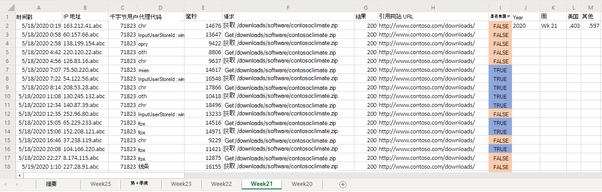
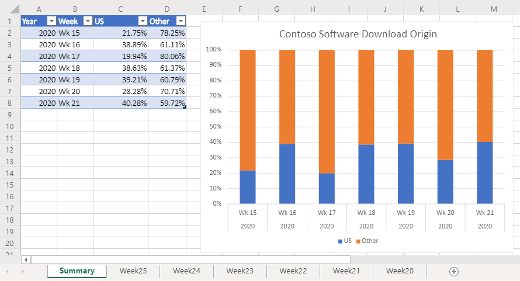

# <a name="office-scripts-sample-scenario-analyze-web-downloads"></a>Office 脚本示例方案：分析 web 下载

在这种情况下，您将负责分析来自公司网站的下载报告。 此分析的目标是确定 web 流量是来自世界各地还是其他地方。

您的同事将原始数据上传到工作簿。 每周的数据集都有自己的工作表。 还有一个显示每周趋势的表格和图表的**摘要**工作表。

您将开发一个脚本，用于分析活动工作表中每周的下载数据。 它将分析与每个下载关联的 IP 地址，并确定是否来自美国。 该答案将作为布尔值（"TRUE" 或 "FALSE"）插入到工作表中，条件格式将应用于这些单元格。 将在工作表上汇总 IP 地址位置结果，并将其复制到摘要表。

## <a name="scripting-skills-covered"></a>涵盖的脚本技能

- 文本解析
- 脚本中的 Subfunctions
- 条件格式
- 表格

## <a name="demo-video"></a>演示视频

此示例是 demoed 年2月2020的 Office 外接程序开发人员社区呼叫的一部分。

> [!VIDEO https://www.youtube.com/embed/vPEqbb7t6-Y?start=154]

## <a name="setup-instructions"></a>设置说明

1. 将<a href="analyze-web-downloads.xlsx">analyze-web-downloads.xlsx</a>下载到你的 OneDrive。

2. 使用适用于 web 的 Excel 打开工作簿。

3. 在 "**自动化**" 选项卡上，打开**代码编辑器**。

4. 在 "**代码编辑器**" 任务窗格中，按 "**新建脚本**"，并将以下脚本粘贴到编辑器中。

    ```TypeScript
    function main(workbook: ExcelScript.Workbook) {
      // Get the Summary worksheet and table.
      let summaryWorksheet = workbook.getWorksheet("Summary");
      let summaryTable = summaryWorksheet?.getTable("Table1");
      if (!summaryWorksheet || !summaryTable) {
          console.log("The script expects the Summary worksheet with a summary table named Table1. Please download the correct template and try again.");
          return;
      }
  
      // Get the current worksheet.
      let currentWorksheet = workbook.getActiveWorksheet();
      if (!currentWorksheet.getName().toLocaleLowerCase().startsWith("week")) {
          console.log("Please switch worksheet to one of the weekly data sheets and try again.")
          return;
      }
  
      // Get the values of the active range of the active worksheet.
      let logRange = currentWorksheet.getUsedRange();
  
        if (logRange.getColumnCount() !== 8) {
        console.log(`Verify that you are on the correct worksheet. Either the week's data has been already processed or the content is incorrect. The following columns are expected: ${[
          "Time Stamp", "IP Address", "kilobytes", "user agent code", "milliseconds", "Request", "Results", "Referrer"
        ]}`);
        return;
      }
      // Get the range that will contain TRUE/FALSE if the IP address is from the United States (US).
      let isUSColumn = logRange
          .getLastColumn()
          .getOffsetRange(0, 1);
  
      // Get the values of all the US IP addresses.
      let ipRange = workbook.getWorksheet("USIPAddresses").getUsedRange();
      let ipRangeValues = ipRange.getValues();
      let logRangeValues = logRange.getValues();
      // Remove the first row.
      let topRow = logRangeValues.shift();
      console.log(`Analyzing ${logRangeValues.length} entries.`);
  
      // Create a new array to contain the boolean representing if this is a US IP address.
      let newCol = [];
  
      // Go through each row in worksheet and add Boolean.
      for (let i = 0; i < logRangeValues.length; i++) {
          let curRowIP = logRangeValues[i][1];
          if (findIP(ipRangeValues, ipAddressToInteger(curRowIP)) > 0) {
              newCol.push([true]);
          } else {
              newCol.push([false]);
          }
      }
  
      // Remove the empty column header and add proper heading.
      newCol = [["Is US IP"], ...newCol];
  
      // Write the result to the spreadsheet.
      console.log(`Adding column to indicate whether IP belongs to US region or not at address: ${isUSColumn.getAddress()}`);
      console.log(newCol.length);
      console.log(newCol);
      isUSColumn.setValues(newCol);
  
      // Call the local function to add summary data to the worksheet.
      addSummaryData();
  
      // Call the local function to apply conditional formatting.
  
      applyConditionalFormatting(isUSColumn);
  
      // Autofit columns.
      currentWorksheet.getUsedRange().getFormat().autofitColumns();
  
      // Get the calculated summary data.
      let summaryRangeValues = currentWorksheet.getRange("J2:M2").getValues();
  
      // Add the corresponding row to the summary table.
      summaryTable.addRow(null, summaryRangeValues[0]);
      console.log("Complete.");
      return;

    /**
     * A function to add summary data on the worksheet.
     */
    function addSummaryData() {
        // Add a summary row and table.
        let summaryHeader = [["Year", "Week", "US", "Other"]];
        let countTrueFormula =
            "=COUNTIF(" + isUSColumn.getAddress() + ', "=TRUE")/' + (newCol.length - 1);
        let countFalseFormula =
            "=COUNTIF(" + isUSColumn.getAddress() + ', "=FALSE")/' + (newCol.length - 1);

        let summaryContent = [
            [
                '=TEXT(A2,"YYYY")',
                '=TEXTJOIN(" ", FALSE, "Wk", WEEKNUM(A2))',
                countTrueFormula,
                countFalseFormula
            ]
        ];
        let summaryHeaderRow = currentWorksheet
            .getRange("J1:M1");
        let summaryContentRow = currentWorksheet
            .getRange("J2:M2");
        console.log("2");

        summaryHeaderRow.setValues(summaryHeader);
        console.log("3");

        summaryContentRow.setValues(summaryContent);
        console.log("4");

        let formats = [[".000", ".000"]];
        summaryContentRow
            .getOffsetRange(0, 2)
            .getResizedRange(0, -2).setNumberFormats(formats);
        }
    }
    /**
     * Apply conditional formatting based on TRUE/FALSE values of the Is US IP column.
     */
    function applyConditionalFormatting(isUSColumn: ExcelScript.Range) {
        // Add conditional formatting to the new column.
        let conditionalFormatTrue = isUSColumn.addConditionalFormat(
            ExcelScript.ConditionalFormatType.cellValue
        );
        let conditionalFormatFalse = isUSColumn.addConditionalFormat(
            ExcelScript.ConditionalFormatType.cellValue
        );
        // Set TRUE to light blue and FALSE to light orange.
        conditionalFormatTrue.getCellValue().getFormat().getFill().setColor("#8FA8DB");
        conditionalFormatTrue.getCellValue().setRule({
            formula1: "=TRUE",
            operator: ExcelScript.ConditionalCellValueOperator.equalTo
        });
        conditionalFormatTrue.getCellValue().getFormat().getFill().setColor("#F8CCAD");
        conditionalFormatTrue.getCellValue().setRule({
            formula1: "=FALSE",
            operator: ExcelScript.ConditionalCellValueOperator.equalTo
        });
    }
    /**
     * Translate an IP address into an integer.
     * @param ipAddress: IP address to verify.
     */
    function ipAddressToInteger(ipAddress: string): number {
        // Split the IP address into octets.
        let octets = ipAddress.split(".");

        // Create a number for each octet and do the math to create the integer value of the IP address.
        let fullNum =
            // Define an arbitrary number for the last octet.
            111 +
            parseInt(octets[2]) * 256 +
            parseInt(octets[1]) * 65536 +
            parseInt(octets[0]) * 16777216;
        return fullNum;
    }
    /**
     * Return the row number where the ip address is found.
     * @param ipLookupTable IP look-up table.
     * @param n IP address to number value.  
     */
    function findIP(ipLookupTable: number[][], n: number): number {
        for (let i = 0; i < ipLookupTable.length; i++) {
            if (ipLookupTable[i][0] <= n && ipLookupTable[i][1] >= n) {
                return i;
            }
        }
        return -1;
    }
    ```

5. 重命名脚本以**分析 Web 下载**并保存它。

## <a name="running-the-script"></a>运行脚本

导航到任意**一周 \* \* **工作表，并运行**分析 Web 下载**脚本。 该脚本将应用在当前工作表上标签的条件格式和位置。 它还将更新**摘要**工作表。

### <a name="before-running-the-script"></a>运行脚本之前


### <a name="after-running-the-script"></a>运行脚本后




