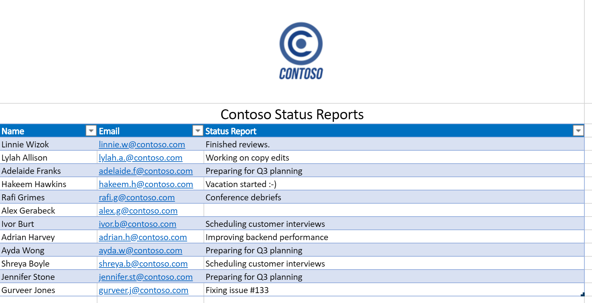

# <a name="office-scripts-sample-scenario-automated-task-reminders"></a><span data-ttu-id="88d9b-103">Office 脚本示例方案：自动任务提醒</span><span class="sxs-lookup"><span data-stu-id="88d9b-103">Office Scripts sample scenario: Automated task reminders</span></span>

<span data-ttu-id="88d9b-104">在这种情况下，您正在管理项目。</span><span class="sxs-lookup"><span data-stu-id="88d9b-104">In this scenario you're managing a project.</span></span> <span data-ttu-id="88d9b-105">您可以使用 Excel 工作表每月跟踪雇员的状态。</span><span class="sxs-lookup"><span data-stu-id="88d9b-105">You use an Excel worksheet to track your employees' status every month.</span></span> <span data-ttu-id="88d9b-106">您通常需要提醒用户填写其状态，因此您已决定自动执行该提醒过程。</span><span class="sxs-lookup"><span data-stu-id="88d9b-106">You often need to remind people to fill out their status, so you've decided to automate that reminder process.</span></span>

<span data-ttu-id="88d9b-107">你将创建一个电源自动流到邮件人员缺少状态字段，并将其响应应用到电子表格。</span><span class="sxs-lookup"><span data-stu-id="88d9b-107">You'll create a Power Automate flow to message people with missing status fields and apply their responses to the spreadsheet.</span></span> <span data-ttu-id="88d9b-108">若要执行此操作，您将开发一对用于处理工作簿的脚本。</span><span class="sxs-lookup"><span data-stu-id="88d9b-108">To do this, you'll develop a pair of scripts to handle the working with the workbook.</span></span> <span data-ttu-id="88d9b-109">第一个脚本获取具有空状态的人员列表，第二个脚本在右侧行中添加一个状态字符串。</span><span class="sxs-lookup"><span data-stu-id="88d9b-109">The first script gets a list of people with blank statuses and the second script adds a status string to the right row.</span></span> <span data-ttu-id="88d9b-110">您还将使用 [工作组自适应卡片](/microsoftteams/platform/task-modules-and-cards/what-are-cards) ，让员工直接从通知中输入其状态。</span><span class="sxs-lookup"><span data-stu-id="88d9b-110">You'll also make use of [Teams Adaptive Cards](/microsoftteams/platform/task-modules-and-cards/what-are-cards) to have employees enter their status directly from the notification.</span></span>

## <a name="scripting-skills-covered"></a><span data-ttu-id="88d9b-111">涵盖的脚本技能</span><span class="sxs-lookup"><span data-stu-id="88d9b-111">Scripting skills covered</span></span>

- <span data-ttu-id="88d9b-112">以自动执行的功能创建流</span><span class="sxs-lookup"><span data-stu-id="88d9b-112">Create flows in Power Automate</span></span>
- <span data-ttu-id="88d9b-113">将数据传递给脚本</span><span class="sxs-lookup"><span data-stu-id="88d9b-113">Pass data to scripts</span></span>
- <span data-ttu-id="88d9b-114">从脚本返回数据</span><span class="sxs-lookup"><span data-stu-id="88d9b-114">Return data from scripts</span></span>
- <span data-ttu-id="88d9b-115">工作组自适应卡片</span><span class="sxs-lookup"><span data-stu-id="88d9b-115">Teams Adaptive Cards</span></span>
- <span data-ttu-id="88d9b-116">表格</span><span class="sxs-lookup"><span data-stu-id="88d9b-116">Tables</span></span>

## <a name="prerequisites"></a><span data-ttu-id="88d9b-117">先决条件</span><span class="sxs-lookup"><span data-stu-id="88d9b-117">Prerequisites</span></span>

<span data-ttu-id="88d9b-118">此方案使用 [Power 自动化](https://flow.microsoft.com) 和 [Microsoft 团队](https://www.microsoft.com/microsoft-365/microsoft-teams/group-chat-software)。</span><span class="sxs-lookup"><span data-stu-id="88d9b-118">This scenario uses [Power Automate](https://flow.microsoft.com) and [Microsoft Teams](https://www.microsoft.com/microsoft-365/microsoft-teams/group-chat-software).</span></span> <span data-ttu-id="88d9b-119">你将需要与用于开发 Office 脚本的帐户相关联。</span><span class="sxs-lookup"><span data-stu-id="88d9b-119">You will need both associated with the account that you use for developing Office Scripts.</span></span> <span data-ttu-id="88d9b-120">若要免费访问 Microsoft 开发人员订阅以了解和使用这些应用程序，请考虑加入 [microsoft 365 开发人员计划](https://developer.microsoft.com/microsoft-365/dev-program)。</span><span class="sxs-lookup"><span data-stu-id="88d9b-120">For free access to a Microsoft Developer subscription to learn about and work with these applications, consider joining the [Microsoft 365 Developer Program](https://developer.microsoft.com/microsoft-365/dev-program).</span></span>

## <a name="setup-instructions"></a><span data-ttu-id="88d9b-121">设置说明</span><span class="sxs-lookup"><span data-stu-id="88d9b-121">Setup instructions</span></span>

1. <span data-ttu-id="88d9b-122">将 <a href="task-reminders.xlsx">task-reminders.xlsx</a> 下载到你的 OneDrive。</span><span class="sxs-lookup"><span data-stu-id="88d9b-122">Download <a href="task-reminders.xlsx">task-reminders.xlsx</a> to your OneDrive.</span></span>

2. <span data-ttu-id="88d9b-123">在 Excel 中的 web 上打开工作簿。</span><span class="sxs-lookup"><span data-stu-id="88d9b-123">Open the workbook in Excel on the web.</span></span>

3. <span data-ttu-id="88d9b-124">在 " **自动化** " 选项卡上，打开 **代码编辑器**。</span><span class="sxs-lookup"><span data-stu-id="88d9b-124">Under the **Automate** tab, open the **Code Editor**.</span></span>

4. <span data-ttu-id="88d9b-125">首先，我们需要一个脚本来获取电子表格中缺少状态报告的所有员工。</span><span class="sxs-lookup"><span data-stu-id="88d9b-125">First, we need a script to get all the employees with status reports that are missing from the spreadsheet.</span></span> <span data-ttu-id="88d9b-126">在 " **代码编辑器** " 任务窗格中，按 " **新建脚本** "，并将以下脚本粘贴到编辑器中。</span><span class="sxs-lookup"><span data-stu-id="88d9b-126">In the **Code Editor** task pane, press **New Script** and paste the following script into the editor.</span></span>

    ```typescript
    /**
     * This script looks for missing status reports in a project management table.
     *
     * @returns An array of Employee objects (containing their names and emails).
     */
    function main(workbook: ExcelScript.Workbook): Employee[] {
      // Get the first worksheet and the first table on that worksheet.
      let sheet = workbook.getFirstWorksheet()
      let table = sheet.getTables()[0];

      // Give the column indices names matching their expected content.
      const NAME_INDEX = 0;
      const EMAIL_INDEX = 1;
      const STATUS_REPORT_INDEX = 2;

      // Get the data for the whole table.
      let bodyRangeValues = table.getRangeBetweenHeaderAndTotal().getValues();

      // Create the array of Employee objects to return.
      let people: Employee[] = [];

      // Loop through the table and check each row for completion.
      for (let i = 0; i < bodyRangeValues.length; i++) {
        let row = bodyRangeValues[i];
        if (row[STATUS_REPORT_INDEX] === "") {
          // Save the email to return.
          people.push({ name: row[NAME_INDEX].toString(), email: row[EMAIL_INDEX].toString() });
        }
      }

      // Log the array to verify we're getting the right rows.
      console.log(people);

      // Return the array of Employees.
      return people;
    }

    /**
     * An interface representing an employee.
     * An array of Employees will be returned from the script
     * for the Power Automate flow.
     */
    interface Employee {
      name: string;
      email: string;
    }
    ```

5. <span data-ttu-id="88d9b-127">使用名称 " **获取人员**" 保存脚本。</span><span class="sxs-lookup"><span data-stu-id="88d9b-127">Save the script with the name **Get People**.</span></span>

6. <span data-ttu-id="88d9b-128">接下来，我们需要使用第二个脚本来处理状态报告卡，并将新信息放入电子表格中。</span><span class="sxs-lookup"><span data-stu-id="88d9b-128">Next, we need a second script to process the status report cards and put the new information in the spreadsheet.</span></span> <span data-ttu-id="88d9b-129">在 " **代码编辑器** " 任务窗格中，按 " **新建脚本** "，并将以下脚本粘贴到编辑器中。</span><span class="sxs-lookup"><span data-stu-id="88d9b-129">In the **Code Editor** task pane, press **New Script** and paste the following script into the editor.</span></span>

    ```typescript
    /**
     * This script applies the results of a Teams Adaptive Card about
     * a status update to a project management table.
     *
     * @param senderEmail - The email address of the employee updating their status.
     * @param statusReportResponse - The employee's status report.
     */
    function main(workbook: ExcelScript.Workbook,
      senderEmail: string,
      statusReportResponse: string) {

      // Get the first worksheet and the first table in that worksheet.
      let sheet = workbook.getFirstWorksheet();
      let table = sheet.getTables()[0];

      // Give the column indices names matching their expected content.
      const NAME_INDEX = 0;
      const EMAIL_INDEX = 1;
      const STATUS_REPORT_INDEX = 2;

      // Get the range and data for the whole table.
      let bodyRange = table.getRangeBetweenHeaderAndTotal();
      let tableRowCount = bodyRange.getRowCount();
      let bodyRangeValues = bodyRange.getValues();

      // Create a flag to denote success.
      let statusAdded = false;

      // Loop through the table and check each row for a matching email address.
      for (let i = 0; i < tableRowCount && !statusAdded; i++) {
        let row = bodyRangeValues[i];

        // Check if the row's email address matches.
        if (row[EMAIL_INDEX] === senderEmail) {
          // Add the Teams Adaptive Card response to the table.
          bodyRange.getCell(i, STATUS_REPORT_INDEX).setValues([
            [statusReportResponse]
          ]);
          statusAdded = true;
        }
      }

      // If successful, log the status update.
      if (statusAdded) {
        console.log(
          `Successfully added status report for ${senderEmail} containing: ${statusReportResponse}`
        );
      }
    }
    ```

7. <span data-ttu-id="88d9b-130">将脚本保存为名称 **保存状态**。</span><span class="sxs-lookup"><span data-stu-id="88d9b-130">Save the script with the name **Save Status**.</span></span>

8. <span data-ttu-id="88d9b-131">现在，我们需要创建流。</span><span class="sxs-lookup"><span data-stu-id="88d9b-131">Now, we need to create the flow.</span></span> <span data-ttu-id="88d9b-132">以 [自动打开电源](https://flow.microsoft.com/)。</span><span class="sxs-lookup"><span data-stu-id="88d9b-132">Open [Power Automate](https://flow.microsoft.com/).</span></span>

    > [!TIP]
    > <span data-ttu-id="88d9b-133">如果之前未创建流程，请查看我们 [的教程开始使用带电的脚本](../../tutorials/excel-power-automate-manual.md) ，以了解基础知识。</span><span class="sxs-lookup"><span data-stu-id="88d9b-133">If you haven't created a flow before, please check out our tutorial [Start using scripts with Power Automate](../../tutorials/excel-power-automate-manual.md) to learn the basics.</span></span>

9. <span data-ttu-id="88d9b-134">创建新的 **即时流**。</span><span class="sxs-lookup"><span data-stu-id="88d9b-134">Create a new **Instant flow**.</span></span>

10. <span data-ttu-id="88d9b-135">从选项中选择 " **手动触发流** "，然后按 " **创建**"。</span><span class="sxs-lookup"><span data-stu-id="88d9b-135">Choose **Manually trigger a flow** from the options and press **Create**.</span></span>

11. <span data-ttu-id="88d9b-136">流需要调用 **获取人员** 脚本，以获取具有空状态字段的所有员工。</span><span class="sxs-lookup"><span data-stu-id="88d9b-136">The flow needs to call the **Get People** script to get all the employees with empty status fields.</span></span> <span data-ttu-id="88d9b-137">按 " **新建步骤** "，然后选择 " **Excel Online (Business)**。</span><span class="sxs-lookup"><span data-stu-id="88d9b-137">Press **New step** and select **Excel Online (Business)**.</span></span> <span data-ttu-id="88d9b-138">在 "**操作**"下，选择 **运行脚本（预览版）**。</span><span class="sxs-lookup"><span data-stu-id="88d9b-138">Under **Actions**, select **Run script (preview)**.</span></span> <span data-ttu-id="88d9b-139">为流步骤提供以下项：</span><span class="sxs-lookup"><span data-stu-id="88d9b-139">Provide the following entries for the flow step:</span></span>

    - <span data-ttu-id="88d9b-140">**位置**：OneDrive for Business</span><span class="sxs-lookup"><span data-stu-id="88d9b-140">**Location**: OneDrive for Business</span></span>
    - <span data-ttu-id="88d9b-141">**文档库**： OneDrive</span><span class="sxs-lookup"><span data-stu-id="88d9b-141">**Document Library**: OneDrive</span></span>
    - <span data-ttu-id="88d9b-142">**文件**： *通过文件浏览器选择 task-reminders.xlsx ()*</span><span class="sxs-lookup"><span data-stu-id="88d9b-142">**File**: task-reminders.xlsx *(Chosen through the file browser)*</span></span>
    - <span data-ttu-id="88d9b-143">**脚本**：获取人员</span><span class="sxs-lookup"><span data-stu-id="88d9b-143">**Script**: Get People</span></span>

    

12. <span data-ttu-id="88d9b-145">接下来，流需要处理由脚本返回的数组中的每个雇员。</span><span class="sxs-lookup"><span data-stu-id="88d9b-145">Next, the flow needs to process each Employee in the array returned by the script.</span></span> <span data-ttu-id="88d9b-146">按 " **新建步骤** " 并选择 " **将自适应卡片发布到团队用户"，然后等待响应**。</span><span class="sxs-lookup"><span data-stu-id="88d9b-146">Press **New step** and select **Post an Adaptive Card to a Teams user and wait for a response**.</span></span>

13. <span data-ttu-id="88d9b-147">对于 " **收件人** " 字段，从动态内容添加 **电子邮件** (所选内容将使用 Excel 徽标) 。</span><span class="sxs-lookup"><span data-stu-id="88d9b-147">For the **Recipient** field, add **email** from the dynamic content (the selection will have the Excel logo by it).</span></span> <span data-ttu-id="88d9b-148">添加 **电子邮件** 会导致流步骤被 **应用于每个** 块。</span><span class="sxs-lookup"><span data-stu-id="88d9b-148">Adding **email** causes the flow step to be surrounded by an **Apply to each** block.</span></span> <span data-ttu-id="88d9b-149">这意味着将通过电源自动化来循环访问数组。</span><span class="sxs-lookup"><span data-stu-id="88d9b-149">That means the array will be iterated over by Power Automate.</span></span>

14. <span data-ttu-id="88d9b-150">发送自适应卡片需要将智能卡的 JSON 作为 **邮件** 提供。</span><span class="sxs-lookup"><span data-stu-id="88d9b-150">Sending an Adaptive Card requires the card's JSON to be provided as the **Message**.</span></span> <span data-ttu-id="88d9b-151">您可以使用 [自适应卡片设计器](https://adaptivecards.io/designer/) 来创建自定义卡片。</span><span class="sxs-lookup"><span data-stu-id="88d9b-151">You can use the [Adaptive Card Designer](https://adaptivecards.io/designer/) to create custom cards.</span></span> <span data-ttu-id="88d9b-152">对于此示例，请使用以下 JSON。</span><span class="sxs-lookup"><span data-stu-id="88d9b-152">For this sample, use the following JSON.</span></span>  

    ```json
    {
      "$schema": "http://adaptivecards.io/schemas/adaptive-card.json",
      "type": "AdaptiveCard",
      "version": "1.0",
      "body": [
        {
          "type": "TextBlock",
          "size": "Medium",
          "weight": "Bolder",
          "text": "Update your Status Report"
        },
        {
          "type": "Image",
          "altText": "",
          "url": "https://i.imgur.com/f5RcuF3.png"
        },
        {
          "type": "TextBlock",
          "text": "This is a reminder to update your status report for this month's review. You can do so right here in this card, or by adding it directly to the spreadsheet.",
          "wrap": true
        },
        {
          "type": "Input.Text",
          "placeholder": "My status report for this month is...",
          "id": "response",
          "isMultiline": true
        }
      ],
      "actions": [
        {
          "type": "Action.Submit",
          "title": "Submit",
          "id": "submit"
        }
      ]
    }
    ```

15. <span data-ttu-id="88d9b-153">填写其余字段，如下所示：</span><span class="sxs-lookup"><span data-stu-id="88d9b-153">Fill out the remaining fields as follows:</span></span>

    - <span data-ttu-id="88d9b-154">**更新邮件**：感谢你提交状态报告。</span><span class="sxs-lookup"><span data-stu-id="88d9b-154">**Update message**: Thank you for submitting your status report.</span></span> <span data-ttu-id="88d9b-155">您的响应已成功添加到电子表格中。</span><span class="sxs-lookup"><span data-stu-id="88d9b-155">Your response has been successfully added to the spreadsheet.</span></span>
    - <span data-ttu-id="88d9b-156">**是否应更新卡片**：是</span><span class="sxs-lookup"><span data-stu-id="88d9b-156">**Should update card**: Yes</span></span>

16. <span data-ttu-id="88d9b-157">在 " **应用于每个** " 块中，在 " **向团队用户发布自适应卡并等待响应**" 后，按 " **添加操作**"。</span><span class="sxs-lookup"><span data-stu-id="88d9b-157">In the **Apply to each** block, following the **Post an Adaptive Card to a Teams user and wait for a response**, press **Add an action**.</span></span> <span data-ttu-id="88d9b-158">选择 " **Excel Online (商业)**"。</span><span class="sxs-lookup"><span data-stu-id="88d9b-158">Select **Excel Online (Business)**.</span></span> <span data-ttu-id="88d9b-159">在 "**操作**"下，选择 **运行脚本（预览版）**。</span><span class="sxs-lookup"><span data-stu-id="88d9b-159">Under **Actions**, select **Run script (preview)**.</span></span> <span data-ttu-id="88d9b-160">为流步骤提供以下项：</span><span class="sxs-lookup"><span data-stu-id="88d9b-160">Provide the following entries for the flow step:</span></span>

    - <span data-ttu-id="88d9b-161">**位置**：OneDrive for Business</span><span class="sxs-lookup"><span data-stu-id="88d9b-161">**Location**: OneDrive for Business</span></span>
    - <span data-ttu-id="88d9b-162">**文档库**： OneDrive</span><span class="sxs-lookup"><span data-stu-id="88d9b-162">**Document Library**: OneDrive</span></span>
    - <span data-ttu-id="88d9b-163">**文件**： *通过文件浏览器选择 task-reminders.xlsx ()*</span><span class="sxs-lookup"><span data-stu-id="88d9b-163">**File**: task-reminders.xlsx *(Chosen through the file browser)*</span></span>
    - <span data-ttu-id="88d9b-164">**脚本**：保存状态</span><span class="sxs-lookup"><span data-stu-id="88d9b-164">**Script**: Save Status</span></span>
    - <span data-ttu-id="88d9b-165">**senderEmail**：电子邮件 *(来自 Excel 的动态内容)*</span><span class="sxs-lookup"><span data-stu-id="88d9b-165">**senderEmail**: email *(dynamic content from Excel)*</span></span>
    - <span data-ttu-id="88d9b-166">**statusReportResponse**： *来自团队) 的响应 (动态内容*</span><span class="sxs-lookup"><span data-stu-id="88d9b-166">**statusReportResponse**: response *(dynamic content from Teams)*</span></span>

    

17. <span data-ttu-id="88d9b-168">保存流。</span><span class="sxs-lookup"><span data-stu-id="88d9b-168">Save the flow.</span></span>

## <a name="running-the-flow"></a><span data-ttu-id="88d9b-169">运行流</span><span class="sxs-lookup"><span data-stu-id="88d9b-169">Running the flow</span></span>

<span data-ttu-id="88d9b-170">若要测试流，请确保任何具有空状态的表格行都使用与团队帐户关联的电子邮件地址 (您在测试) 时，您可能会使用自己的电子邮件地址。</span><span class="sxs-lookup"><span data-stu-id="88d9b-170">To test the flow, make sure any table rows with blank status use an email address tied to a Teams account (you should probably use your own email address while testing).</span></span>

<span data-ttu-id="88d9b-171">您可以从流设计器中选择 " **测试** "，也可以从 " **我的流** " 页面运行流。</span><span class="sxs-lookup"><span data-stu-id="88d9b-171">You can either select **Test** from the flow designer, or run the flow from the **My flows** page.</span></span> <span data-ttu-id="88d9b-172">启动流并接受使用所需的连接后，应通过团队从电源自动化接收自适应卡片。</span><span class="sxs-lookup"><span data-stu-id="88d9b-172">After starting the flow and accepting the use of the required connections, you should receive an Adaptive Card from Power Automate through Teams.</span></span> <span data-ttu-id="88d9b-173">填写完卡片中的 "状态" 字段后，流将继续并以您提供的状态更新电子表格。</span><span class="sxs-lookup"><span data-stu-id="88d9b-173">Once you fill out the status field in the card, the flow will continue and update the spreadsheet with the status you provide.</span></span>

### <a name="before-running-the-flow"></a><span data-ttu-id="88d9b-174">运行流之前</span><span class="sxs-lookup"><span data-stu-id="88d9b-174">Before running the flow</span></span>



### <a name="receiving-the-adaptive-card"></a><span data-ttu-id="88d9b-176">接收自适应卡片</span><span class="sxs-lookup"><span data-stu-id="88d9b-176">Receiving the Adaptive Card</span></span>


### <a name="after-running-the-flow"></a><span data-ttu-id="88d9b-178">运行流后</span><span class="sxs-lookup"><span data-stu-id="88d9b-178">After running the flow</span></span>


