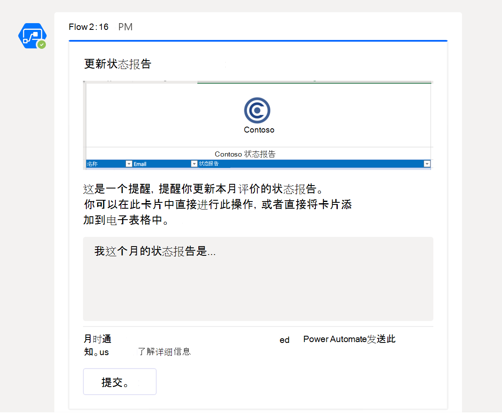

# <a name="office-scripts-sample-scenario-automated-task-reminders"></a>Office 脚本示例方案：自动任务提醒

在这种情况下，您正在管理项目。 您可以使用 Excel 工作表每月跟踪雇员的状态。 您通常需要提醒用户填写其状态，因此您已决定自动执行该提醒过程。

你将创建一个电源自动流到邮件人员缺少状态字段，并将其响应应用到电子表格。 若要执行此操作，您将开发一对用于处理工作簿的脚本。 第一个脚本获取具有空状态的人员列表，第二个脚本在右侧行中添加一个状态字符串。 您还将使用 [工作组自适应卡片](/microsoftteams/platform/task-modules-and-cards/what-are-cards) ，让员工直接从通知中输入其状态。

## <a name="scripting-skills-covered"></a>涵盖的脚本技能

- 以自动执行的功能创建流
- 将数据传递给脚本
- 从脚本返回数据
- 工作组自适应卡片
- 表格

## <a name="prerequisites"></a>先决条件

此方案使用 [Power 自动化](https://flow.microsoft.com) 和 [Microsoft 团队](https://www.microsoft.com/microsoft-365/microsoft-teams/group-chat-software)。 你将需要与用于开发 Office 脚本的帐户相关联。 若要免费访问 Microsoft 开发人员订阅以了解和使用这些应用程序，请考虑加入 [microsoft 365 开发人员计划](https://developer.microsoft.com/microsoft-365/dev-program)。

## <a name="setup-instructions"></a>设置说明

1. 将 <a href="task-reminders.xlsx">task-reminders.xlsx</a> 下载到你的 OneDrive。

2. 在 Excel 中的 web 上打开工作簿。

3. 在 " **自动化** " 选项卡上，打开 **代码编辑器**。

4. 首先，我们需要一个脚本来获取电子表格中缺少状态报告的所有员工。 在 " **代码编辑器** " 任务窗格中，按 " **新建脚本** "，并将以下脚本粘贴到编辑器中。

    ```typescript
    /**
     * This script looks for missing status reports in a project management table.
     *
     * @returns An array of Employee objects (containing their names and emails).
     */
    function main(workbook: ExcelScript.Workbook): Employee[] {
      // Get the first worksheet and the first table on that worksheet.
      let sheet = workbook.getFirstWorksheet()
      let table = sheet.getTables()[0];

      // Give the column indices names matching their expected content.
      const NAME_INDEX = 0;
      const EMAIL_INDEX = 1;
      const STATUS_REPORT_INDEX = 2;

      // Get the data for the whole table.
      let bodyRangeValues = table.getRangeBetweenHeaderAndTotal().getValues();

      // Create the array of Employee objects to return.
      let people: Employee[] = [];

      // Loop through the table and check each row for completion.
      for (let i = 0; i < bodyRangeValues.length; i++) {
        let row = bodyRangeValues[i];
        if (row[STATUS_REPORT_INDEX] === "") {
          // Save the email to return.
          people.push({ name: row[NAME_INDEX].toString(), email: row[EMAIL_INDEX].toString() });
        }
      }

      // Log the array to verify we're getting the right rows.
      console.log(people);

      // Return the array of Employees.
      return people;
    }

    /**
     * An interface representing an employee.
     * An array of Employees will be returned from the script
     * for the Power Automate flow.
     */
    interface Employee {
      name: string;
      email: string;
    }
    ```

5. 使用名称 " **获取人员**" 保存脚本。

6. 接下来，我们需要使用第二个脚本来处理状态报告卡，并将新信息放入电子表格中。 在 " **代码编辑器** " 任务窗格中，按 " **新建脚本** "，并将以下脚本粘贴到编辑器中。

    ```typescript
    /**
     * This script applies the results of a Teams Adaptive Card about
     * a status update to a project management table.
     *
     * @param senderEmail - The email address of the employee updating their status.
     * @param statusReportResponse - The employee's status report.
     */
    function main(workbook: ExcelScript.Workbook,
      senderEmail: string,
      statusReportResponse: string) {

      // Get the first worksheet and the first table in that worksheet.
      let sheet = workbook.getFirstWorksheet();
      let table = sheet.getTables()[0];

      // Give the column indices names matching their expected content.
      const NAME_INDEX = 0;
      const EMAIL_INDEX = 1;
      const STATUS_REPORT_INDEX = 2;

      // Get the range and data for the whole table.
      let bodyRange = table.getRangeBetweenHeaderAndTotal();
      let tableRowCount = bodyRange.getRowCount();
      let bodyRangeValues = bodyRange.getValues();

      // Create a flag to denote success.
      let statusAdded = false;

      // Loop through the table and check each row for a matching email address.
      for (let i = 0; i < tableRowCount && !statusAdded; i++) {
        let row = bodyRangeValues[i];

        // Check if the row's email address matches.
        if (row[EMAIL_INDEX] === senderEmail) {
          // Add the Teams Adaptive Card response to the table.
          bodyRange.getCell(i, STATUS_REPORT_INDEX).setValues([
            [statusReportResponse]
          ]);
          statusAdded = true;
        }
      }

      // If successful, log the status update.
      if (statusAdded) {
        console.log(
          `Successfully added status report for ${senderEmail} containing: ${statusReportResponse}`
        );
      }
    }
    ```

7. 将脚本保存为名称 **保存状态**。

8. 现在，我们需要创建流。 以 [自动打开电源](https://flow.microsoft.com/)。

    > [!TIP]
    > 如果之前未创建流程，请查看我们 [的教程开始使用带电的脚本](../../tutorials/excel-power-automate-manual.md) ，以了解基础知识。

9. 创建新的 **即时流**。

10. 从选项中选择 " **手动触发流** "，然后按 " **创建**"。

11. 流需要调用 **获取人员** 脚本，以获取具有空状态字段的所有员工。 按 " **新建步骤** "，然后选择 " **Excel Online (Business)**。 在 "**操作**"下，选择 **运行脚本（预览版）**。 为流步骤提供以下项：

    - **位置**：OneDrive for Business
    - **文档库**： OneDrive
    - **文件**： *通过文件浏览器选择 task-reminders.xlsx ()*
    - **脚本**：获取人员

    

12. 接下来，流需要处理由脚本返回的数组中的每个雇员。 按 " **新建步骤** " 并选择 " **将自适应卡片发布到团队用户"，然后等待响应**。

13. 对于 " **收件人** " 字段，从动态内容添加 **电子邮件** (所选内容将使用 Excel 徽标) 。 添加 **电子邮件** 会导致流步骤被 **应用于每个** 块。 这意味着将通过电源自动化来循环访问数组。

14. 发送自适应卡片需要将智能卡的 JSON 作为 **邮件** 提供。 您可以使用 [自适应卡片设计器](https://adaptivecards.io/designer/) 来创建自定义卡片。 对于此示例，请使用以下 JSON。  

    ```json
    {
      "$schema": "http://adaptivecards.io/schemas/adaptive-card.json",
      "type": "AdaptiveCard",
      "version": "1.0",
      "body": [
        {
          "type": "TextBlock",
          "size": "Medium",
          "weight": "Bolder",
          "text": "Update your Status Report"
        },
        {
          "type": "Image",
          "altText": "",
          "url": "https://i.imgur.com/f5RcuF3.png"
        },
        {
          "type": "TextBlock",
          "text": "This is a reminder to update your status report for this month's review. You can do so right here in this card, or by adding it directly to the spreadsheet.",
          "wrap": true
        },
        {
          "type": "Input.Text",
          "placeholder": "My status report for this month is...",
          "id": "response",
          "isMultiline": true
        }
      ],
      "actions": [
        {
          "type": "Action.Submit",
          "title": "Submit",
          "id": "submit"
        }
      ]
    }
    ```

15. 填写其余字段，如下所示：

    - **更新邮件**：感谢你提交状态报告。 您的响应已成功添加到电子表格中。
    - **是否应更新卡片**：是

16. 在 " **应用于每个** " 块中，在 " **向团队用户发布自适应卡并等待响应**" 后，按 " **添加操作**"。 选择 " **Excel Online (商业)**"。 在 "**操作**"下，选择 **运行脚本（预览版）**。 为流步骤提供以下项：

    - **位置**：OneDrive for Business
    - **文档库**： OneDrive
    - **文件**： *通过文件浏览器选择 task-reminders.xlsx ()*
    - **脚本**：保存状态
    - **senderEmail**：电子邮件 *(来自 Excel 的动态内容)*
    - **statusReportResponse**： *来自团队) 的响应 (动态内容*

    

17. 保存流。

## <a name="running-the-flow"></a>运行流

若要测试流，请确保任何具有空状态的表格行都使用与团队帐户关联的电子邮件地址 (您在测试) 时，您可能会使用自己的电子邮件地址。

您可以从流设计器中选择 " **测试** "，也可以从 " **我的流** " 页面运行流。 启动流并接受使用所需的连接后，应通过团队从电源自动化接收自适应卡片。 填写完卡片中的 "状态" 字段后，流将继续并以您提供的状态更新电子表格。

### <a name="before-running-the-flow"></a>运行流之前


### <a name="receiving-the-adaptive-card"></a>接收自适应卡片



### <a name="after-running-the-flow"></a>运行流后


