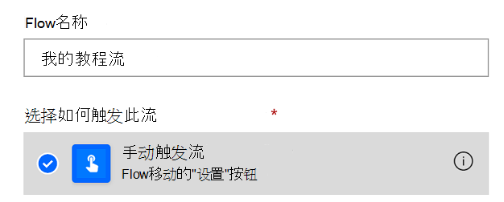
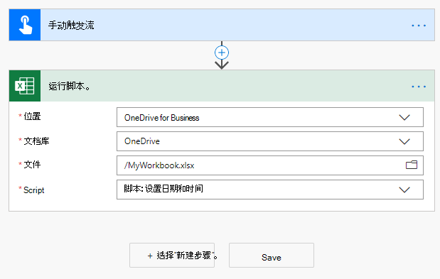

# <a name="start-using-scripts-with-power-automate-preview"></a><span data-ttu-id="65f57-103">开始使用启用了 Power 自动化的脚本（预览）</span><span class="sxs-lookup"><span data-stu-id="65f57-103">Start using scripts with Power Automate (preview)</span></span>

<span data-ttu-id="65f57-104">本教程向您介绍如何通过[Power 自动化](https://flow.microsoft.com)在 web 上运行适用于 Excel 的 Office 脚本。</span><span class="sxs-lookup"><span data-stu-id="65f57-104">This tutorial teaches you how to run an Office Script for Excel on the web through [Power Automate](https://flow.microsoft.com).</span></span>

## <a name="prerequisites"></a><span data-ttu-id="65f57-105">先决条件</span><span class="sxs-lookup"><span data-stu-id="65f57-105">Prerequisites</span></span>

[!INCLUDE [Tutorial prerequisites](../includes/tutorial-prerequisites.md)]

> [!IMPORTANT]
> <span data-ttu-id="65f57-106">本教程假定您已在 web 教程中完成了[Excel 中的记录、编辑和创建 Office 脚本](excel-tutorial.md)。</span><span class="sxs-lookup"><span data-stu-id="65f57-106">This tutorial assumes you have completed the [Record, edit, and create Office Scripts in Excel on the web](excel-tutorial.md) tutorial.</span></span>

## <a name="prepare-the-workbook"></a><span data-ttu-id="65f57-107">准备工作簿</span><span class="sxs-lookup"><span data-stu-id="65f57-107">Prepare the workbook</span></span>

<span data-ttu-id="65f57-108">Power 自动执行无法使用相对引用 `Workbook.getActiveWorksheet` ，如访问工作簿组件。</span><span class="sxs-lookup"><span data-stu-id="65f57-108">Power Automate can't use relative references like `Workbook.getActiveWorksheet` to access workbook components.</span></span> <span data-ttu-id="65f57-109">因此，我们需要具有一致的名称的工作簿和工作表，电源自动化可以参考。</span><span class="sxs-lookup"><span data-stu-id="65f57-109">So, we need a workbook and worksheet with consistent names that Power Automate can reference.</span></span>

1. <span data-ttu-id="65f57-110">创建一个名为**MyWorkbook**的新工作簿。</span><span class="sxs-lookup"><span data-stu-id="65f57-110">Create a new workbook named **MyWorkbook**.</span></span>

2. <span data-ttu-id="65f57-111">在**MyWorkbook**工作簿中，创建一个名为 " **TutorialWorksheet**" 的工作表。</span><span class="sxs-lookup"><span data-stu-id="65f57-111">In the **MyWorkbook** workbook, create a worksheet called **TutorialWorksheet**.</span></span>

## <a name="create-an-office-script"></a><span data-ttu-id="65f57-112">创建 Office 脚本</span><span class="sxs-lookup"><span data-stu-id="65f57-112">Create an Office Script</span></span>

1. <span data-ttu-id="65f57-113">转到 "**自动**" 选项卡，然后选择 "**代码编辑器**"。</span><span class="sxs-lookup"><span data-stu-id="65f57-113">Go to the **Automate** tab and select **Code Editor**.</span></span>

2. <span data-ttu-id="65f57-114">选择 "**新建脚本**"。</span><span class="sxs-lookup"><span data-stu-id="65f57-114">Select **New Script**.</span></span>

3. <span data-ttu-id="65f57-115">将默认脚本替换为以下脚本。</span><span class="sxs-lookup"><span data-stu-id="65f57-115">Replace the default script with the following script.</span></span> <span data-ttu-id="65f57-116">此脚本将当前日期和时间添加到**TutorialWorksheet**工作表的前两个单元格中。</span><span class="sxs-lookup"><span data-stu-id="65f57-116">This script adds the current date and time to the first two cells of the **TutorialWorksheet** worksheet.</span></span>

    ```TypeScript
    function main(workbook: ExcelScript.Workbook) {
      // Get the "TutorialWorksheet" worksheet from the workbook.
      let worksheet = workbook.getWorksheet("TutorialWorksheet");

      // Get the cells at A1 and B1.
      let dateRange = worksheet.getRange("A1");
      let timeRange = worksheet.getRange("B1");

      // Get the current date and time using the JavaScript Date object.
      let date = new Date(Date.now());

      // Add the date string to A1.
      dateRange.setValue(date.toLocaleDateString());

      // Add the time string to B1.
      timeRange.setValue(date.toLocaleTimeString());
    }
    ```

4. <span data-ttu-id="65f57-117">重命名脚本以**设置日期和时间**。</span><span class="sxs-lookup"><span data-stu-id="65f57-117">Rename the script to **Set date and time**.</span></span> <span data-ttu-id="65f57-118">若要更改此名称，请按脚本名称。</span><span class="sxs-lookup"><span data-stu-id="65f57-118">Press the script name to change it.</span></span>

5. <span data-ttu-id="65f57-119">通过按 "**保存脚本**" 保存该脚本。</span><span class="sxs-lookup"><span data-stu-id="65f57-119">Save the script by pressing **Save Script**.</span></span>

## <a name="create-an-automated-workflow-with-power-automate"></a><span data-ttu-id="65f57-120">使用 Power 自动化创建自动工作流</span><span class="sxs-lookup"><span data-stu-id="65f57-120">Create an automated workflow with Power Automate</span></span>

1. <span data-ttu-id="65f57-121">登录到[Power 自动预览网站](https://flow.microsoft.com)。</span><span class="sxs-lookup"><span data-stu-id="65f57-121">Sign in to the [Power Automate preview site](https://flow.microsoft.com).</span></span>

2. <span data-ttu-id="65f57-122">在屏幕左侧显示的菜单中，按 "**创建**"。</span><span class="sxs-lookup"><span data-stu-id="65f57-122">In the menu that's displayed on the left side of the screen, press **Create**.</span></span> <span data-ttu-id="65f57-123">这将向你显示创建新工作流的方式列表。</span><span class="sxs-lookup"><span data-stu-id="65f57-123">This brings you to list of ways to create new workflows.</span></span>

    

3. <span data-ttu-id="65f57-125">在 "**从空白开始**" 部分中，选择 "**即时流**"。</span><span class="sxs-lookup"><span data-stu-id="65f57-125">In the **Start from blank** section, select **Instant flow**.</span></span> <span data-ttu-id="65f57-126">这将创建手动激活的工作流。</span><span class="sxs-lookup"><span data-stu-id="65f57-126">This creates a manually activated workflow.</span></span>

    

4. <span data-ttu-id="65f57-128">在显示的对话框窗口中，在 "**流名称**" 文本框中输入流的名称，从 "**选择如何触发流**" 下的选项列表中选择 "**手动触发流**"，然后按 "**创建**"。</span><span class="sxs-lookup"><span data-stu-id="65f57-128">In the dialog window that appears, enter a name for your flow in the **Flow name** text box, select **Manually trigger a flow** from the list of options under **Choose how to trigger the flow**, and press **Create**.</span></span>

    

5. <span data-ttu-id="65f57-130">按 "**新建步骤**"。</span><span class="sxs-lookup"><span data-stu-id="65f57-130">Press **New step**.</span></span>

6. <span data-ttu-id="65f57-131">选择 "**标准**" 选项卡，然后选择 " **Excel Online （企业）**"。</span><span class="sxs-lookup"><span data-stu-id="65f57-131">Select the **Standard** tab, then select **Excel Online (Business)**.</span></span>

    

7. <span data-ttu-id="65f57-133">在 "**操作**" 下，选择 "**运行脚本（预览）**"。</span><span class="sxs-lookup"><span data-stu-id="65f57-133">Under **Actions**, select **Run script (preview)**.</span></span>

    

8. <span data-ttu-id="65f57-135">为 "**运行脚本**" 连接器指定以下设置：</span><span class="sxs-lookup"><span data-stu-id="65f57-135">Specify the following settings for the **Run script** connector:</span></span>

    - <span data-ttu-id="65f57-136">**位置**： OneDrive for business</span><span class="sxs-lookup"><span data-stu-id="65f57-136">**Location**: OneDrive for Business</span></span>
    - <span data-ttu-id="65f57-137">**文档库**： OneDrive</span><span class="sxs-lookup"><span data-stu-id="65f57-137">**Document Library**: OneDrive</span></span>
    - <span data-ttu-id="65f57-138">**文件**： MyWorkbook.xlsx</span><span class="sxs-lookup"><span data-stu-id="65f57-138">**File**: MyWorkbook.xlsx</span></span>
    - <span data-ttu-id="65f57-139">**脚本**：设置日期和时间</span><span class="sxs-lookup"><span data-stu-id="65f57-139">**Script**: Set date and time</span></span>

    

9. <span data-ttu-id="65f57-141">按 "**保存**"。</span><span class="sxs-lookup"><span data-stu-id="65f57-141">Press **Save**.</span></span>

<span data-ttu-id="65f57-142">您的流程现已准备好通过电源自动运行。</span><span class="sxs-lookup"><span data-stu-id="65f57-142">Your flow is now ready to be run through Power Automate.</span></span> <span data-ttu-id="65f57-143">您可以使用流编辑器中的 "**测试**" 按钮对其进行测试，也可以按照其余的教程步骤运行流集合中的流。</span><span class="sxs-lookup"><span data-stu-id="65f57-143">You can test it using the **Test** button in the flow editor or follow the remaining tutorial steps to run the flow from your flow collection.</span></span>

## <a name="run-the-script-through-power-automate"></a><span data-ttu-id="65f57-144">通过 Power 自动运行脚本</span><span class="sxs-lookup"><span data-stu-id="65f57-144">Run the script through Power Automate</span></span>

1. <span data-ttu-id="65f57-145">从 "主电自动" 页面中，选择 "**我的流**"。</span><span class="sxs-lookup"><span data-stu-id="65f57-145">From the main Power Automate page, select **My flows**.</span></span>

    

2. <span data-ttu-id="65f57-147">从 "**我的流量**" 选项卡中显示的流列表中选择 **"我的教程流**"。这将显示之前创建的流的详细信息。</span><span class="sxs-lookup"><span data-stu-id="65f57-147">Select **My tutorial flow** from the list of flows displayed in the **My flows** tab. This shows the details of the flow we previously created.</span></span>

3. <span data-ttu-id="65f57-148">按 "**运行**"。</span><span class="sxs-lookup"><span data-stu-id="65f57-148">Press **Run**.</span></span>

    

4. <span data-ttu-id="65f57-150">将显示用于运行流的任务窗格。</span><span class="sxs-lookup"><span data-stu-id="65f57-150">A task pane will appear for running the flow.</span></span> <span data-ttu-id="65f57-151">如果系统询问您是否**登录**到 Excel Online，请按 "**继续**"。</span><span class="sxs-lookup"><span data-stu-id="65f57-151">If you are asked to **Sign in** to Excel Online, do so by pressing **Continue**.</span></span>

5. <span data-ttu-id="65f57-152">按 "**运行流**"。</span><span class="sxs-lookup"><span data-stu-id="65f57-152">Press **Run flow**.</span></span> <span data-ttu-id="65f57-153">这将运行流，这将运行相关的 Office 脚本。</span><span class="sxs-lookup"><span data-stu-id="65f57-153">This runs the flow, which runs the related Office Script.</span></span>

6. <span data-ttu-id="65f57-154">按 "**完成**"。</span><span class="sxs-lookup"><span data-stu-id="65f57-154">Press **Done**.</span></span> <span data-ttu-id="65f57-155">您应该会看到 "**运行**" 部分进行了相应的更新。</span><span class="sxs-lookup"><span data-stu-id="65f57-155">You should see the **Runs** section update accordingly.</span></span>

7. <span data-ttu-id="65f57-156">刷新页面以查看电源自动执行的结果。</span><span class="sxs-lookup"><span data-stu-id="65f57-156">Refresh the page to see the results of the Power Automate.</span></span> <span data-ttu-id="65f57-157">如果成功，请转到工作簿以查看更新的单元格。</span><span class="sxs-lookup"><span data-stu-id="65f57-157">If it succeeded, go to the workbook to see the updated cells.</span></span> <span data-ttu-id="65f57-158">如果失败，请验证流设置并再次运行它。</span><span class="sxs-lookup"><span data-stu-id="65f57-158">If it failed, verify the flow's settings and run it a second time.</span></span>

    

## <a name="next-steps"></a><span data-ttu-id="65f57-160">后续步骤</span><span class="sxs-lookup"><span data-stu-id="65f57-160">Next steps</span></span>

<span data-ttu-id="65f57-161">使用自动[电源自动化流教程完成自动运行脚本](excel-power-automate-trigger.md)。</span><span class="sxs-lookup"><span data-stu-id="65f57-161">Complete the [Automatically run scripts with automated Power Automate flows](excel-power-automate-trigger.md) tutorial.</span></span> <span data-ttu-id="65f57-162">它向您介绍如何将数据从工作流服务传递到您的 Office 脚本。</span><span class="sxs-lookup"><span data-stu-id="65f57-162">It teaches you how to pass data from a workflow service to your Office Script.</span></span>
