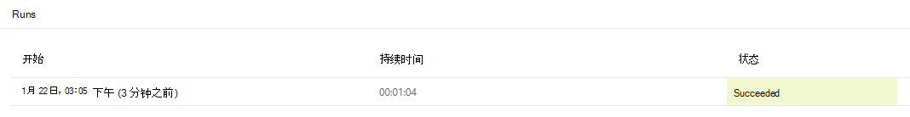

# <a name="call-scripts-from-a-manual-power-automate-flow-preview"></a><span data-ttu-id="84034-103">通过手动 Power Automate 流呼叫脚本（预览版）</span><span class="sxs-lookup"><span data-stu-id="84034-103">Call scripts from a manual Power Automate flow (preview)</span></span>

<span data-ttu-id="84034-104">本教程将指导你如何通过 [Power Automate](https://flow.microsoft.com) 在 web 上运行 Office Script for Excel。</span><span class="sxs-lookup"><span data-stu-id="84034-104">This tutorial teaches you how to run an Office Script for Excel on the web through [Power Automate](https://flow.microsoft.com).</span></span>

## <a name="prerequisites"></a><span data-ttu-id="84034-105">必备条件</span><span class="sxs-lookup"><span data-stu-id="84034-105">Prerequisites</span></span>

[!INCLUDE [Tutorial prerequisites](../includes/power-automate-tutorial-prerequisites.md)]

> [!IMPORTANT]
> <span data-ttu-id="84034-106">本教程假定你已完成[在 Excel 网页版中录制、编辑和创建 Office 脚本](excel-tutorial.md)教程。</span><span class="sxs-lookup"><span data-stu-id="84034-106">This tutorial assumes you have completed the [Record, edit, and create Office Scripts in Excel on the web](excel-tutorial.md) tutorial.</span></span>

## <a name="prepare-the-workbook"></a><span data-ttu-id="84034-107">准备工作簿</span><span class="sxs-lookup"><span data-stu-id="84034-107">Prepare the workbook</span></span>

<span data-ttu-id="84034-108">Power Automate 无法使用 `Workbook.getActiveWorksheet` 访问工作簿组件等相对引用。</span><span class="sxs-lookup"><span data-stu-id="84034-108">Power Automate can't use relative references like `Workbook.getActiveWorksheet` to access workbook components.</span></span> <span data-ttu-id="84034-109">因此，我们需要一个具有 Power Automate 可以引用的一致名称的工作簿和工作表。</span><span class="sxs-lookup"><span data-stu-id="84034-109">So, we need a workbook and worksheet with consistent names that Power Automate can reference.</span></span>

1. <span data-ttu-id="84034-110">创建名为 **MyWorkbook** 的新工作簿。</span><span class="sxs-lookup"><span data-stu-id="84034-110">Create a new workbook named **MyWorkbook**.</span></span>

2. <span data-ttu-id="84034-111">在 **MyWorkbook** 工作簿中，创建一个名为 **TutorialWorksheet** 的工作表。</span><span class="sxs-lookup"><span data-stu-id="84034-111">In the **MyWorkbook** workbook, create a worksheet called **TutorialWorksheet**.</span></span>

## <a name="create-an-office-script"></a><span data-ttu-id="84034-112">创建 Office 脚本</span><span class="sxs-lookup"><span data-stu-id="84034-112">Create an Office Script</span></span>

1. <span data-ttu-id="84034-113">转到 "**自动**" 选项卡，然后选择 "**代码编辑器**"。</span><span class="sxs-lookup"><span data-stu-id="84034-113">Go to the **Automate** tab and select **Code Editor**.</span></span>

2. <span data-ttu-id="84034-114">选择 "**New Script**"。</span><span class="sxs-lookup"><span data-stu-id="84034-114">Select **New Script**.</span></span>

3. <span data-ttu-id="84034-115">将默认脚本替换为以下脚本。</span><span class="sxs-lookup"><span data-stu-id="84034-115">Replace the default script with the following script.</span></span> <span data-ttu-id="84034-116">此脚本将当前日期和时间添加到 **TutorialWorksheet** 工作表的前两个单元格。</span><span class="sxs-lookup"><span data-stu-id="84034-116">This script adds the current date and time to the first two cells of the **TutorialWorksheet** worksheet.</span></span>

    ```TypeScript
    function main(workbook: ExcelScript.Workbook) {
      // Get the "TutorialWorksheet" worksheet from the workbook.
      let worksheet = workbook.getWorksheet("TutorialWorksheet");

      // Get the cells at A1 and B1.
      let dateRange = worksheet.getRange("A1");
      let timeRange = worksheet.getRange("B1");

      // Get the current date and time using the JavaScript Date object.
      let date = new Date(Date.now());

      // Add the date string to A1.
      dateRange.setValue(date.toLocaleDateString());

      // Add the time string to B1.
      timeRange.setValue(date.toLocaleTimeString());
    }
    ```

4. <span data-ttu-id="84034-117">将脚本重命名为 "**设置日期和时间**"。</span><span class="sxs-lookup"><span data-stu-id="84034-117">Rename the script to **Set date and time**.</span></span> <span data-ttu-id="84034-118">按脚本名称进行更改。</span><span class="sxs-lookup"><span data-stu-id="84034-118">Press the script name to change it.</span></span>

5. <span data-ttu-id="84034-119">按 "**保存脚本**" 保存脚本。</span><span class="sxs-lookup"><span data-stu-id="84034-119">Save the script by pressing **Save Script**.</span></span>

## <a name="create-an-automated-workflow-with-power-automate"></a><span data-ttu-id="84034-120">使用 Power Automate 功能创建自动工作流</span><span class="sxs-lookup"><span data-stu-id="84034-120">Create an automated workflow with Power Automate</span></span>

1. <span data-ttu-id="84034-121">登录 [Power Automate 网站](https://flow.microsoft.com)。</span><span class="sxs-lookup"><span data-stu-id="84034-121">Sign in to the [Power Automate site](https://flow.microsoft.com).</span></span>

2. <span data-ttu-id="84034-122">在屏幕左侧显示的菜单中，按 "**创建**"。</span><span class="sxs-lookup"><span data-stu-id="84034-122">In the menu that's displayed on the left side of the screen, press **Create**.</span></span> <span data-ttu-id="84034-123">这将带你进入创建新工作流的方式列表。</span><span class="sxs-lookup"><span data-stu-id="84034-123">This brings you to list of ways to create new workflows.</span></span>

    

3. <span data-ttu-id="84034-125">在**从空白开始**部分中，选择**即时流**。</span><span class="sxs-lookup"><span data-stu-id="84034-125">In the **Start from blank** section, select **Instant flow**.</span></span> <span data-ttu-id="84034-126">这将创建手动激活的工作流。</span><span class="sxs-lookup"><span data-stu-id="84034-126">This creates a manually activated workflow.</span></span>

    

4. <span data-ttu-id="84034-128">在出现的对话框窗口中，在 "**流名称**" 文本框中输入流的名称，从 "**选择如何触发流**" 下的选项列表中，选择 "**手动触发流** "，然后按 "**创建**"。</span><span class="sxs-lookup"><span data-stu-id="84034-128">In the dialog window that appears, enter a name for your flow in the **Flow name** text box, select **Manually trigger a flow** from the list of options under **Choose how to trigger the flow**, and press **Create**.</span></span>

    

    <span data-ttu-id="84034-130">请注意，手动触发流仅是许多类型流中的一种。</span><span class="sxs-lookup"><span data-stu-id="84034-130">Note that a manually triggered flow is just one of many types of flows.</span></span> <span data-ttu-id="84034-131">在下一个教程中，你将创建收到电子邮件时自动运行的流程。</span><span class="sxs-lookup"><span data-stu-id="84034-131">In the next tutorial, you'll make a flow that automatically runs when you receive an email.</span></span>

5. <span data-ttu-id="84034-132">按 **"新建步骤"**。</span><span class="sxs-lookup"><span data-stu-id="84034-132">Press **New step**.</span></span>

6. <span data-ttu-id="84034-133">选择 "**标准**" 选项卡，然后选择 "**Excel Online （企业）**"。</span><span class="sxs-lookup"><span data-stu-id="84034-133">Select the **Standard** tab, then select **Excel Online (Business)**.</span></span>

    

7. <span data-ttu-id="84034-135">在 "**操作**"下，选择 **运行脚本（预览版）**。</span><span class="sxs-lookup"><span data-stu-id="84034-135">Under **Actions**, select **Run script (preview)**.</span></span>

    

8. <span data-ttu-id="84034-137">为 **运行脚本** 连接器指定以下设置：</span><span class="sxs-lookup"><span data-stu-id="84034-137">Specify the following settings for the **Run script** connector:</span></span>

    - <span data-ttu-id="84034-138">**位置**：OneDrive for Business</span><span class="sxs-lookup"><span data-stu-id="84034-138">**Location**: OneDrive for Business</span></span>
    - <span data-ttu-id="84034-139">**文档库**： OneDrive</span><span class="sxs-lookup"><span data-stu-id="84034-139">**Document Library**: OneDrive</span></span>
    - <span data-ttu-id="84034-140">**文件**： MyWorkbook.xlsx</span><span class="sxs-lookup"><span data-stu-id="84034-140">**File**: MyWorkbook.xlsx</span></span>
    - <span data-ttu-id="84034-141">**脚本**：设置日期和时间</span><span class="sxs-lookup"><span data-stu-id="84034-141">**Script**: Set date and time</span></span>

    

9. <span data-ttu-id="84034-143">按“**保存**”。</span><span class="sxs-lookup"><span data-stu-id="84034-143">Press **Save**.</span></span>

<span data-ttu-id="84034-144">现在，你的流程可以通过 Power Automate 运行。</span><span class="sxs-lookup"><span data-stu-id="84034-144">Your flow is now ready to be run through Power Automate.</span></span> <span data-ttu-id="84034-145">可使用流编辑器中的 "**测试**" 按钮对其进行测试，或按照其余教程步骤运行流集合中的流程。</span><span class="sxs-lookup"><span data-stu-id="84034-145">You can test it using the **Test** button in the flow editor or follow the remaining tutorial steps to run the flow from your flow collection.</span></span>

## <a name="run-the-script-through-power-automate"></a><span data-ttu-id="84034-146">通过 Power Automate 运行脚本</span><span class="sxs-lookup"><span data-stu-id="84034-146">Run the script through Power Automate</span></span>

1. <span data-ttu-id="84034-147">在 Power Automate 主页面上，选择**我的流**。</span><span class="sxs-lookup"><span data-stu-id="84034-147">From the main Power Automate page, select **My flows**.</span></span>

    

2. <span data-ttu-id="84034-149">从 "**我的流**" 选项卡中显示的流列表中选择 **我的教程流**。这将显示之前创建的流程的详细信息。</span><span class="sxs-lookup"><span data-stu-id="84034-149">Select **My tutorial flow** from the list of flows displayed in the **My flows** tab. This shows the details of the flow we previously created.</span></span>

3. <span data-ttu-id="84034-150">按 **"运行"**。</span><span class="sxs-lookup"><span data-stu-id="84034-150">Press **Run**.</span></span>

    

4. <span data-ttu-id="84034-152">将显示用于运行流的任务窗格。</span><span class="sxs-lookup"><span data-stu-id="84034-152">A task pane will appear for running the flow.</span></span> <span data-ttu-id="84034-153">如果系统要求 **登录** 到 Excel Online，请按 **"继续"** 操作。</span><span class="sxs-lookup"><span data-stu-id="84034-153">If you are asked to **Sign in** to Excel Online, do so by pressing **Continue**.</span></span>

5. <span data-ttu-id="84034-154">按 **"运行流程"**。</span><span class="sxs-lookup"><span data-stu-id="84034-154">Press **Run flow**.</span></span> <span data-ttu-id="84034-155">此时将运行流，该流将运行相关的 Office 脚本。</span><span class="sxs-lookup"><span data-stu-id="84034-155">This runs the flow, which runs the related Office Script.</span></span>

6. <span data-ttu-id="84034-156">按“**完成**”。</span><span class="sxs-lookup"><span data-stu-id="84034-156">Press **Done**.</span></span> <span data-ttu-id="84034-157">你应该看到**运行**部分进行了相应的更新。</span><span class="sxs-lookup"><span data-stu-id="84034-157">You should see the **Runs** section update accordingly.</span></span>

7. <span data-ttu-id="84034-158">刷新页面，查看 Power Automate 的结果。</span><span class="sxs-lookup"><span data-stu-id="84034-158">Refresh the page to see the results of the Power Automate.</span></span> <span data-ttu-id="84034-159">如果成功，请转到工作簿查看已更新的单元格。</span><span class="sxs-lookup"><span data-stu-id="84034-159">If it succeeded, go to the workbook to see the updated cells.</span></span> <span data-ttu-id="84034-160">如果失败，请验证流的设置并再次运行。</span><span class="sxs-lookup"><span data-stu-id="84034-160">If it failed, verify the flow's settings and run it a second time.</span></span>

    

## <a name="next-steps"></a><span data-ttu-id="84034-162">后续步骤</span><span class="sxs-lookup"><span data-stu-id="84034-162">Next steps</span></span>

<span data-ttu-id="84034-163">完成[将数据传递到自动运行的 Power Automate 流中的脚本](excel-power-automate-trigger.md)教程。</span><span class="sxs-lookup"><span data-stu-id="84034-163">Complete the [Pass data to scripts in an automatically-run Power Automate flow](excel-power-automate-trigger.md) tutorial.</span></span> <span data-ttu-id="84034-164">它教你如何将数据从工作流服务传递到你的 Office 脚本，并在发生特定事件时运行 Power Automate 流。</span><span class="sxs-lookup"><span data-stu-id="84034-164">It teaches you how to pass data from a workflow service to your Office Script and run the Power Automate flow when certain events occur.</span></span>
