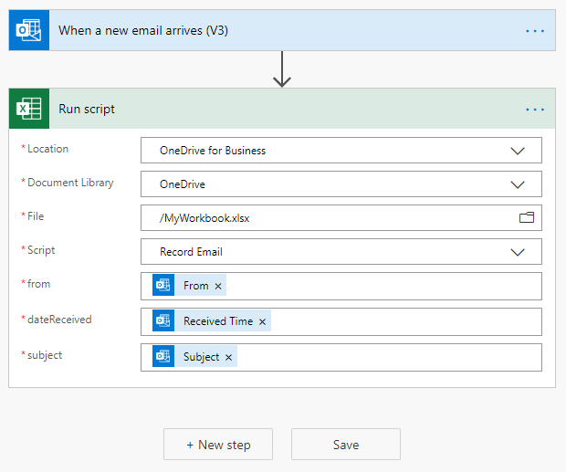
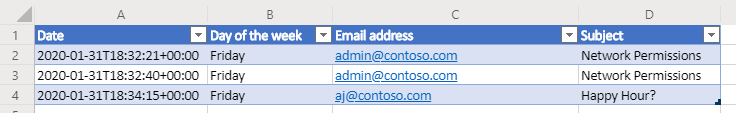

# <a name="pass-data-to-scripts-in-an-automatically-run-power-automate-flow-preview"></a><span data-ttu-id="dd543-103">将数据传递到自动运行的 Power Automate 流中的脚本（预览版）</span><span class="sxs-lookup"><span data-stu-id="dd543-103">Pass data to scripts in an automatically-run Power Automate flow (preview)</span></span>

<span data-ttu-id="dd543-104">本教程教你如何通过自动化的[ Power Automate ](https://flow.microsoft.com)工作流在 Web 上使用 Office Script for Excel。</span><span class="sxs-lookup"><span data-stu-id="dd543-104">This tutorial teaches you how to use an Office Script for Excel on the web with an automated [Power Automate](https://flow.microsoft.com) workflow.</span></span> <span data-ttu-id="dd543-105">每当你收到电子邮件时，脚本都会自动运行，并将电子邮件中的信息记录在 Excel 工作簿中。</span><span class="sxs-lookup"><span data-stu-id="dd543-105">Your script will automatically run each time you receive an email, recording information from the email in an Excel workbook.</span></span> <span data-ttu-id="dd543-106">能够将其他应用程序中的数据传递到 Office 脚本中，可以为你在自动化过程中提供极大的灵活性和自由度。</span><span class="sxs-lookup"><span data-stu-id="dd543-106">Being able to pass data from other applications into an Office Script gives you a great deal of flexibility and freedom in your automated processes.</span></span>

> [!TIP]
> <span data-ttu-id="dd543-107">如果你不熟悉 Office 脚本，建议先查看[在 Excel 网页版中录制、编辑和创建 Office 脚本](excel-tutorial.md)教程。</span><span class="sxs-lookup"><span data-stu-id="dd543-107">If you are new to Office Scripts, we recommend starting with the [Record, edit, and create Office Scripts in Excel on the web](excel-tutorial.md) tutorial.</span></span> <span data-ttu-id="dd543-108">如果你没有使用过 Power Automate，建议你从[从手动 Power Automate 流调用脚本](excel-power-automate-manual.md)开始。</span><span class="sxs-lookup"><span data-stu-id="dd543-108">If you are new to Power Automate, we recommend starting with the [Call scripts from a manual Power Automate flow](excel-power-automate-manual.md) tutorial.</span></span> <span data-ttu-id="dd543-109">[Office 脚本使用 TypeScript](../overview/code-editor-environment.md)，本教程面向在 JavaScript 或 TypeScript 方面具备初级到中级知识的人员。</span><span class="sxs-lookup"><span data-stu-id="dd543-109">[Office Scripts use TypeScript](../overview/code-editor-environment.md) and this tutorial is intended for people with beginner to intermediate-level knowledge of JavaScript or TypeScript.</span></span> <span data-ttu-id="dd543-110">如果你不熟悉 JavaScript，建议从 [Mozilla JavaScript 教程](https://developer.mozilla.org/docs/Web/JavaScript/Guide/Introduction)入手。</span><span class="sxs-lookup"><span data-stu-id="dd543-110">If you're new to JavaScript, we recommend starting with the [Mozilla JavaScript tutorial](https://developer.mozilla.org/docs/Web/JavaScript/Guide/Introduction).</span></span>

## <a name="prerequisites"></a><span data-ttu-id="dd543-111">先决条件</span><span class="sxs-lookup"><span data-stu-id="dd543-111">Prerequisites</span></span>

[!INCLUDE [Tutorial prerequisites](../includes/power-automate-tutorial-prerequisites.md)]

## <a name="prepare-the-workbook"></a><span data-ttu-id="dd543-112">准备工作簿</span><span class="sxs-lookup"><span data-stu-id="dd543-112">Prepare the workbook</span></span>

<span data-ttu-id="dd543-113">Power Automate 无法使用`Workbook.getActiveWorksheet`之类的[相对引用](../develop/power-automate-integration.md#avoid-using-relative-references)访问工作簿组件。</span><span class="sxs-lookup"><span data-stu-id="dd543-113">Power Automate can't use [relative references](../develop/power-automate-integration.md#avoid-using-relative-references) like `Workbook.getActiveWorksheet` to access workbook components.</span></span> <span data-ttu-id="dd543-114">因此，我们需要一个具有一致名称的工作簿和工作表，以供 Power Automate 引用。</span><span class="sxs-lookup"><span data-stu-id="dd543-114">So, we need a workbook and worksheet with consistent names for Power Automate to reference.</span></span>

1. <span data-ttu-id="dd543-115">创建名为 **MyWorkbook** 的新工作簿。</span><span class="sxs-lookup"><span data-stu-id="dd543-115">Create a new workbook named **MyWorkbook**.</span></span>

2. <span data-ttu-id="dd543-116">转到 "**自动**" 选项卡，然后选择 "**代码编辑器**"。</span><span class="sxs-lookup"><span data-stu-id="dd543-116">Go to the **Automate** tab and select **Code Editor**.</span></span>

3. <span data-ttu-id="dd543-117">选择 "**New Script**"。</span><span class="sxs-lookup"><span data-stu-id="dd543-117">Select **New Script**.</span></span>

4. <span data-ttu-id="dd543-118">将现有代码替换为以下脚本，然后按 "**运行**"。</span><span class="sxs-lookup"><span data-stu-id="dd543-118">Replace the existing code with the following script and press **Run**.</span></span> <span data-ttu-id="dd543-119">这会将工作簿设置为一致的工作表、表和数据透视表名称。</span><span class="sxs-lookup"><span data-stu-id="dd543-119">This will setup the workbook with consistent worksheet, table, and PivotTable names.</span></span>

    ```TypeScript
    function main(workbook: ExcelScript.Workbook) {
      // Add a new worksheet to store our email table
      let emailsSheet = workbook.addWorksheet("Emails");

      // Add data and create a table
      emailsSheet.getRange("A1:D1").setValues([
        ["Date", "Day of the week", "Email address", "Subject"]
      ]);
      let newTable = workbook.addTable(emailsSheet.getRange("A1:D2"), true);
      newTable.setName("EmailTable");

      // Add a new PivotTable to a new worksheet
      let pivotWorksheet = workbook.addWorksheet("Subjects");
      let newPivotTable = workbook.addPivotTable("Pivot", "EmailTable", pivotWorksheet.getRange("A3:C20"));

      // Setup the pivot hierarchies
      newPivotTable.addRowHierarchy(newPivotTable.getHierarchy("Day of the week"));
      newPivotTable.addRowHierarchy(newPivotTable.getHierarchy("Email address"));
      newPivotTable.addDataHierarchy(newPivotTable.getHierarchy("Subject"));
    }
    ```

## <a name="create-an-office-script"></a><span data-ttu-id="dd543-120">创建 Office 脚本</span><span class="sxs-lookup"><span data-stu-id="dd543-120">Create an Office Script</span></span>

<span data-ttu-id="dd543-121">我们来创建一个脚本来记录电子邮件中的信息。</span><span class="sxs-lookup"><span data-stu-id="dd543-121">Let's create a script that logs information from an email.</span></span> <span data-ttu-id="dd543-122">我们想知道一周中的哪几天我们收到最多的邮件，以及有多少发件人发送邮件。</span><span class="sxs-lookup"><span data-stu-id="dd543-122">We want to know how which days of the week we receive the most mail and how many unique senders are sending that mail.</span></span> <span data-ttu-id="dd543-123">我们的工作簿中有一个表格，其中包含**日期**，**星期几**，**电子邮件地址**和**主题**列。</span><span class="sxs-lookup"><span data-stu-id="dd543-123">Our workbook has a table with **Date**, **Day of the week**, **Email address**, and **Subject** columns.</span></span> <span data-ttu-id="dd543-124">我们的工作表还具有一个数据透视表，该数据透视表在**星期**和**电子邮件地址**（这些是行层次结构）上进行透视。</span><span class="sxs-lookup"><span data-stu-id="dd543-124">Our worksheet also has a PivotTable that is pivoting on the **Day of the week** and **Email address** (those are the row hierarchies).</span></span> <span data-ttu-id="dd543-125">唯一**主题**的计数是所显示的聚合信息（数据层次结构）。</span><span class="sxs-lookup"><span data-stu-id="dd543-125">The count of unique **Subjects** is the aggregated information being displayed (the data hierarchy).</span></span> <span data-ttu-id="dd543-126">更新电子邮件表后，我们的脚本将刷新该数据透视表。</span><span class="sxs-lookup"><span data-stu-id="dd543-126">We'll have our script refresh that PivotTable after updating the email table.</span></span>

1. <span data-ttu-id="dd543-127">在 **"代码编辑器"** 中，选择 **"New Script"**。</span><span class="sxs-lookup"><span data-stu-id="dd543-127">From within the **Code Editor**, select **New Script**.</span></span>

2. <span data-ttu-id="dd543-128">我们将在本指南后面创建流程发送有关收到的每封电子邮件的脚本信息。</span><span class="sxs-lookup"><span data-stu-id="dd543-128">The flow that we'll create later in the tutorial will send our script information about each email that's received.</span></span> <span data-ttu-id="dd543-129">脚本需要通过 `main` 函数中的参数接受该输入。</span><span class="sxs-lookup"><span data-stu-id="dd543-129">The script needs to accept that input through parameters in the `main` function.</span></span> <span data-ttu-id="dd543-130">将默认脚本替换为以下脚本：</span><span class="sxs-lookup"><span data-stu-id="dd543-130">Replace the default script with the following script:</span></span>

    ```TypeScript
    function main(
      workbook: ExcelScript.Workbook,
      from: string,
      dateReceived: string,
      subject: string) {

    }
    ```

3. <span data-ttu-id="dd543-131">脚本需要访问工作簿的表和数据透视表。</span><span class="sxs-lookup"><span data-stu-id="dd543-131">The script needs access to the workbook's table and PivotTable.</span></span> <span data-ttu-id="dd543-132">将下面的代码添加到脚本主体中的起始 `{`后面：</span><span class="sxs-lookup"><span data-stu-id="dd543-132">Add the following code to the body of the script, after the opening `{`:</span></span>

    ```TypeScript
    // Get the email table.
    let emailWorksheet = workbook.getWorksheet("Emails");
    let table = emailWorksheet.getTable("EmailTable");
  
    // Get the PivotTable.
    let pivotTableWorksheet = workbook.getWorksheet("Subjects");
    let pivotTable = pivotTableWorksheet.getPivotTable("Pivot");
    ```

4. <span data-ttu-id="dd543-133">`dateReceived`参数的类型为`string`。</span><span class="sxs-lookup"><span data-stu-id="dd543-133">The `dateReceived` parameter is of type `string`.</span></span> <span data-ttu-id="dd543-134">我们将其转换为 [`Date` 对象](../develop/javascript-objects.md#date)，以便我们可以轻松地获取一周中的一天。</span><span class="sxs-lookup"><span data-stu-id="dd543-134">Let's convert that to a [`Date` object](../develop/javascript-objects.md#date) so we can easily get the day of the week.</span></span> <span data-ttu-id="dd543-135">之后，我们需要将当天的数字值映射到更易读的版本。</span><span class="sxs-lookup"><span data-stu-id="dd543-135">After doing that, we'll need to map the day's number value to a more readable version.</span></span> <span data-ttu-id="dd543-136">将以下代码添加到脚本的末尾（在结束 `}` 之前）：</span><span class="sxs-lookup"><span data-stu-id="dd543-136">Add the following code to the end of your script, before the closing `}`:</span></span>

    ```TypeScript
      // Parse the received date string to determine the day of the week.
      let emailDate = new Date(dateReceived);
      let dayName = emailDate.toLocaleDateString("en-US", { weekday: 'long' });
    ```

5. <span data-ttu-id="dd543-137">`subject` 字符串可能包含 "RE:" 回复标记。</span><span class="sxs-lookup"><span data-stu-id="dd543-137">The `subject` string may include the "RE:" reply tag.</span></span> <span data-ttu-id="dd543-138">从字符串中删除该对象，以便同一线程中的电子邮件具有相同的表格主题。</span><span class="sxs-lookup"><span data-stu-id="dd543-138">Let's remove that from the string so that emails in the same thread have the same subject for the table.</span></span> <span data-ttu-id="dd543-139">将以下代码添加到脚本的末尾（在结束 `}` 之前）：</span><span class="sxs-lookup"><span data-stu-id="dd543-139">Add the following code to the end of your script, before the closing `}`:</span></span>

    ```TypeScript
    // Remove the reply tag from the email subject to group emails on the same thread.
    let subjectText = subject.replace("Re: ", "");
    subjectText = subjectText.replace("RE: ", "");
    ```

6. <span data-ttu-id="dd543-140">现在，电子邮件数据已经按照我们的喜好进行了格式化，让我们在电子邮件表中添加一行。</span><span class="sxs-lookup"><span data-stu-id="dd543-140">Now that the email data has been formatted to our liking, let's add a row to the email table.</span></span> <span data-ttu-id="dd543-141">将以下代码添加到脚本的末尾（在结束 `}` 之前）：</span><span class="sxs-lookup"><span data-stu-id="dd543-141">Add the following code to the end of your script, before the closing `}`:</span></span>

    ```TypeScript
    // Add the parsed text to the table.
    table.addRow(-1, [dateReceived, dayName, from, subjectText]);
    ```

7. <span data-ttu-id="dd543-142">最后，我们来确保刷新了数据透视表。</span><span class="sxs-lookup"><span data-stu-id="dd543-142">Finally, let's make sure the PivotTable is refreshed.</span></span> <span data-ttu-id="dd543-143">将以下代码添加到脚本的末尾（在结束 `}` 之前）：</span><span class="sxs-lookup"><span data-stu-id="dd543-143">Add the following code to the end of your script, before the closing `}`:</span></span>

    ```TypeScript
    // Refresh the PivotTable to include the new row.
    pivotTable.refresh();
    ```

8. <span data-ttu-id="dd543-144">将脚本重命名为 "**录制电子邮件**"，然后按 "**保存脚本**"。</span><span class="sxs-lookup"><span data-stu-id="dd543-144">Rename your script **Record Email** and press **Save script**.</span></span>

<span data-ttu-id="dd543-145">现在，你的脚本已准备就绪，可运行 Power Automate 工作流。</span><span class="sxs-lookup"><span data-stu-id="dd543-145">Your script is now ready for a Power Automate workflow.</span></span> <span data-ttu-id="dd543-146">它应类似于以下脚本：</span><span class="sxs-lookup"><span data-stu-id="dd543-146">It should look like the following script:</span></span>

```TypeScript
function main(
  workbook: ExcelScript.Workbook,
  from: string,
  dateReceived: string,
  subject: string) {
  // Get the email table.
  let emailWorksheet = workbook.getWorksheet("Emails");
  let table = emailWorksheet.getTable("EmailTable");

  // Get the PivotTable.
  let pivotTableWorksheet = workbook.getWorksheet("Subjects");
  let pivotTable = pivotTableWorksheet.getPivotTable("Pivot");

  // Parse the received date string to determine the day of the week.
  let emailDate = new Date(dateReceived);
  let dayName = emailDate.toLocaleDateString("en-US", { weekday: 'long' });

  // Remove the reply tag from the email subject to group emails on the same thread.
  let subjectText = subject.replace("Re: ", "");
  subjectText = subjectText.replace("RE: ", "");

  // Add the parsed text to the table.
  table.addRow(-1, [dateReceived, dayName, from, subjectText]);

  // Refresh the PivotTable to include the new row.
  pivotTable.refresh();
}
```

## <a name="create-an-automated-workflow-with-power-automate"></a><span data-ttu-id="dd543-147">使用 Power Automate 功能创建自动工作流</span><span class="sxs-lookup"><span data-stu-id="dd543-147">Create an automated workflow with Power Automate</span></span>

1. <span data-ttu-id="dd543-148">登录 [Power Automate 网站](https://flow.microsoft.com)。</span><span class="sxs-lookup"><span data-stu-id="dd543-148">Sign in to the [Power Automate site](https://flow.microsoft.com).</span></span>

2. <span data-ttu-id="dd543-149">在屏幕左侧显示的菜单中，按 "**创建**"。</span><span class="sxs-lookup"><span data-stu-id="dd543-149">In the menu that's displayed on the left side of the screen, press **Create**.</span></span> <span data-ttu-id="dd543-150">这将带你进入创建新工作流的方式列表。</span><span class="sxs-lookup"><span data-stu-id="dd543-150">This brings you to list of ways to create new workflows.</span></span>

    

3. <span data-ttu-id="dd543-152">在**从空白开始**部分中，选择**即时流**。</span><span class="sxs-lookup"><span data-stu-id="dd543-152">In the **Start from blank** section, select **Automated flow**.</span></span> <span data-ttu-id="dd543-153">这将创建由事件（例如接收电子邮件）触发的工作流。</span><span class="sxs-lookup"><span data-stu-id="dd543-153">This creates a workflow triggered by an event, such as receiving an email.</span></span>

    

4. <span data-ttu-id="dd543-155">在出现的对话框窗口中，在 "**流名称**" 文本框中输入流的名称。</span><span class="sxs-lookup"><span data-stu-id="dd543-155">In the dialog window that appears, enter a name for your flow in the **Flow name** text box.</span></span> <span data-ttu-id="dd543-156">然后从"**选择流的触发器**" 下的 "选项" 列表中选择 "**新电子邮件到达时**"。</span><span class="sxs-lookup"><span data-stu-id="dd543-156">Then select **When a new email arrives** from the list of options under **Choose your flow's trigger**.</span></span> <span data-ttu-id="dd543-157">可能需要使用搜索框搜索选项。</span><span class="sxs-lookup"><span data-stu-id="dd543-157">You may need to search for the option using the search box.</span></span> <span data-ttu-id="dd543-158">最后，按 **创建**。</span><span class="sxs-lookup"><span data-stu-id="dd543-158">Finally, press **Create**.</span></span>

    

    > [!NOTE]
    > <span data-ttu-id="dd543-160">本教程使用 Outlook。</span><span class="sxs-lookup"><span data-stu-id="dd543-160">This tutorial uses Outlook.</span></span> <span data-ttu-id="dd543-161">可改为使用你喜欢的电子邮件服务，但某些选项可能不同。</span><span class="sxs-lookup"><span data-stu-id="dd543-161">Feel free to use your preferred email service instead, though some options may be different.</span></span>

5. <span data-ttu-id="dd543-162">按 **"新建步骤"**。</span><span class="sxs-lookup"><span data-stu-id="dd543-162">Press **New step**.</span></span>

6. <span data-ttu-id="dd543-163">选择 "**标准**" 选项卡，然后选择 "**Excel Online （企业）**"。</span><span class="sxs-lookup"><span data-stu-id="dd543-163">Select the **Standard** tab, then select **Excel Online (Business)**.</span></span>

    

7. <span data-ttu-id="dd543-165">在 "**操作**"下，选择 **运行脚本（预览版）**。</span><span class="sxs-lookup"><span data-stu-id="dd543-165">Under **Actions**, select **Run script (preview)**.</span></span>

    

8. <span data-ttu-id="dd543-167">接下来，选择要在流步骤中使用的工作簿、脚本和脚本输入参数。</span><span class="sxs-lookup"><span data-stu-id="dd543-167">Next, you'll select the workbook, script, and script input arguments to use in the flow step.</span></span> <span data-ttu-id="dd543-168">对于本教程，你将使用在 OneDrive 中创建的工作簿，但可以在 OneDrive 或 SharePoint 网站中使用任何工作簿。</span><span class="sxs-lookup"><span data-stu-id="dd543-168">For the tutorial, you'll use the workbook you created in your OneDrive, but you could use any workbook in a OneDrive or SharePoint site.</span></span> <span data-ttu-id="dd543-169">为 **运行脚本** 连接器指定以下设置：</span><span class="sxs-lookup"><span data-stu-id="dd543-169">Specify the following settings for the **Run script** connector:</span></span>

    - <span data-ttu-id="dd543-170">**位置**：OneDrive for Business</span><span class="sxs-lookup"><span data-stu-id="dd543-170">**Location**: OneDrive for Business</span></span>
    - <span data-ttu-id="dd543-171">**文档库**： OneDrive</span><span class="sxs-lookup"><span data-stu-id="dd543-171">**Document Library**: OneDrive</span></span>
    - <span data-ttu-id="dd543-172">**文件**： MyWorkbook.xlsx</span><span class="sxs-lookup"><span data-stu-id="dd543-172">**File**: MyWorkbook.xlsx</span></span>
    - <span data-ttu-id="dd543-173">**Script**： "记录电子邮件"</span><span class="sxs-lookup"><span data-stu-id="dd543-173">**Script**: Record Email</span></span>
    - <span data-ttu-id="dd543-174">**from**：来自 *（Outlook 中的动态内容）*</span><span class="sxs-lookup"><span data-stu-id="dd543-174">**from**: From *(dynamic content from Outlook)*</span></span>
    - <span data-ttu-id="dd543-175">**dateReceived**：收到时间 *（Outlook 中的动态内容）*</span><span class="sxs-lookup"><span data-stu-id="dd543-175">**dateReceived**: Received Time *(dynamic content from Outlook)*</span></span>
    - <span data-ttu-id="dd543-176">**subject**： "主题" *（Outlook 中的动态内容）*</span><span class="sxs-lookup"><span data-stu-id="dd543-176">**subject**: Subject *(dynamic content from Outlook)*</span></span>

    <span data-ttu-id="dd543-177">*请注意，仅当选择脚本后，才会显示脚本的参数。*</span><span class="sxs-lookup"><span data-stu-id="dd543-177">*Note that the parameters for the script will only appear once the script is selected.*</span></span>

    

9. <span data-ttu-id="dd543-179">按“**保存**”。</span><span class="sxs-lookup"><span data-stu-id="dd543-179">Press **Save**.</span></span>

<span data-ttu-id="dd543-180">现已启用你的流程。</span><span class="sxs-lookup"><span data-stu-id="dd543-180">Your flow is now enabled.</span></span> <span data-ttu-id="dd543-181">每次通过 Outlook 收到电子邮件时，它都会自动运行脚本。</span><span class="sxs-lookup"><span data-stu-id="dd543-181">It will automatically run your script each time you receive an email through Outlook.</span></span>

## <a name="manage-the-script-in-power-automate"></a><span data-ttu-id="dd543-182">在 Power Automate 功能中管理脚本</span><span class="sxs-lookup"><span data-stu-id="dd543-182">Manage the script in Power Automate</span></span>

1. <span data-ttu-id="dd543-183">在 Power Automate 主页面上，选择**我的流**。</span><span class="sxs-lookup"><span data-stu-id="dd543-183">From the main Power Automate page, select **My flows**.</span></span>

    

2. <span data-ttu-id="dd543-185">选择你的流程。</span><span class="sxs-lookup"><span data-stu-id="dd543-185">Select your flow.</span></span> <span data-ttu-id="dd543-186">可在此处查看 "运行历史记录"。</span><span class="sxs-lookup"><span data-stu-id="dd543-186">Here you can see the run history.</span></span> <span data-ttu-id="dd543-187">可刷新页面，或按 "刷新 **所有运行"** 按钮更新历史记录。</span><span class="sxs-lookup"><span data-stu-id="dd543-187">You can refresh the page or press the refresh **All runs** button to update the history.</span></span> <span data-ttu-id="dd543-188">收到电子邮件后，流将立即触发。</span><span class="sxs-lookup"><span data-stu-id="dd543-188">The flow will trigger shortly after an email is received.</span></span> <span data-ttu-id="dd543-189">通过发送自己的邮件来测试流。</span><span class="sxs-lookup"><span data-stu-id="dd543-189">Test the flow by sending yourself mail.</span></span>

<span data-ttu-id="dd543-190">当流被触发并成功运行脚本时，应该可以看到工作簿的表和数据透视表更新。</span><span class="sxs-lookup"><span data-stu-id="dd543-190">When the flow is triggered and successfully runs your script, you should see the workbook's table and PivotTable update.</span></span>




## <a name="next-steps"></a><span data-ttu-id="dd543-193">后续步骤</span><span class="sxs-lookup"><span data-stu-id="dd543-193">Next steps</span></span>

<span data-ttu-id="dd543-194">访问[使用 Power Automate 运行 Office 脚本](../develop/power-automate-integration.md)，以了解有关将 Office Script 与 Power Automate 连接的更多信息。</span><span class="sxs-lookup"><span data-stu-id="dd543-194">Visit [Run Office Scripts with Power Automate](../develop/power-automate-integration.md) to learn more about connecting Office Scripts with Power Automate.</span></span>

<span data-ttu-id="dd543-195">你还可以查看[自动任务提醒示例场景](../resources/scenarios/task-reminders.md)，以了解如何将 Office 脚本和 Power Automate 与 Team Adaptive Cards 结合使用。</span><span class="sxs-lookup"><span data-stu-id="dd543-195">You can also check out the [Automated task reminders sample scenario](../resources/scenarios/task-reminders.md) to learn how to combine Office Scripts and Power Automate with Teams Adaptive Cards.</span></span>
