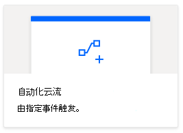

# <a name="automatically-run-scripts-with-power-automate-preview"></a><span data-ttu-id="15918-103">自动运行带电自动化的脚本（预览）</span><span class="sxs-lookup"><span data-stu-id="15918-103">Automatically run scripts with Power Automate (preview)</span></span>

<span data-ttu-id="15918-104">本教程向您介绍如何通过自动[功能自动执行](https://flow.microsoft.com)工作流，在 web 上使用适用于 Excel 的 Office 脚本。</span><span class="sxs-lookup"><span data-stu-id="15918-104">This tutorial teaches you how to use an Office Script for Excel on the web with an automated [Power Automate](https://flow.microsoft.com) workflow.</span></span> <span data-ttu-id="15918-105">您的脚本将在您每次收到电子邮件时自动运行，并在 Excel 工作簿中记录来自电子邮件的信息。</span><span class="sxs-lookup"><span data-stu-id="15918-105">Your script will automatically run each time you receive an email, recording information from the email in an Excel workbook.</span></span>

## <a name="prerequisites"></a><span data-ttu-id="15918-106">先决条件</span><span class="sxs-lookup"><span data-stu-id="15918-106">Prerequisites</span></span>

[!INCLUDE [Tutorial prerequisites](../includes/tutorial-prerequisites.md)]

> [!IMPORTANT]
> <span data-ttu-id="15918-107">本教程假定您已完成[使用 Power 自动化教程的 web 上的 Excel 中运行 Office 脚本](excel-power-automate-manual.md)。</span><span class="sxs-lookup"><span data-stu-id="15918-107">This tutorial assumes you have completed the [Run Office Scripts in Excel on the web with Power Automate](excel-power-automate-manual.md) tutorial.</span></span>

## <a name="prepare-the-workbook"></a><span data-ttu-id="15918-108">准备工作簿</span><span class="sxs-lookup"><span data-stu-id="15918-108">Prepare the workbook</span></span>

<span data-ttu-id="15918-109">Power 自动执行无法使用[相对引用](../develop/power-automate-integration.md#avoid-using-relative-references) `Workbook.getActiveWorksheet` ，如访问工作簿组件。</span><span class="sxs-lookup"><span data-stu-id="15918-109">Power Automate can't use [relative references](../develop/power-automate-integration.md#avoid-using-relative-references) like `Workbook.getActiveWorksheet` to access workbook components.</span></span> <span data-ttu-id="15918-110">因此，我们需要具有一致的名称的工作簿和工作表，以使电源自动参考。</span><span class="sxs-lookup"><span data-stu-id="15918-110">So, we need a workbook and worksheet with consistent names for Power Automate to reference.</span></span>

1. <span data-ttu-id="15918-111">创建一个名为**MyWorkbook**的新工作簿。</span><span class="sxs-lookup"><span data-stu-id="15918-111">Create a new workbook named **MyWorkbook**.</span></span>

2. <span data-ttu-id="15918-112">转到 "**自动**" 选项卡，然后选择 "**代码编辑器**"。</span><span class="sxs-lookup"><span data-stu-id="15918-112">Go to the **Automate** tab and select **Code Editor**.</span></span>

3. <span data-ttu-id="15918-113">选择 "**新建脚本**"。</span><span class="sxs-lookup"><span data-stu-id="15918-113">Select **New Script**.</span></span>

4. <span data-ttu-id="15918-114">将现有代码替换为以下脚本，然后按 "**运行**"。</span><span class="sxs-lookup"><span data-stu-id="15918-114">Replace the existing code with the following script and press **Run**.</span></span> <span data-ttu-id="15918-115">这将使用一致的工作表、表和数据透视表名称设置工作簿。</span><span class="sxs-lookup"><span data-stu-id="15918-115">This will setup the workbook with consistent worksheet, table, and PivotTable names.</span></span>

    ```TypeScript
    function main(workbook: ExcelScript.Workbook) {
      // Add a new worksheet to store our email table
      let emailsSheet = workbook.addWorksheet("Emails");

      // Add data and create a table
      emailsSheet.getRange("A1:D1").setValues([
        ["Date", "Day of the week", "Email address", "Subject"]
      ]);
      let newTable = workbook.addTable(emailsSheet.getRange("A1:D2"), true);
      newTable.setName("EmailTable");

      // Add a new PivotTable to a new worksheet
      let pivotWorksheet = workbook.addWorksheet("SubjectPivot");
      let newPivotTable = workbook.addPivotTable("Pivot", "EmailTable", pivotWorksheet.getRange("A3:C20"));

      // Setup the pivot hierarchies
      newPivotTable.addRowHierarchy(newPivotTable.getHierarchy("Day of the week"));
      newPivotTable.addRowHierarchy(newPivotTable.getHierarchy("Email address"));
      newPivotTable.addDataHierarchy(newPivotTable.getHierarchy("Subject"));
    }
    ```

## <a name="create-an-office-script-for-your-automated-workflow"></a><span data-ttu-id="15918-116">为自动工作流创建 Office 脚本</span><span class="sxs-lookup"><span data-stu-id="15918-116">Create an Office Script for your automated workflow</span></span>

<span data-ttu-id="15918-117">我们来创建一个脚本，用于记录来自电子邮件的信息。</span><span class="sxs-lookup"><span data-stu-id="15918-117">Let's create a script that logs information from an email.</span></span> <span data-ttu-id="15918-118">我们想知道我们在一周中的哪几天收到最多的邮件，以及有多少唯一发件人发送该邮件。</span><span class="sxs-lookup"><span data-stu-id="15918-118">We want to know how which days of the week we receive the most mail and how many unique senders are sending that mail.</span></span> <span data-ttu-id="15918-119">我们的工作簿包含一个包含**日期**、**星期几**、**电子邮件地址**和**主题**列的表格。</span><span class="sxs-lookup"><span data-stu-id="15918-119">Our workbook has a table with **Date**, **Day of the week**, **Email address**, and **Subject** columns.</span></span> <span data-ttu-id="15918-120">我们的工作表还有一个透视表，该数据透视表在**星期**和**电子邮件地址**（这些行是行分层）中进行透视。</span><span class="sxs-lookup"><span data-stu-id="15918-120">Our worksheet also has a PivotTable that is pivoting on the **Day of the week** and **Email address** (those are the row hierarchies).</span></span> <span data-ttu-id="15918-121">"唯一"**主题**的计数是要显示的聚合信息（数据层次结构）。</span><span class="sxs-lookup"><span data-stu-id="15918-121">The count of unique **Subjects** is the aggregated information being displayed (the data hierarchy).</span></span> <span data-ttu-id="15918-122">我们将在更新电子邮件表后，脚本刷新数据透视表。</span><span class="sxs-lookup"><span data-stu-id="15918-122">We'll have our script refresh that PivotTable after updating the email table.</span></span>

1. <span data-ttu-id="15918-123">在**代码编辑器**中，选择 "**新建脚本**"。</span><span class="sxs-lookup"><span data-stu-id="15918-123">From within the **Code Editor**, select **New Script**.</span></span>

2. <span data-ttu-id="15918-124">我们稍后将在本教程中创建的流程将发送有关收到的每封电子邮件的脚本信息。</span><span class="sxs-lookup"><span data-stu-id="15918-124">The flow that we'll create later in the tutorial will send our script information about each email that's received.</span></span> <span data-ttu-id="15918-125">脚本需要通过函数中的参数接受该输入 `main` 。</span><span class="sxs-lookup"><span data-stu-id="15918-125">The script needs to accept that input through parameters in the `main` function.</span></span> <span data-ttu-id="15918-126">将默认脚本替换为以下脚本：</span><span class="sxs-lookup"><span data-stu-id="15918-126">Replace the default script with the following script:</span></span>

    ```TypeScript
    function main(
      workbook: ExcelScript.Workbook,
      from: string,
      dateReceived: string,
      subject: string) {

    }
    ```

3. <span data-ttu-id="15918-127">该脚本需要访问工作簿的表和数据透视表。</span><span class="sxs-lookup"><span data-stu-id="15918-127">The script needs access to the workbook's table and PivotTable.</span></span> <span data-ttu-id="15918-128">将下面的代码添加到脚本正文中的开头 `{` ：</span><span class="sxs-lookup"><span data-stu-id="15918-128">Add the following code to the body of the script, after the opening `{`:</span></span>

    ```TypeScript
    // Get the email table.
    let emailWorksheet = workbook.getWorksheet("Emails");
    let table = emailWorksheet.getTable("EmailTable");
  
    // Get the PivotTable.
    let pivotTableWorksheet = workbook.getWorksheet("SubjectPivot");
    let pivotTable = pivotTableWorksheet.getPivotTable("Pivot");
    ```

4. <span data-ttu-id="15918-129">`dateReceived`参数的类型为 `string` 。</span><span class="sxs-lookup"><span data-stu-id="15918-129">The `dateReceived` parameter is of type `string`.</span></span> <span data-ttu-id="15918-130">让我们将它转换为[ `Date` 对象](../develop/javascript-objects.md#date)，以便我们可以轻松获取一周中的一天。</span><span class="sxs-lookup"><span data-stu-id="15918-130">Let's convert that to a [`Date` object](../develop/javascript-objects.md#date) so we can easily get the day of the week.</span></span> <span data-ttu-id="15918-131">执行此操作后，我们需要将日的数字值映射到更易于阅读的版本。</span><span class="sxs-lookup"><span data-stu-id="15918-131">After doing that, we'll need to map the day's number value to a more readable version.</span></span> <span data-ttu-id="15918-132">将以下代码添加到脚本末尾，在结束之前 `}` ：</span><span class="sxs-lookup"><span data-stu-id="15918-132">Add the following code to the end of your script, before the closing `}`:</span></span>

    ```TypeScript
    // Parse the received date string.
    let date = new Date(dateReceived);

    // Convert number representing the day of the week into the name of the day.
    let dayText : string;
    switch (date.getDay()) {
      case 0:
        dayText = "Sunday";
        break;
      case 1:
        dayText = "Monday";
        break;
      case 2:
        dayText = "Tuesday";
        break;
      case 3:
        dayText = "Wednesday";
        break;
      case 4:
        dayText = "Thursday";
        break;
      case 5:
        dayText = "Friday";
        break;
      default:
        dayText = "Saturday";
        break;
    }
    ```

5. <span data-ttu-id="15918-133">该 `subject` 字符串可能包含 "RE：" 答复标记。</span><span class="sxs-lookup"><span data-stu-id="15918-133">The `subject` string may include the "RE:" reply tag.</span></span> <span data-ttu-id="15918-134">让我们从字符串中删除该对象，以便同一线程中的电子邮件具有相同的表格主题。</span><span class="sxs-lookup"><span data-stu-id="15918-134">Let's remove that from the string so that emails in the same thread have the same subject for the table.</span></span> <span data-ttu-id="15918-135">将以下代码添加到脚本末尾，在结束之前 `}` ：</span><span class="sxs-lookup"><span data-stu-id="15918-135">Add the following code to the end of your script, before the closing `}`:</span></span>

    ```TypeScript
    // Remove the reply tag from the email subject to group emails on the same thread.
    let subjectText = subject.replace("Re: ", "");
    subjectText = subjectText.replace("RE: ", "");
    ```

6. <span data-ttu-id="15918-136">现在，已经根据需要对电子邮件数据进行了格式化，我们将行添加到电子邮件表中。</span><span class="sxs-lookup"><span data-stu-id="15918-136">Now that the email data has been formatted to our liking, let's add a row to the email table.</span></span> <span data-ttu-id="15918-137">将以下代码添加到脚本末尾，在结束之前 `}` ：</span><span class="sxs-lookup"><span data-stu-id="15918-137">Add the following code to the end of your script, before the closing `}`:</span></span>

    ```TypeScript
    // Add the parsed text to the table.
    table.addRow(-1, [dateReceived, dayText, from, subjectText]);
    ```

7. <span data-ttu-id="15918-138">最后，让我们确保刷新数据透视表。</span><span class="sxs-lookup"><span data-stu-id="15918-138">Finally, let's make sure the PivotTable is refreshed.</span></span> <span data-ttu-id="15918-139">将以下代码添加到脚本末尾，在结束之前 `}` ：</span><span class="sxs-lookup"><span data-stu-id="15918-139">Add the following code to the end of your script, before the closing `}`:</span></span>

    ```TypeScript
    // Refresh the PivotTable to include the new row.
    pivotTable.refresh();
    ```

8. <span data-ttu-id="15918-140">重命名脚本**记录电子邮件**，然后按 "**保存脚本**"。</span><span class="sxs-lookup"><span data-stu-id="15918-140">Rename your script **Record Email** and press **Save script**.</span></span>

<span data-ttu-id="15918-141">现在，你的脚本已准备就绪，可以自动执行工作流。</span><span class="sxs-lookup"><span data-stu-id="15918-141">Your script is now ready for a Power Automate workflow.</span></span> <span data-ttu-id="15918-142">它应类似于下面的脚本：</span><span class="sxs-lookup"><span data-stu-id="15918-142">It should look like the following script:</span></span>

```TypeScript
function main(
  workbook: ExcelScript.Workbook,
  from: string,
  dateReceived: string,
  subject: string) {
  // Get the email table.
  let emailWorksheet = workbook.getWorksheet("Emails");
  let table = emailWorksheet.getTable("EmailTable");

  // Get the PivotTable.
  let pivotTableWorksheet = workbook.getWorksheet("Pivot");
  let pivotTable = pivotTableWorksheet.getPivotTable("SubjectPivot");

  // Parse the received date string.
  let date = new Date(dateReceived);

  // Convert number representing the day of the week into the name of the day.
  let dayText: string;
  switch (date.getDay()) {
    case 0:
      dayText = "Sunday";
      break;
    case 1:
      dayText = "Monday";
      break;
    case 2:
      dayText = "Tuesday";
      break;
    case 3:
      dayText = "Wednesday";
      break;
    case 4:
      dayText = "Thursday";
      break;
    case 5:
      dayText = "Friday";
      break;
    default:
      dayText = "Saturday";
      break;
  }

  // Remove the reply tag from the email subject to group emails on the same thread.
  let subjectText = subject.replace("Re: ", "");
  subjectText = subjectText.replace("RE: ", "");

  // Add the parsed text to the table.
  table.addRow(-1, [dateReceived, dayText, from, subjectText]);

  // Refresh the PivotTable to include the new row.
  pivotTable.refresh();
}
```

## <a name="create-an-automated-workflow-with-power-automate"></a><span data-ttu-id="15918-143">使用 Power 自动化创建自动工作流</span><span class="sxs-lookup"><span data-stu-id="15918-143">Create an automated workflow with Power Automate</span></span>

1. <span data-ttu-id="15918-144">登录到[Power 自动预览网站](https://flow.microsoft.com)。</span><span class="sxs-lookup"><span data-stu-id="15918-144">Sign in to the [Power Automate preview site](https://flow.microsoft.com).</span></span>

2. <span data-ttu-id="15918-145">在屏幕左侧显示的菜单中，按 "**创建**"。</span><span class="sxs-lookup"><span data-stu-id="15918-145">In the menu that's displayed on the left side of the screen, press **Create**.</span></span> <span data-ttu-id="15918-146">这将向你显示创建新工作流的方式列表。</span><span class="sxs-lookup"><span data-stu-id="15918-146">This brings you to list of ways to create new workflows.</span></span>

    

3. <span data-ttu-id="15918-148">在 "**从空白开始**" 部分，选择 "**自动流**"。</span><span class="sxs-lookup"><span data-stu-id="15918-148">In the **Start from blank** section, select **Automated flow**.</span></span> <span data-ttu-id="15918-149">这将创建由事件（如接收电子邮件）触发的工作流。</span><span class="sxs-lookup"><span data-stu-id="15918-149">This creates a workflow triggered by an event, such as receiving an email.</span></span>

    

4. <span data-ttu-id="15918-151">在出现的对话框窗口中，在 "**流名称**" 文本框中输入流的名称。</span><span class="sxs-lookup"><span data-stu-id="15918-151">In the dialog window that appears, enter a name for your flow in the **Flow name** text box.</span></span> <span data-ttu-id="15918-152">然后，从 "**选择您的流的触发**" 下的选项列表中选择 "**新电子邮件到达时**"。</span><span class="sxs-lookup"><span data-stu-id="15918-152">Then select **When a new email arrives** from the list of options under **Choose your flow's trigger**.</span></span> <span data-ttu-id="15918-153">您可能需要使用 "搜索" 框搜索选项。</span><span class="sxs-lookup"><span data-stu-id="15918-153">You may need to search for the option using the search box.</span></span> <span data-ttu-id="15918-154">最后，按 "**创建**"。</span><span class="sxs-lookup"><span data-stu-id="15918-154">Finally, press **Create**.</span></span>

    

    > [!NOTE]
    > <span data-ttu-id="15918-156">本教程使用 Outlook。</span><span class="sxs-lookup"><span data-stu-id="15918-156">This tutorial uses Outlook.</span></span> <span data-ttu-id="15918-157">你可以改用首选的电子邮件服务，但某些选项可能会有所不同。</span><span class="sxs-lookup"><span data-stu-id="15918-157">Feel free to use your preferred email service instead, though some options may be different.</span></span>

5. <span data-ttu-id="15918-158">按 "**新建步骤**"。</span><span class="sxs-lookup"><span data-stu-id="15918-158">Press **New step**.</span></span>

6. <span data-ttu-id="15918-159">选择 "**标准**" 选项卡，然后选择 " **Excel Online （企业）**"。</span><span class="sxs-lookup"><span data-stu-id="15918-159">Select the **Standard** tab, then select **Excel Online (Business)**.</span></span>

    

7. <span data-ttu-id="15918-161">在 "**操作**" 下，选择 "**运行脚本（预览）**"。</span><span class="sxs-lookup"><span data-stu-id="15918-161">Under **Actions**, select **Run script (preview)**.</span></span>

    

8. <span data-ttu-id="15918-163">为 "**运行脚本**" 连接器指定以下设置：</span><span class="sxs-lookup"><span data-stu-id="15918-163">Specify the following settings for the **Run script** connector:</span></span>

    - <span data-ttu-id="15918-164">**位置**： OneDrive for business</span><span class="sxs-lookup"><span data-stu-id="15918-164">**Location**: OneDrive for Business</span></span>
    - <span data-ttu-id="15918-165">**文档库**： OneDrive</span><span class="sxs-lookup"><span data-stu-id="15918-165">**Document Library**: OneDrive</span></span>
    - <span data-ttu-id="15918-166">**文件**： MyWorkbook.xlsx</span><span class="sxs-lookup"><span data-stu-id="15918-166">**File**: MyWorkbook.xlsx</span></span>
    - <span data-ttu-id="15918-167">**脚本**：记录电子邮件</span><span class="sxs-lookup"><span data-stu-id="15918-167">**Script**: Record Email</span></span>
    - <span data-ttu-id="15918-168">**发件人**： from *（来自 Outlook 的动态内容）*</span><span class="sxs-lookup"><span data-stu-id="15918-168">**from**: From *(dynamic content from Outlook)*</span></span>
    - <span data-ttu-id="15918-169">**dateReceived**：接收时间 *（来自 Outlook 的动态内容）*</span><span class="sxs-lookup"><span data-stu-id="15918-169">**dateReceived**: Received Time *(dynamic content from Outlook)*</span></span>
    - <span data-ttu-id="15918-170">**subject**： subject *（来自 Outlook 的动态内容）*</span><span class="sxs-lookup"><span data-stu-id="15918-170">**subject**: Subject *(dynamic content from Outlook)*</span></span>

    <span data-ttu-id="15918-171">*请注意，只有在选择脚本后，才会显示脚本的参数。*</span><span class="sxs-lookup"><span data-stu-id="15918-171">*Note that the parameters for the script will only appear once the script is selected.*</span></span>

    

9. <span data-ttu-id="15918-173">按 "**保存**"。</span><span class="sxs-lookup"><span data-stu-id="15918-173">Press **Save**.</span></span>

<span data-ttu-id="15918-174">您的流现已启用。</span><span class="sxs-lookup"><span data-stu-id="15918-174">Your flow is now enabled.</span></span> <span data-ttu-id="15918-175">它将在您每次通过 Outlook 收到电子邮件时自动运行您的脚本。</span><span class="sxs-lookup"><span data-stu-id="15918-175">It will automatically run your script each time you receive an email through Outlook.</span></span>

## <a name="manage-the-script-in-power-automate"></a><span data-ttu-id="15918-176">管理自动电源中的脚本</span><span class="sxs-lookup"><span data-stu-id="15918-176">Manage the script in Power Automate</span></span>

1. <span data-ttu-id="15918-177">从 "主电自动" 页面中，选择 "**我的流**"。</span><span class="sxs-lookup"><span data-stu-id="15918-177">From the main Power Automate page, select **My flows**.</span></span>

    

2. <span data-ttu-id="15918-179">选择您的流。</span><span class="sxs-lookup"><span data-stu-id="15918-179">Select your flow.</span></span> <span data-ttu-id="15918-180">你可以在此处查看运行历史记录。</span><span class="sxs-lookup"><span data-stu-id="15918-180">Here you can see the run history.</span></span> <span data-ttu-id="15918-181">您可以刷新页面或按 "刷新**所有运行**" 按钮以更新历史记录。</span><span class="sxs-lookup"><span data-stu-id="15918-181">You can refresh the page or press the refresh **All runs** button to update the history.</span></span> <span data-ttu-id="15918-182">在收到电子邮件后，流将立即触发。</span><span class="sxs-lookup"><span data-stu-id="15918-182">The flow will trigger shortly after an email is received.</span></span> <span data-ttu-id="15918-183">通过发送自己的邮件测试流。</span><span class="sxs-lookup"><span data-stu-id="15918-183">Test the flow by sending yourself mail.</span></span>

<span data-ttu-id="15918-184">当触发流并成功运行脚本时，您应该会看到工作簿的表和数据透视表更新。</span><span class="sxs-lookup"><span data-stu-id="15918-184">When the flow is triggered and successfully runs your script, you should see the workbook's table and PivotTable update.</span></span>


## <a name="next-steps"></a><span data-ttu-id="15918-187">后续步骤</span><span class="sxs-lookup"><span data-stu-id="15918-187">Next steps</span></span>

<span data-ttu-id="15918-188">访问 "[使用 power 自动运行 Office 脚本](../develop/power-automate-integration.md)"，以详细了解如何通过 power 自动化连接 office 脚本。</span><span class="sxs-lookup"><span data-stu-id="15918-188">Visit [Run Office Scripts with Power Automate](../develop/power-automate-integration.md) to learn more about connecting Office Scripts with Power Automate.</span></span>

<span data-ttu-id="15918-189">您还可以查看[自动任务提醒示例方案](../resources/scenarios/task-reminders.md)，以了解如何使用工作组自适应卡片将 Office 脚本和电力自动化组合在一起。</span><span class="sxs-lookup"><span data-stu-id="15918-189">You can also check out the [Automated task reminders sample scenario](../resources/scenarios/task-reminders.md) to learn how to combine Office Scripts and Power Automate with Teams Adaptive Cards.</span></span>
