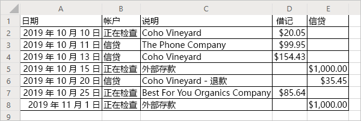

# <a name="read-workbook-data-with-office-scripts-in-excel-on-the-web"></a><span data-ttu-id="ffbbb-103">在 Excel 网页版中使用 Office 脚本读取工作簿数据</span><span class="sxs-lookup"><span data-stu-id="ffbbb-103">Read workbook data with Office Scripts in Excel on the web</span></span>

<span data-ttu-id="ffbbb-104">本教程将介绍如何在 Excel 网页版中使用 Office 脚本从工作簿中读取数据。</span><span class="sxs-lookup"><span data-stu-id="ffbbb-104">This tutorial teaches you how to read data from a workbook with an Office Script for Excel on the web.</span></span> <span data-ttu-id="ffbbb-105">然后，你将编辑所读取的数据，并将其放回工作簿中。</span><span class="sxs-lookup"><span data-stu-id="ffbbb-105">You'll then edit the data you read and put it back in the workbook.</span></span>

> [!TIP]
> <span data-ttu-id="ffbbb-106">如果你不熟悉 Office 脚本，建议先查看[在 Excel 网页版中录制、编辑和创建 Office 脚本](excel-tutorial.md)教程。</span><span class="sxs-lookup"><span data-stu-id="ffbbb-106">If you are new to Office Scripts, we recommend starting with the [Record, edit, and create Office Scripts in Excel on the web](excel-tutorial.md) tutorial.</span></span>

## <a name="prerequisites"></a><span data-ttu-id="ffbbb-107">先决条件</span><span class="sxs-lookup"><span data-stu-id="ffbbb-107">Prerequisites</span></span>

[!INCLUDE [Tutorial prerequisites](../includes/tutorial-prerequisites.md)]

> [!IMPORTANT]
> <span data-ttu-id="ffbbb-108">本教程面向在 JavaScript 或 TypeScript 方面具备初级到中级知识的人员。</span><span class="sxs-lookup"><span data-stu-id="ffbbb-108">This tutorial is intended for people with beginner to intermediate-level knowledge of JavaScript or TypeScript.</span></span> <span data-ttu-id="ffbbb-109">如果你不熟悉 JavaScript，建议查看 [Mozilla JavaScript 教程](https://developer.mozilla.org/docs/Web/JavaScript/Guide/Introduction)。</span><span class="sxs-lookup"><span data-stu-id="ffbbb-109">If you're new to JavaScript, we recommend reviewing the [Mozilla JavaScript tutorial](https://developer.mozilla.org/docs/Web/JavaScript/Guide/Introduction).</span></span> <span data-ttu-id="ffbbb-110">请访问 [Excel 网页版中的 Office 脚本](../overview/excel.md)，以了解有关脚本环境的详细信息。</span><span class="sxs-lookup"><span data-stu-id="ffbbb-110">Visit [Office Scripts in Excel on the web](../overview/excel.md) to learn more about the script environment.</span></span>

## <a name="read-a-cell"></a><span data-ttu-id="ffbbb-111">读取单元格</span><span class="sxs-lookup"><span data-stu-id="ffbbb-111">Read a cell</span></span>

<span data-ttu-id="ffbbb-112">使用操作录制器创建的脚本只能将信息写入工作簿。</span><span class="sxs-lookup"><span data-stu-id="ffbbb-112">Scripts made with the Action Recorder can only write information to the workbook.</span></span> <span data-ttu-id="ffbbb-113">借助代码编辑器，可以编辑并创建也从工作簿中读取数据的脚本。</span><span class="sxs-lookup"><span data-stu-id="ffbbb-113">With the Code Editor, you can edit and make scripts that also read data from a workbook.</span></span>

<span data-ttu-id="ffbbb-114">我们来创建一个读取数据并根据读取的数据执行操作的脚本。</span><span class="sxs-lookup"><span data-stu-id="ffbbb-114">Let's make a script that reads data and acts based on what was read.</span></span> <span data-ttu-id="ffbbb-115">我们将使用示例银行帐单。</span><span class="sxs-lookup"><span data-stu-id="ffbbb-115">We're going to work with a sample banking statement.</span></span> <span data-ttu-id="ffbbb-116">此帐单是结合了支票和信贷的帐单。</span><span class="sxs-lookup"><span data-stu-id="ffbbb-116">This statement is a combined checking and credit statement.</span></span> <span data-ttu-id="ffbbb-117">遗憾的是，它们会以不同的方式报告余额变化。</span><span class="sxs-lookup"><span data-stu-id="ffbbb-117">Unfortunately, they report balance changes differently.</span></span> <span data-ttu-id="ffbbb-118">支票帐单将收入作为正面信贷，将费用作为负面借记。</span><span class="sxs-lookup"><span data-stu-id="ffbbb-118">The checking statement gives income as positive credit and costs as negative debit.</span></span> <span data-ttu-id="ffbbb-119">信贷帐单与之相反。</span><span class="sxs-lookup"><span data-stu-id="ffbbb-119">The credit statement does the opposite.</span></span>

<span data-ttu-id="ffbbb-120">在本教程的其余部分中，我们将使用脚本对此数据进行标准化。</span><span class="sxs-lookup"><span data-stu-id="ffbbb-120">Over the rest of the tutorial, we will normalize this data using a script.</span></span> <span data-ttu-id="ffbbb-121">首先，让我们来了解如何从工作簿中读取数据。</span><span class="sxs-lookup"><span data-stu-id="ffbbb-121">First, let's learn how to read data from the workbook.</span></span>

1. <span data-ttu-id="ffbbb-122">在用于教程其余部分的工作簿中创建新工作表。</span><span class="sxs-lookup"><span data-stu-id="ffbbb-122">Create a new worksheet in the workbook you've used for the rest of the tutorial.</span></span>
2. <span data-ttu-id="ffbbb-123">复制以下数据，并将其粘贴到新工作表中，从单元格 **A1** 开始。</span><span class="sxs-lookup"><span data-stu-id="ffbbb-123">Copy the following data and paste it into the new worksheet, starting at cell **A1**.</span></span>

    |<span data-ttu-id="ffbbb-124">日期</span><span class="sxs-lookup"><span data-stu-id="ffbbb-124">Date</span></span> |<span data-ttu-id="ffbbb-125">帐户</span><span class="sxs-lookup"><span data-stu-id="ffbbb-125">Account</span></span> |<span data-ttu-id="ffbbb-126">说明</span><span class="sxs-lookup"><span data-stu-id="ffbbb-126">Description</span></span> |<span data-ttu-id="ffbbb-127">借记</span><span class="sxs-lookup"><span data-stu-id="ffbbb-127">Debit</span></span> |<span data-ttu-id="ffbbb-128">信贷</span><span class="sxs-lookup"><span data-stu-id="ffbbb-128">Credit</span></span> |
    |:--|:--|:--|:--|:--|
    |<span data-ttu-id="ffbbb-129">2019 年 10 月 10 日</span><span class="sxs-lookup"><span data-stu-id="ffbbb-129">10/10/2019</span></span> |<span data-ttu-id="ffbbb-130">支票</span><span class="sxs-lookup"><span data-stu-id="ffbbb-130">Checking</span></span> |<span data-ttu-id="ffbbb-131">Coho Vineyard</span><span class="sxs-lookup"><span data-stu-id="ffbbb-131">Coho Vineyard</span></span> |<span data-ttu-id="ffbbb-132">-20.05</span><span class="sxs-lookup"><span data-stu-id="ffbbb-132">-20.05</span></span> | |
    |<span data-ttu-id="ffbbb-133">2019 年 10 月 11 日</span><span class="sxs-lookup"><span data-stu-id="ffbbb-133">10/11/2019</span></span> |<span data-ttu-id="ffbbb-134">信贷</span><span class="sxs-lookup"><span data-stu-id="ffbbb-134">Credit</span></span> |<span data-ttu-id="ffbbb-135">The Phone Company</span><span class="sxs-lookup"><span data-stu-id="ffbbb-135">The Phone Company</span></span> |<span data-ttu-id="ffbbb-136">99.95</span><span class="sxs-lookup"><span data-stu-id="ffbbb-136">99.95</span></span> | |
    |<span data-ttu-id="ffbbb-137">2019 年 10 月 13 日</span><span class="sxs-lookup"><span data-stu-id="ffbbb-137">10/13/2019</span></span> |<span data-ttu-id="ffbbb-138">信贷</span><span class="sxs-lookup"><span data-stu-id="ffbbb-138">Credit</span></span> |<span data-ttu-id="ffbbb-139">Coho Vineyard</span><span class="sxs-lookup"><span data-stu-id="ffbbb-139">Coho Vineyard</span></span> |<span data-ttu-id="ffbbb-140">154.43</span><span class="sxs-lookup"><span data-stu-id="ffbbb-140">154.43</span></span> | |
    |<span data-ttu-id="ffbbb-141">2019 年 10 月 15 日</span><span class="sxs-lookup"><span data-stu-id="ffbbb-141">10/15/2019</span></span> |<span data-ttu-id="ffbbb-142">支票</span><span class="sxs-lookup"><span data-stu-id="ffbbb-142">Checking</span></span> |<span data-ttu-id="ffbbb-143">外部存款</span><span class="sxs-lookup"><span data-stu-id="ffbbb-143">External Deposit</span></span> | |<span data-ttu-id="ffbbb-144">1000</span><span class="sxs-lookup"><span data-stu-id="ffbbb-144">1000</span></span> |
    |<span data-ttu-id="ffbbb-145">2019 年 10 月 20 日</span><span class="sxs-lookup"><span data-stu-id="ffbbb-145">10/20/2019</span></span> |<span data-ttu-id="ffbbb-146">信贷</span><span class="sxs-lookup"><span data-stu-id="ffbbb-146">Credit</span></span> |<span data-ttu-id="ffbbb-147">Coho Vineyard - 退款</span><span class="sxs-lookup"><span data-stu-id="ffbbb-147">Coho Vineyard - Refund</span></span> | |<span data-ttu-id="ffbbb-148">-35.45</span><span class="sxs-lookup"><span data-stu-id="ffbbb-148">-35.45</span></span> |
    |<span data-ttu-id="ffbbb-149">2019 年 10 月 25 日</span><span class="sxs-lookup"><span data-stu-id="ffbbb-149">10/25/2019</span></span> |<span data-ttu-id="ffbbb-150">支票</span><span class="sxs-lookup"><span data-stu-id="ffbbb-150">Checking</span></span> |<span data-ttu-id="ffbbb-151">Best For You Organics Company</span><span class="sxs-lookup"><span data-stu-id="ffbbb-151">Best For You Organics Company</span></span> | <span data-ttu-id="ffbbb-152">-85.64</span><span class="sxs-lookup"><span data-stu-id="ffbbb-152">-85.64</span></span> | |
    |<span data-ttu-id="ffbbb-153">2019 年 11 月 1 日</span><span class="sxs-lookup"><span data-stu-id="ffbbb-153">11/01/2019</span></span> |<span data-ttu-id="ffbbb-154">支票</span><span class="sxs-lookup"><span data-stu-id="ffbbb-154">Checking</span></span> |<span data-ttu-id="ffbbb-155">外部存款</span><span class="sxs-lookup"><span data-stu-id="ffbbb-155">External Deposit</span></span> | |<span data-ttu-id="ffbbb-156">1000</span><span class="sxs-lookup"><span data-stu-id="ffbbb-156">1000</span></span> |

3. <span data-ttu-id="ffbbb-157">打开“代码编辑器”，然后选择“新建脚本”\*\*\*\*\*\*\*\*。</span><span class="sxs-lookup"><span data-stu-id="ffbbb-157">Open the **Code Editor** and select **New Script**.</span></span>
4. <span data-ttu-id="ffbbb-158">让我们来清理格式。</span><span class="sxs-lookup"><span data-stu-id="ffbbb-158">Let's clean up the formatting.</span></span> <span data-ttu-id="ffbbb-159">这是一个财务文档，因此更改“借记”和“信贷”列中的数字格式以将值显示为美元金额\*\*\*\*\*\*\*\*。</span><span class="sxs-lookup"><span data-stu-id="ffbbb-159">This is a financial document, so let's change the number formatting in the **Debit** and **Credit** columns to show values as dollar amounts.</span></span> <span data-ttu-id="ffbbb-160">我们还调整列宽以适应数据。</span><span class="sxs-lookup"><span data-stu-id="ffbbb-160">Let's also fit the column width to the data.</span></span>

    <span data-ttu-id="ffbbb-161">将脚本内容替换为以下代码：</span><span class="sxs-lookup"><span data-stu-id="ffbbb-161">Replace the script contents with the following code:</span></span>

    ```TypeScript
    function main(workbook: ExcelScript.Workbook) {
        // Get the current worksheet.
        let selectedSheet = workbook.getActiveWorksheet();

        // Format the range to display numerical dollar amounts.
        selectedSheet.getRange("D2:E8").setNumberFormat("$#,##0.00");

        // Fit the width of all the used columns to the data.
        selectedSheet.getUsedRange().getFormat().autofitColumns();
    }
    ```

5. <span data-ttu-id="ffbbb-162">现在，让我们从数字列之一中读取一个值。</span><span class="sxs-lookup"><span data-stu-id="ffbbb-162">Now let's read a value from one of the number columns.</span></span> <span data-ttu-id="ffbbb-163">将以下代码添加到脚本的末尾（在结束 `}` 之前）：</span><span class="sxs-lookup"><span data-stu-id="ffbbb-163">Add the following code to the end of the script (before the closing `}`):</span></span>

    ```TypeScript
    // Get the value of cell D2.
    let range = selectedSheet.getRange("D2");
    console.log(range.getValues());
    ```

6. <span data-ttu-id="ffbbb-164">运行脚本。</span><span class="sxs-lookup"><span data-stu-id="ffbbb-164">Run the script.</span></span>
7. <span data-ttu-id="ffbbb-165">应在控制台中看到 `[Array[1]]`。</span><span class="sxs-lookup"><span data-stu-id="ffbbb-165">You should see `[Array[1]]` in the console.</span></span> <span data-ttu-id="ffbbb-166">这不是数字，因为区域是数据的二维数组。</span><span class="sxs-lookup"><span data-stu-id="ffbbb-166">This is not a number because ranges are two-dimensional arrays of data.</span></span> <span data-ttu-id="ffbbb-167">该二维区域直接记录到控制台。</span><span class="sxs-lookup"><span data-stu-id="ffbbb-167">That two-dimensional range is being logged to the console directly.</span></span> <span data-ttu-id="ffbbb-168">幸运的是，代码编辑器让你能够看到数组的内容。</span><span class="sxs-lookup"><span data-stu-id="ffbbb-168">Luckily, the Code Editor lets you see the contents of the array.</span></span>
8. <span data-ttu-id="ffbbb-169">将二维数组记录到控制台时，它会对每行下面的列值进行分组。</span><span class="sxs-lookup"><span data-stu-id="ffbbb-169">When a two-dimensional array is logged to the console, it groups column values under each row.</span></span> <span data-ttu-id="ffbbb-170">按蓝色三角形展开数组日志。</span><span class="sxs-lookup"><span data-stu-id="ffbbb-170">Expand the array log by pressing the blue triangle.</span></span>
9. <span data-ttu-id="ffbbb-171">按新出现的蓝色三角形展开数组的第二级别。</span><span class="sxs-lookup"><span data-stu-id="ffbbb-171">Expand the second level of the array by pressing the newly revealed blue triangle.</span></span> <span data-ttu-id="ffbbb-172">现在，你应该会看到：</span><span class="sxs-lookup"><span data-stu-id="ffbbb-172">You should now see this:</span></span>

    

## <a name="modify-the-value-of-a-cell"></a><span data-ttu-id="ffbbb-174">修改单元格的值</span><span class="sxs-lookup"><span data-stu-id="ffbbb-174">Modify the value of a cell</span></span>

<span data-ttu-id="ffbbb-175">现在，我们可以读取数据，让我们使用该数据来修改工作簿。</span><span class="sxs-lookup"><span data-stu-id="ffbbb-175">Now that we can read data, let's use that data to modify the workbook.</span></span> <span data-ttu-id="ffbbb-176">使单元格 **D2** 的值与 `Math.abs` 函数呈正相关。</span><span class="sxs-lookup"><span data-stu-id="ffbbb-176">We'll make the value of the cell **D2** positive with the `Math.abs` function.</span></span> <span data-ttu-id="ffbbb-177">[Math](https://developer.mozilla.org/docs/web/javascript/reference/global_objects/math) 对象包含许多脚本具有访问权限的函数。</span><span class="sxs-lookup"><span data-stu-id="ffbbb-177">The [Math](https://developer.mozilla.org/docs/web/javascript/reference/global_objects/math) object contains many functions to which your scripts have access.</span></span> <span data-ttu-id="ffbbb-178">可在[使用 Office 脚本中的内置 JavaScript 对象](../develop/javascript-objects.md)中找到有关 `Math` 和其他内置对象的详细信息。</span><span class="sxs-lookup"><span data-stu-id="ffbbb-178">More information about `Math` and other built-in objects can be found at [Using built-in JavaScript objects in Office Scripts](../develop/javascript-objects.md).</span></span>

1. <span data-ttu-id="ffbbb-179">将以下代码添加到脚本末尾：</span><span class="sxs-lookup"><span data-stu-id="ffbbb-179">Add the following code to the end of the script:</span></span>

    ```TypeScript
    // Run the `Math.abs` function with the value at D2 and apply that value back to D2.
    let positiveValue = Math.abs(range.getValue());
    range.setValue(positiveValue);
    ```

    <span data-ttu-id="ffbbb-180">请注意，我们正在使用 `getValue` 和 `setValue`。</span><span class="sxs-lookup"><span data-stu-id="ffbbb-180">Note that we're using `getValue` and `setValue`.</span></span> <span data-ttu-id="ffbbb-181">这些方法适用于单个单元格。</span><span class="sxs-lookup"><span data-stu-id="ffbbb-181">These methods work on a single cell.</span></span> <span data-ttu-id="ffbbb-182">处理多单元格区域时，需使用 `getValues` 和 `setValues`。</span><span class="sxs-lookup"><span data-stu-id="ffbbb-182">When handling multi-cell ranges, you'll want to use `getValues` and `setValues`.</span></span>

2. <span data-ttu-id="ffbbb-183">单元格 **D2** 的值现在应为正值。</span><span class="sxs-lookup"><span data-stu-id="ffbbb-183">The value of cell **D2** should now be positive.</span></span>

## <a name="modify-the-values-of-a-column"></a><span data-ttu-id="ffbbb-184">修改列的值</span><span class="sxs-lookup"><span data-stu-id="ffbbb-184">Modify the values of a column</span></span>

<span data-ttu-id="ffbbb-185">现在，我们知道如何读取和写入单个单元格，让我们对脚本进行一般化，使其适用于整个“借记”和“信贷”列\*\*\*\*\*\*\*\*。</span><span class="sxs-lookup"><span data-stu-id="ffbbb-185">Now that we know how to read and write to a single cell, let's generalize the script to work on the entire **Debit** and **Credit** columns.</span></span>

1. <span data-ttu-id="ffbbb-186">删除仅影响单个单元格的代码（先前的绝对值代码），以便你的脚本现在如下所示：</span><span class="sxs-lookup"><span data-stu-id="ffbbb-186">Remove the code that affects only a single cell (the previous absolute value code), such that your script now looks like this:</span></span>

    ```TypeScript
    function main(workbook: ExcelScript.Workbook) {
        // Get the current worksheet.
        let selectedSheet = workbook.getActiveWorksheet();

        // Format the range to display numerical dollar amounts.
        selectedSheet.getRange("D2:E8").setNumberFormat("$#,##0.00");

        // Fit the width of all the used columns to the data.
        selectedSheet.getUsedRange().getFormat().autofitColumns();
    }
    ```

2. <span data-ttu-id="ffbbb-187">在脚本末尾添加循环访问最后两列中的行的循环。</span><span class="sxs-lookup"><span data-stu-id="ffbbb-187">Add a loop to the end of the script that iterates through the rows in the last two columns.</span></span> <span data-ttu-id="ffbbb-188">对于每个单元格，脚本将值设置为当前值的绝对值。</span><span class="sxs-lookup"><span data-stu-id="ffbbb-188">For each cell, the script sets the value to the current value's absolute value.</span></span>

    <span data-ttu-id="ffbbb-189">请注意，定义单元格位置的数组是从零开始的。</span><span class="sxs-lookup"><span data-stu-id="ffbbb-189">Note that the array defining cell locations is zero-based.</span></span> <span data-ttu-id="ffbbb-190">这意味着单元格 **A1** 为 `range[0][0]`。</span><span class="sxs-lookup"><span data-stu-id="ffbbb-190">That means cell **A1** is `range[0][0]`.</span></span>

    ```TypeScript
    // Get the values of the used range.
    let range = selectedSheet.getUsedRange();
    let rangeValues = range.getValues();

    // Iterate over the fourth and fifth columns and set their values to their absolute value.
    let rowCount = range.getRowCount();
    for (let i = 1; i < rowCount; i++) {
        // The column at index 3 is column "4" in the worksheet.
        if (rangeValues[i][3] != 0) {
            let positiveValue = Math.abs(rangeValues[i][3]);
            selectedSheet.getCell(i, 3).setValue(positiveValue);
        }

        // The column at index 4 is column "5" in the worksheet.
        if (rangeValues[i][4] != 0) {
            let positiveValue = Math.abs(rangeValues[i][4]);
            selectedSheet.getCell(i, 4).setValue(positiveValue);
        }
    }
    ```

    <span data-ttu-id="ffbbb-191">此部分的脚本执行几项重要任务。</span><span class="sxs-lookup"><span data-stu-id="ffbbb-191">This portion of the script does several important tasks.</span></span> <span data-ttu-id="ffbbb-192">首先，获取已用区域的值和行计数。</span><span class="sxs-lookup"><span data-stu-id="ffbbb-192">First, it gets the values and row count of the used range.</span></span> <span data-ttu-id="ffbbb-193">这样，我们就可以查看值并知道何时停止。</span><span class="sxs-lookup"><span data-stu-id="ffbbb-193">This lets us look at values and know when to stop.</span></span> <span data-ttu-id="ffbbb-194">其次，循环访问已用区域，检查“借记”或“信贷”列中的每个单元格\*\*\*\*\*\*\*\*。</span><span class="sxs-lookup"><span data-stu-id="ffbbb-194">Second, it iterates through the used range, checking each cell in the **Debit** or **Credit** columns.</span></span> <span data-ttu-id="ffbbb-195">最后，如果单元格中的值不为 0，则该值将替换为其绝对值。</span><span class="sxs-lookup"><span data-stu-id="ffbbb-195">Finally, if the value in the cell is not 0, it is replaced by its absolute value.</span></span> <span data-ttu-id="ffbbb-196">我们正在避免使用零，因此可以将空白单元格保留原样。</span><span class="sxs-lookup"><span data-stu-id="ffbbb-196">We're avoiding zeroes so we can leave the blank cells as they were.</span></span>

3. <span data-ttu-id="ffbbb-197">运行脚本。</span><span class="sxs-lookup"><span data-stu-id="ffbbb-197">Run the script.</span></span>

    <span data-ttu-id="ffbbb-198">现在，你的银行帐单如下所示：</span><span class="sxs-lookup"><span data-stu-id="ffbbb-198">Your banking statement should now look like this:</span></span>

    

## <a name="next-steps"></a><span data-ttu-id="ffbbb-200">后续步骤</span><span class="sxs-lookup"><span data-stu-id="ffbbb-200">Next steps</span></span>

<span data-ttu-id="ffbbb-201">打开“代码编辑器”，然后尝试使用一些 [Excel 网页版中的 Office 脚本的示例脚本](../resources/excel-samples.md)。</span><span class="sxs-lookup"><span data-stu-id="ffbbb-201">Open the Code Editor and try out some of our [Sample scripts for Office Scripts in Excel on the web](../resources/excel-samples.md).</span></span> <span data-ttu-id="ffbbb-202">还可以访问 [Excel 网页版中的 Office 脚本的脚本基础知识](../develop/scripting-fundamentals.md)，了解有关创建 Office 脚本的详细信息。</span><span class="sxs-lookup"><span data-stu-id="ffbbb-202">You can also visit [Scripting Fundamentals for Office Scripts in Excel on the web](../develop/scripting-fundamentals.md) to learn more about creating Office Scripts.</span></span>
