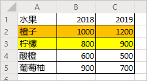
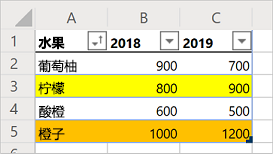

# <a name="record-edit-and-create-office-scripts-in-excel-on-the-web"></a>在 Excel 网页版中录制、编辑和创建 Office 脚本

本教程将提供有关为 Excel 网页版录制、编辑和编写 Office 脚本的基础知识。

## <a name="prerequisites"></a>先决条件

[!INCLUDE [Preview note](../includes/preview-note.md)]

在开始本教程之前，你需要具有 Office 脚本的访问权限，要求如下：

- [Excel 网页版](https://www.office.com/launch/excel)。
- 要求管理员[为组织启用 Office 脚本](https://support.office.com/article/office-scripts-settings-in-m365-19d3c51a-6ca2-40ab-978d-60fa49554dcf)，这会将“**自动**”选项卡添加到功能区。

> [!IMPORTANT]
> 本教程面向在 JavaScript 或 TypeScript 方面具备初级到中级知识的人员。 如果你不熟悉 JavaScript，建议查看 [Mozilla JavaScript 教程](https://developer.mozilla.org/docs/Web/JavaScript/Guide/Introduction)。 请访问 [Excel 网页版中的 Office 脚本](../overview/excel.md)，以了解有关脚本环境的详细信息。

## <a name="add-data-and-record-a-basic-script"></a>添加数据和录制基本脚本

首先，我们需要一些数据和一个小的启动脚本。

1. 在 Excel 网页版中创建新的工作簿。
2. 复制以下水果销售数据，并将其粘贴到工作表中，从单元格 **A1** 开始。

    |水果 |2018 年 |2019 年 |
    |:---|:---|:---|
    |橙子 |1000 |1200 |
    |柠檬 |800 |900 |
    |酸橙 |600 |500 |
    |葡萄柚 |900 |700 |

3. 打开“**自动**”选项卡。如果未看到“**自动**”选项卡，请通过按下拉箭头来检查功能区溢出。
4. 按“**录制操作**”按钮。
5. 选择单元格 **A2:C2**（“橙子”行），并将填充颜色设置为橙色。
6. 通过按“**停止**”按钮来停止录制。
7. 在“**脚本名称**”字段中填写一个便于记忆的名称。
8. *可选：* 在“**描述**”字段中填写有意义的描述。 这用于提供有关脚本功能的上下文。 在本教程中，你可以使用“表格的颜色代码行”。

   > [!TIP]
   > 稍后可以从“**脚本详细信息**”窗格编辑脚本的描述，该窗格位于代码编辑器的“**...**”菜单下。

9. 通过按“**保存**”按钮来保存脚本。

    你的工作表应如下所示（不要担心颜色是否不同）:

    

## <a name="edit-an-existing-script"></a>编辑现有脚本

前面的脚本将“橙子”行的颜色设置为橙色。 让我们为“柠檬”添加黄色行。

1. 打开“**自动**”选项卡。
2. 按“**代码编辑器**”按钮。
3. 打开在前面部分录制的脚本。 你应该会该看到与此代码类似的内容：

    ```TypeScript
    async function main(context: Excel.RequestContext) {
      // Set fill color to FFC000 for range Sheet1!A2:C2
      let workbook = context.workbook;
      let worksheets = workbook.worksheets;
      let selectedSheet = worksheets.getActiveWorksheet();
      selectedSheet.getRange("A2:C2").format.fill.color = "FFC000";
    }
    ```

    此代码首先通过访问工作簿的工作表集合来获取当前工作表。 然后，它将设置区域 **A2:C2** 的填充颜色。

    区域是 Excel 网页版中的 Office 脚本的基本组成部分。 区域是一个连续的矩形单元格块，其中包含值、公式和格式。 它们是单元格的基本结构，你可以通过它们执行大多数脚本编写任务。

4. 将以下行添加到脚本的末尾（在 `color` 设置位置和结束 `}` 之间）：

    ```TypeScript
    selectedSheet.getRange("A3:C3").format.fill.color = "yellow";
    ```

5. 通过按“**运行**”来测试脚本。 工作簿现在应如下所示：

    

## <a name="create-a-table"></a>创建表格

让我们将此水果销售数据转换为表格。 我们将在整个过程中使用自己的脚本。

1. 将以下行添加到脚本的末尾（在结束 `}` 之前）：

    ```TypeScript
    let table = selectedSheet.tables.add("A1:C5", true);
    ```

2. 该调用将返回 `Table` 对象。 让我们使用该表对数据进行排序。 我们将根据“水果”列中的值按升序对数据进行排序。 在创建表格后添加以下行：

    ```TypeScript
    table.sort.apply([{ key: 0, ascending: true }]);
    ```

    你的脚本应如下所示：

    ```TypeScript
    async function main(context: Excel.RequestContext) {
      // Set fill color to FFC000 for range Sheet1!A2:C2
      let workbook = context.workbook;
      let worksheets = workbook.worksheets;
      let selectedSheet = worksheets.getActiveWorksheet();
      selectedSheet.getRange("A2:C2").format.fill.color = "FFC000";
      selectedSheet.getRange("A3:C3").format.fill.color = "yellow";
      let table = selectedSheet.tables.add("A1:C5", true);
      table.sort.apply([{ key: 0, ascending: true }]);
    }
    ```

    表格具有 `TableSort` 对象，可通过 `Table.sort` 属性进行访问。 可以对该对象应用排序条件。 `apply` 方法接受 `SortField` 对象的数组。 在本示例中，我们只有一个排序条件，因此只使用一个 `SortField`。 `key: 0` 将具有排序定义值的列设置为“0”（这是表格上的第一列，在本示例中为 **A**）。 `ascending: true` 以升序（而不是降序）对数据进行排序。

3. 运行脚本。 你看到的表格应类似于：

    

    > [!NOTE]
    > 如果重新运行该脚本，将会收到错误消息。 这是因为不能在另一个表格的顶部创建表格。 但是，可以在其他工作表或工作簿上运行脚本。

### <a name="re-run-the-script"></a>重新运行脚本

1. 在当前工作簿中创建一个新的工作表。
2. 从教程开头复制水果数据，并将其粘贴到新的工作表中，从单元格 **A1** 开始。
3. 运行脚本。

## <a name="next-steps"></a>后续步骤

完成[在 Excel 网页版中使用 Office 脚本读取工作簿数据](excel-read-tutorial.md)教程。 它指导你如何使用 Office 脚本从工作簿中读取数据。
